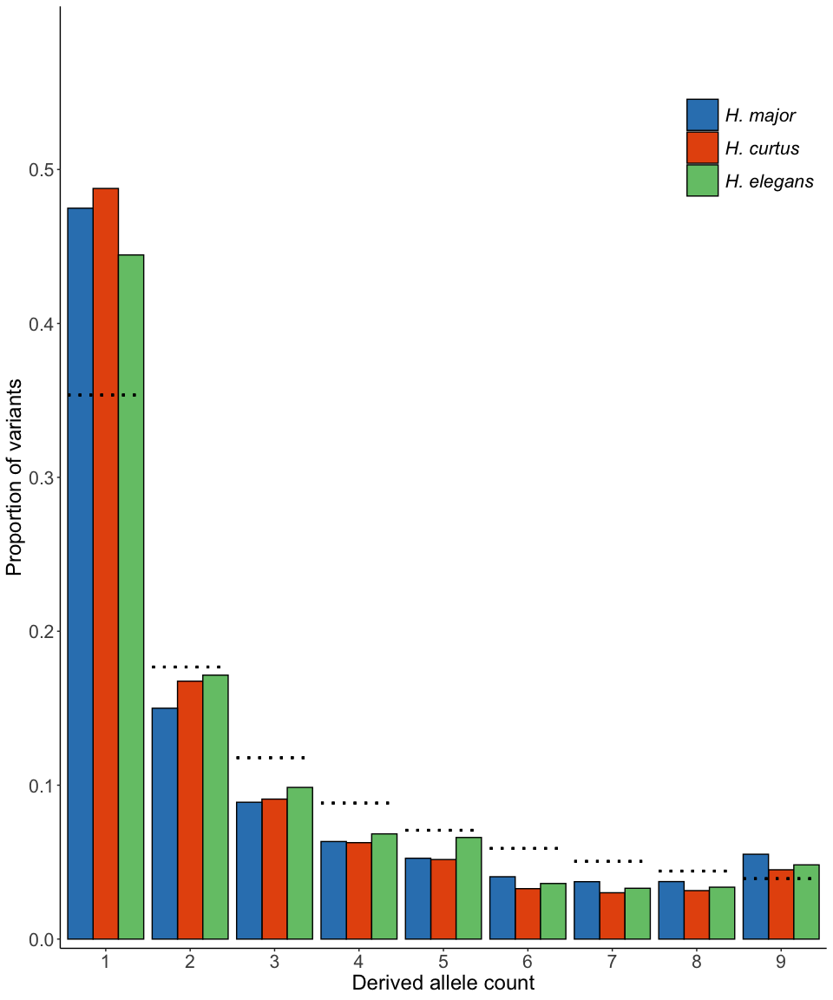
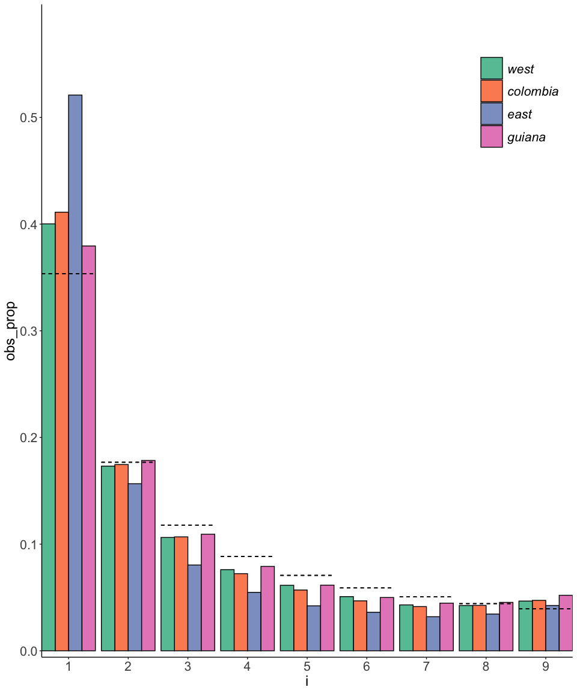
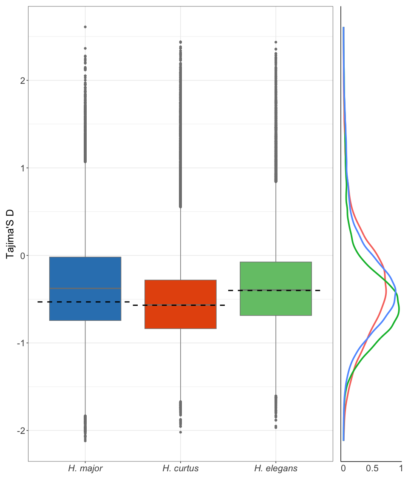
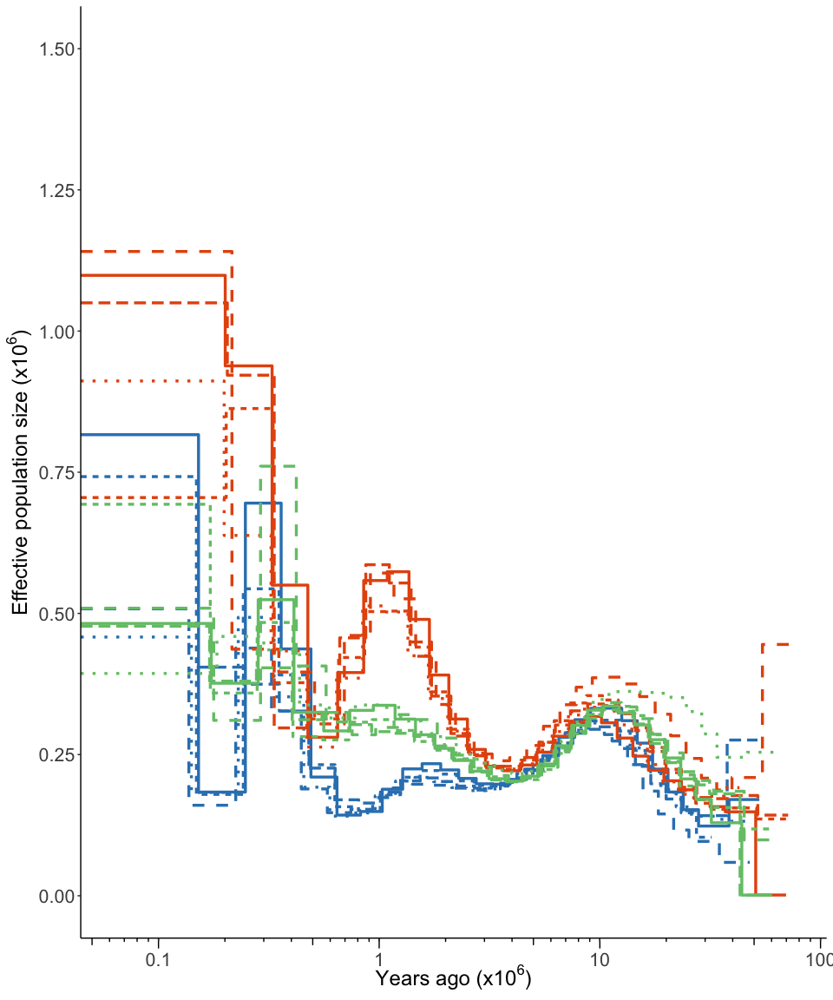
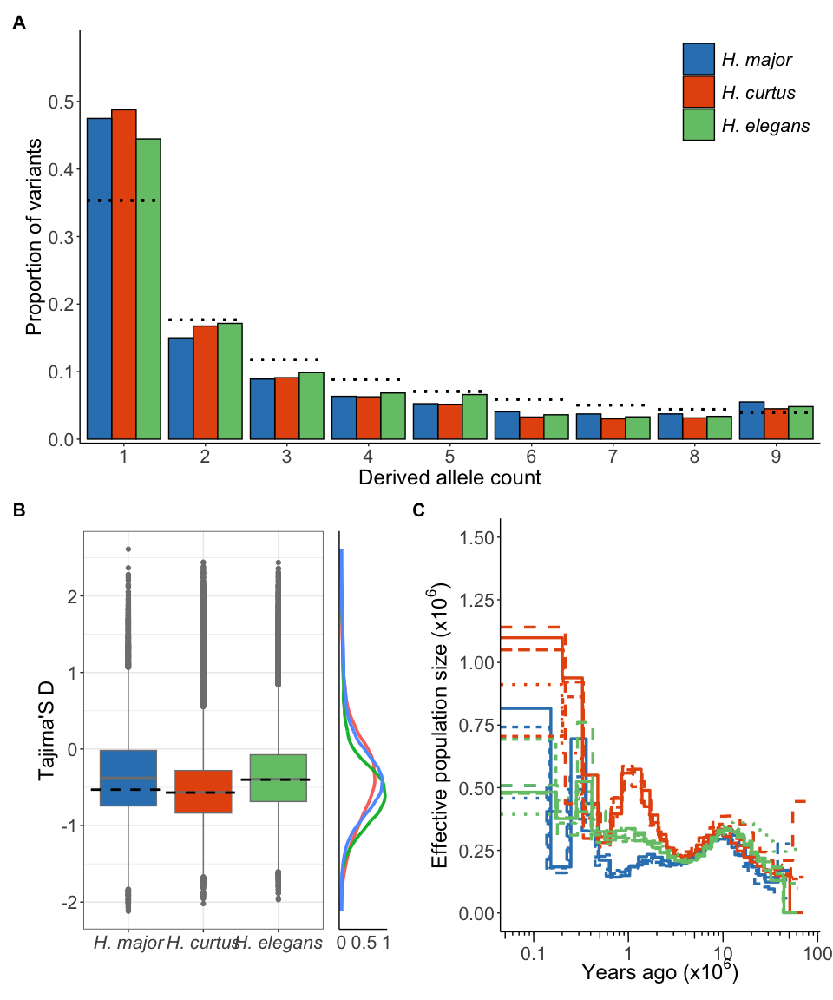

Demography
================
Alastair Ludington
2025-03-30

- [SFS](#sfs)
  - [Data: this manuscript](#data-this-manuscript)
  - [Validation](#validation)
- [Tajimas D](#tajimas-d)
  - [Genome-wide estimate](#genome-wide-estimate)
  - [Sliding window estimate](#sliding-window-estimate)
  - [Effective population size (Ne)](#effective-population-size-ne)
- [Create main-text figure](#create-main-text-figure)

Here we’ll go through the SFS and PSMC’ results.

# SFS

Separate SFS results were generated for each species i.e. the SFS for
*H. major* was estimated separately from *H. curtus* and *H. elegans*.
The program `ANGSD` was used for all SFS estimation.

Some pages that I used for assistance:

- [This
  tutorial](https://eriqande.github.io/coalescent-hands-on/004-one-dimensional-SFS.nb.html)
  for the calculations
- Formula for expected counts under the standard neutral model ([Fu
  1995](doi:10.1006/tpbi.1995.1025))

``` r
# This code is built from the tutorial above
helper <- function(path) {
  # Used on our datasets where the SFS is a single line of text in a file
  sfs <- scan(path)
  
  # Calculate expected SFS
  nSNPs <- sum(sfs[-c(1, length(sfs))]) # Removing homozygous ALT as they're not variable
  fracts <-  1 / 1:9 # Unnormalised fractions
  Sin <- nSNPs * fracts / sum(fracts) # Normalize then multiply by the number of SNPs
  
  # Expected
  df.exp <- tibble(
    i = 1:9,
    exp_count = Sin
  ) %>%
    mutate(exp_prop = exp_count / nSNPs)
  
  # Obvserved
  df.obs <- tibble(
    i = 1:9,
    obs_count = sfs[-c(1, length(sfs))]
  ) %>%
    mutate(obs_prop = obs_count / nSNPs)
  
  left_join(df.obs, df.exp) |>
    mutate(Species = str_remove(basename(path), '.sfs'))
}
```

## Data: this manuscript

Below I load each SFS file for the three species and apply the helper
function above. The data are then stored in a long-format dataframe for
plotting below.

``` r
# Ordering levels
lvls <- c("H. major", "H. curtus", "H. elegans")

sfs <- dir_ls(path = here("results", "02-demography", "sfs"), glob = "*.sfs") |>
  (\(x) x[basename(x) %in% c("hcu.sfs", "hel.sfs", "hma.sfs")])() |>
  map(helper) |>
  list_rbind()  |>
  # Using actual species names as I extract the legend for the patchwork plot
  mutate(
    Species = toupper(Species),
    Species = case_when(
      Species == "HMA" ~ "H. major",
      Species == "HEL" ~ "H. elegans",
      Species == "HCU" ~ "H. curtus"
    ),
    Species = factor(Species, levels = lvls)
  )
```

Below is the SFS figure.

``` r
plot_sfs <- sfs |>
  ggplot(aes(x = i, y = obs_prop, fill = Species)) +
  geom_bar(stat = "identity", position = 'dodge', colour = 'black') +
  geom_segment(
    aes(
      x = as.numeric(i) - .45, xend = as.numeric(i) + .45,
      y = exp_prop, yend = exp_prop
    ),
    colour = 'black',
    linetype = 'dotted',
    linewidth = 1.1
  ) +
  labs(
    x = 'Derived allele count',
    y = 'Proportion of variants'
  ) +
  scale_x_continuous(expand = c(0.01,0), breaks = 1:9) +
  scale_y_continuous(
    expand = c(0.01, 0),
    limits = c(0, 0.6),
    breaks = seq(0, 0.5, 0.1)
  ) +
  scale_fill_manual(values = pal_within) +
  theme_classic() +
  theme(
    axis.text = element_text(size = 16),
    axis.title = element_text(size = 18),
    legend.text = element_text(size = 16,face = "italic"),
    legend.title = element_blank(),
    legend.position = "inside",
    legend.position.inside = c(0.85, 0.85),
    legend.key.size = unit(1, "cm")
  )

plot_sfs
```



## Validation

I’ve used data from Simon Martin’s [2016
paper](https://doi.org/10.1534/genetics.115.183285) to validate what
we’ve done here. Essentially, I’m loading their 4D data using my code
above and plotting it. I then checked if what I generated is the same as
what’s in Figure 2B in the manuscript.

``` r
helper2 <- function(sfs, nm) {
  # S. Martin data is in CSV format, so have edited the function to accommodated CSV input
  
  # Calculate expected SFS
  nSNPs <- sum(sfs) # Removing homozygous ALT as they're not variable
  fracts <-  1 / 1:9 # Unnormalised fractions
  Sin <- nSNPs * fracts / sum(fracts) # Normalize then multiply by the number of SNPs
  
  # Expected
  df.exp <- tibble(
    i = 1:9,
    exp_count = Sin
  ) %>%
    mutate(exp_prop = exp_count / nSNPs)
  
  # Obvserved
  df.obs <- tibble(
    i = 1:9,
    obs_count = sfs
  ) %>%
    mutate(obs_prop = obs_count / nSNPs)
  
  left_join(df.obs, df.exp) |>
    mutate(Species = sub('.+autoScafs\\.(.*).sample5.+', '\\1', basename(nm)))
}
```

The figure below matches Figure 2B from the manuscript identically (bar
the colours). Consequently, we’re happy that the code above is doing the
right thing.

``` r
dir_ls(path = here("results", "02-demography", "sfs", "sfs_v2"), glob = "*4D*sample5*.csv") |>
  magrittr::extract(c(2, 4, 6, 8)) |>
  map(\(x) {
    sfs <- x |>
      read_csv(col_types = cols()) |>
      filter(!is.na(sites)) |>
      pull(sites)
  }) |>
  imap(\(x, y) { helper2(x, y)}) |>
  list_rbind() |>
  mutate(
    i = factor(i, levels = 1:9),
    Species = factor(Species, levels = c('west', 'colombia', 'east', 'guiana'))
  ) |>
  ggplot(
    aes(x = i, y = obs_prop, fill = Species)
  ) +
  geom_bar(position = 'dodge', stat = 'identity', colour = 'black') +
  geom_segment(
    aes(
      x = as.numeric(i) - .45, 
      xend = as.numeric(i) + .45,
      y = exp_prop, yend = exp_prop
    ), 
    colour = 'black', 
    linetype = 'dashed'
  ) +
  scale_x_discrete(expand = c(0.01,0)) +
  scale_y_continuous(
    expand = c(0.01, 0),
    limits = c(0, 0.6),
    breaks = seq(0, 0.5, 0.1)
  ) +
  scale_fill_brewer(palette = "Set2") +
  theme_classic() +
  theme(
    axis.text = element_text(size = 16),
    axis.title = element_text(size = 18),
    legend.text = element_text(size = 16,face = "italic"),
    legend.title = element_blank(),
    legend.position = "inside",
    legend.position.inside = c(0.9, 0.85),
    legend.key.size = unit(1, "cm")
  )
```



# Tajimas D

This analysis is also dependent on the SFS. Tajima’s D values were
estimated using `VCFtools`, but also from the SFS tables used above.
Below, we import the windowed Tajima’s D results to form boxplots, while
we use the SFS data above to estimate genome-wide estimates of the
statistic.

Importantly, data were filtered for completeness **only**. No filtering
was applied based on minor allele frequency (MAF) or minor allele count
(MAC). Filtering on MAF/MAC would bias estimates of Tajima’s D (and the
SFS figure above) upward as low-frequency alleles would be removed from
the dataset.

## Genome-wide estimate

First, we have the genome-wide estimate of Tajima’s D estimated from the
SFS tables. I use an excellent package `sfsr` to perform the
calculation.

``` r
sfs_tajD <- dir_ls(path = here("results", "02-demography", "sfs"), glob = "*.sfs") |>
  (\(x) x[basename(x) %in% c("hcu.sfs", "hel.sfs", "hma.sfs")])() |>
  map(sfsr::read_sfs, 10) |>
  map(sfsr::tajimaD) %>%
  set_names(toupper(str_remove(basename(names(.)), ".sfs"))) |>
  as_tibble() |>
  pivot_longer(
    names_to = "Species",
    values_to = "tajimasD_sfs",
    1:3
  ) |>
  mutate(
    Species = case_when(
      Species == "HMA" ~ "H. major",
      Species == "HEL" ~ "H. elegans",
      Species == "HCU" ~ "H. curtus"
    ),
    Species = factor(Species, levels = lvls),
    int = as.numeric(Species)
  )

# Write to file
sfs_tajD |>
  write_csv(here("results", "02-demography", "sfs-tajimas-D.csv"))
```

## Sliding window estimate

Below are the sliding-window estimates of Tajima’s D generated by
`VCFtools` as box-plots.

First, we load the data.

``` r
# Load the data
df_tajD <- dir_ls(path = here("results", "02-demography", "neutrality"), glob = "*.tsv") |>
  map(read_tsv, col_names = TRUE, col_types = cols()) |>
  list_rbind(names_to = 'Species') |>
  mutate(
    Species = toupper(str_remove(basename(Species), "\\.50kb.*")),
    Species = case_when(
      Species == "HMA" ~ "H. major",
      Species == "HEL" ~ "H. elegans",
      Species == "HCU" ~ "H. curtus"
    ),
    Species = factor(Species, levels = lvls),
    int = as.numeric(Species)
  )
```

Then we generate the figure. I’ve overlaid the genome-wide estimate in
the box-plot as a black dotted line to show the difference between the
two approaches. I’ve also made a density plot to go along the side to
assist in visualising the distribution of windowed estimates.

``` r
plot_box <- df_tajD |>
  ggplot(
    aes(
      x = factor(int),
      y = TajimaD,
      fill = Species
    )
  ) +
  geom_boxplot(colour = "grey50") +
  geom_segment(
    data = sfs_tajD,
    aes(
      x= int - 0.5, xend=int + 0.5,
        y=tajimasD_sfs, yend=tajimasD_sfs
    ),
    inherit.aes=FALSE,
    color="black",
    linewidth=1,
    linetype = "dashed"
  ) +
  scale_x_discrete(
    labels = c(
      "1" = "H. major",
      "2" = "H. curtus",
      "3" = "H. elegans")
  ) +
  scale_y_continuous() +
  scale_fill_manual(values = pal_within) +
  labs(x = "") +
  theme_classic() +
  theme(
    axis.text.x = element_text(face = "italic"),
    legend.position = 'none'
  )

# Density plot
plot_density <- df_tajD |>
  ggplot(
    aes(
      y = TajimaD,
      colour = Species
    )
  ) +
  geom_density(linewidth = 1.3) +
  labs(x = 'Density') +
  scale_x_continuous(breaks = c(0, 0.5, 1), labels = c('0', '0.5', '1')) +
  scale_fill_manual(values = pal_within) +
  theme_classic() +
  theme(
    legend.position = 'none',
    axis.text.y = element_blank(),
    axis.title.x = element_blank(),
    axis.ticks = element_blank(),
    axis.text = element_text(size = 16)
  )

# Stitch the Density and boxplot together
plot_box_density <- plot_box + plot_density +
  plot_layout(
    widths = c(1, 0.2),
    axes = "collect", axis_titles = "collect",
    guides = 'collect'
  ) &
  labs(y = "Tajima's D") &
  theme(
    axis.title = element_text(size = 18),
    axis.text = element_text(size = 16),
    # legend.position = 'none'
  )

plot_box_density
```



## Effective population size (Ne)

Lastly, we’ll visualise the estimates of historical effective population
size ($\text{N}_\text{e}$) through time. We generated per-sample
estimates using the program `MSMC2`.

``` r
# Parameters
mu <- 2e-9  # mutation rate 
gen <- 10   # Generation in years
lvls <- c("HMA", "HCU", "HEL")

# Load msmc output files
df_msmc <- dir_ls(
  path = here( "results", "02-demography", "msmc"),
  glob = '*.final.txt',
  recurse = TRUE
) %>%
  # Ignore bootstrap files for the main figure
  magrittr::extract(!str_detect(., "bootstrap")) |>
  read_tsv(col_names = TRUE, col_types = cols(), id = 'tmp') |>
  separate(col = tmp, into = c("tmp", 'clock'), sep = "__") |>
  mutate(
    tmp = basename(tmp),
    clock = str_remove(clock, '.final.txt'),
    clock = str_replace_all(clock, '_', "*"),
    clock = str_replace_all(clock, "-", '+'),
    Years = (left_time_boundary/mu)*gen,
    Ne = (1/lambda)/(2*mu)
  ) |>
  separate(col = tmp, into = c("Species", 'sample'), sep = "-") |>
  mutate(Species = factor(x = Species, lvls))

# Dummy column for linetype
df_dummy <- df_msmc |>
  select(Species, sample) |>
  distinct() |>
  mutate(lt = rep(LETTERS[1:5], 3))

df_msmc <- df_msmc |>
  left_join(df_dummy)

# Preview of the data
df_msmc |>
  head() |>
  gt::gt(rowname_col = "Species") |>
  gt::fmt_number(columns = 5:6, n_sigfig = 2) |>
  gt::fmt_number(columns = 7:9, decimals = 2) |>
  gt::cols_align(columns = 2:9, align = "center") |>
  gt::tab_style(
    style = gt::cell_text(weight = "bold"),
    locations = gt::cells_column_labels(everything())
  ) |>
  gt::tab_source_note(
    source_note = "First six lines of the total dataset"
  ) |>
  gt::as_raw_html()
```

<div id="bjunqhodbh" style="padding-left:0px;padding-right:0px;padding-top:10px;padding-bottom:10px;overflow-x:auto;overflow-y:auto;width:auto;height:auto;">
  &#10;  <table class="gt_table" data-quarto-disable-processing="false" data-quarto-bootstrap="false" style="-webkit-font-smoothing: antialiased; -moz-osx-font-smoothing: grayscale; font-family: system-ui, 'Segoe UI', Roboto, Helvetica, Arial, sans-serif, 'Apple Color Emoji', 'Segoe UI Emoji', 'Segoe UI Symbol', 'Noto Color Emoji'; display: table; border-collapse: collapse; line-height: normal; margin-left: auto; margin-right: auto; color: #333333; font-size: 16px; font-weight: normal; font-style: normal; background-color: #FFFFFF; width: auto; border-top-style: solid; border-top-width: 2px; border-top-color: #A8A8A8; border-right-style: none; border-right-width: 2px; border-right-color: #D3D3D3; border-bottom-style: solid; border-bottom-width: 2px; border-bottom-color: #A8A8A8; border-left-style: none; border-left-width: 2px; border-left-color: #D3D3D3;" bgcolor="#FFFFFF">
  <thead style="border-style: none;">
    <tr class="gt_col_headings" style="border-style: none; border-top-style: solid; border-top-width: 2px; border-top-color: #D3D3D3; border-bottom-style: solid; border-bottom-width: 2px; border-bottom-color: #D3D3D3; border-left-style: none; border-left-width: 1px; border-left-color: #D3D3D3; border-right-style: none; border-right-width: 1px; border-right-color: #D3D3D3;">
      <th class="gt_col_heading gt_columns_bottom_border gt_left" rowspan="1" colspan="1" scope="col" id="a::stub" style="border-style: none; color: #333333; background-color: #FFFFFF; font-size: 100%; font-weight: normal; text-transform: inherit; border-left-style: none; border-left-width: 1px; border-left-color: #D3D3D3; border-right-style: none; border-right-width: 1px; border-right-color: #D3D3D3; vertical-align: bottom; padding-top: 5px; padding-bottom: 6px; padding-left: 5px; padding-right: 5px; overflow-x: hidden; text-align: left;" bgcolor="#FFFFFF" valign="bottom" align="left"></th>
      <th class="gt_col_heading gt_columns_bottom_border gt_center" rowspan="1" colspan="1" style="border-style: none; color: #333333; background-color: #FFFFFF; font-size: 100%; text-transform: inherit; border-left-style: none; border-left-width: 1px; border-left-color: #D3D3D3; border-right-style: none; border-right-width: 1px; border-right-color: #D3D3D3; vertical-align: bottom; padding-top: 5px; padding-bottom: 6px; padding-left: 5px; padding-right: 5px; overflow-x: hidden; text-align: center; font-weight: bold;" scope="col" id="sample" bgcolor="#FFFFFF" valign="bottom" align="center">sample</th>
      <th class="gt_col_heading gt_columns_bottom_border gt_center" rowspan="1" colspan="1" style="border-style: none; color: #333333; background-color: #FFFFFF; font-size: 100%; text-transform: inherit; border-left-style: none; border-left-width: 1px; border-left-color: #D3D3D3; border-right-style: none; border-right-width: 1px; border-right-color: #D3D3D3; vertical-align: bottom; padding-top: 5px; padding-bottom: 6px; padding-left: 5px; padding-right: 5px; overflow-x: hidden; text-align: center; font-weight: bold;" scope="col" id="clock" bgcolor="#FFFFFF" valign="bottom" align="center">clock</th>
      <th class="gt_col_heading gt_columns_bottom_border gt_center" rowspan="1" colspan="1" style="border-style: none; color: #333333; background-color: #FFFFFF; font-size: 100%; text-transform: inherit; border-left-style: none; border-left-width: 1px; border-left-color: #D3D3D3; border-right-style: none; border-right-width: 1px; border-right-color: #D3D3D3; vertical-align: bottom; padding-top: 5px; padding-bottom: 6px; padding-left: 5px; padding-right: 5px; overflow-x: hidden; text-align: center; font-weight: bold;" scope="col" id="time_index" bgcolor="#FFFFFF" valign="bottom" align="center">time_index</th>
      <th class="gt_col_heading gt_columns_bottom_border gt_center" rowspan="1" colspan="1" style="border-style: none; color: #333333; background-color: #FFFFFF; font-size: 100%; text-transform: inherit; border-left-style: none; border-left-width: 1px; border-left-color: #D3D3D3; border-right-style: none; border-right-width: 1px; border-right-color: #D3D3D3; vertical-align: bottom; padding-top: 5px; padding-bottom: 6px; padding-left: 5px; padding-right: 5px; overflow-x: hidden; text-align: center; font-weight: bold;" scope="col" id="left_time_boundary" bgcolor="#FFFFFF" valign="bottom" align="center">left_time_boundary</th>
      <th class="gt_col_heading gt_columns_bottom_border gt_center" rowspan="1" colspan="1" style="border-style: none; color: #333333; background-color: #FFFFFF; font-size: 100%; text-transform: inherit; border-left-style: none; border-left-width: 1px; border-left-color: #D3D3D3; border-right-style: none; border-right-width: 1px; border-right-color: #D3D3D3; vertical-align: bottom; padding-top: 5px; padding-bottom: 6px; padding-left: 5px; padding-right: 5px; overflow-x: hidden; text-align: center; font-weight: bold;" scope="col" id="right_time_boundary" bgcolor="#FFFFFF" valign="bottom" align="center">right_time_boundary</th>
      <th class="gt_col_heading gt_columns_bottom_border gt_center" rowspan="1" colspan="1" style="border-style: none; color: #333333; background-color: #FFFFFF; font-size: 100%; text-transform: inherit; border-left-style: none; border-left-width: 1px; border-left-color: #D3D3D3; border-right-style: none; border-right-width: 1px; border-right-color: #D3D3D3; vertical-align: bottom; padding-top: 5px; padding-bottom: 6px; padding-left: 5px; padding-right: 5px; overflow-x: hidden; text-align: center; font-weight: bold;" scope="col" id="lambda" bgcolor="#FFFFFF" valign="bottom" align="center">lambda</th>
      <th class="gt_col_heading gt_columns_bottom_border gt_center" rowspan="1" colspan="1" style="border-style: none; color: #333333; background-color: #FFFFFF; font-size: 100%; text-transform: inherit; border-left-style: none; border-left-width: 1px; border-left-color: #D3D3D3; border-right-style: none; border-right-width: 1px; border-right-color: #D3D3D3; vertical-align: bottom; padding-top: 5px; padding-bottom: 6px; padding-left: 5px; padding-right: 5px; overflow-x: hidden; text-align: center; font-weight: bold;" scope="col" id="Years" bgcolor="#FFFFFF" valign="bottom" align="center">Years</th>
      <th class="gt_col_heading gt_columns_bottom_border gt_center" rowspan="1" colspan="1" style="border-style: none; color: #333333; background-color: #FFFFFF; font-size: 100%; text-transform: inherit; border-left-style: none; border-left-width: 1px; border-left-color: #D3D3D3; border-right-style: none; border-right-width: 1px; border-right-color: #D3D3D3; vertical-align: bottom; padding-top: 5px; padding-bottom: 6px; padding-left: 5px; padding-right: 5px; overflow-x: hidden; text-align: center; font-weight: bold;" scope="col" id="Ne" bgcolor="#FFFFFF" valign="bottom" align="center">Ne</th>
      <th class="gt_col_heading gt_columns_bottom_border gt_left" rowspan="1" colspan="1" style="border-style: none; color: #333333; background-color: #FFFFFF; font-size: 100%; text-transform: inherit; border-left-style: none; border-left-width: 1px; border-left-color: #D3D3D3; border-right-style: none; border-right-width: 1px; border-right-color: #D3D3D3; vertical-align: bottom; padding-top: 5px; padding-bottom: 6px; padding-left: 5px; padding-right: 5px; overflow-x: hidden; text-align: left; font-weight: bold;" scope="col" id="lt" bgcolor="#FFFFFF" valign="bottom" align="left">lt</th>
    </tr>
  </thead>
  <tbody class="gt_table_body" style="border-style: none; border-top-style: solid; border-top-width: 2px; border-top-color: #D3D3D3; border-bottom-style: solid; border-bottom-width: 2px; border-bottom-color: #D3D3D3;">
    <tr style="border-style: none;"><th id="stub_1_1" scope="row" class="gt_row gt_center gt_stub" style="border-style: none; padding-top: 8px; padding-bottom: 8px; margin: 10px; border-top-style: solid; border-top-width: 1px; border-top-color: #D3D3D3; border-left-style: none; border-left-width: 1px; border-left-color: #D3D3D3; vertical-align: middle; overflow-x: hidden; color: #333333; background-color: #FFFFFF; font-size: 100%; font-weight: initial; text-transform: inherit; border-right-style: solid; border-right-width: 2px; border-right-color: #D3D3D3; padding-left: 5px; padding-right: 5px; text-align: center;" valign="middle" bgcolor="#FFFFFF" align="center">HCU</th>
<td headers="stub_1_1 sample" class="gt_row gt_center" style="border-style: none; padding-top: 8px; padding-bottom: 8px; padding-left: 5px; padding-right: 5px; margin: 10px; border-top-style: solid; border-top-width: 1px; border-top-color: #D3D3D3; border-left-style: none; border-left-width: 1px; border-left-color: #D3D3D3; border-right-style: none; border-right-width: 1px; border-right-color: #D3D3D3; vertical-align: middle; overflow-x: hidden; text-align: center;" valign="middle" align="center">1VT</td>
<td headers="stub_1_1 clock" class="gt_row gt_center" style="border-style: none; padding-top: 8px; padding-bottom: 8px; padding-left: 5px; padding-right: 5px; margin: 10px; border-top-style: solid; border-top-width: 1px; border-top-color: #D3D3D3; border-left-style: none; border-left-width: 1px; border-left-color: #D3D3D3; border-right-style: none; border-right-width: 1px; border-right-color: #D3D3D3; vertical-align: middle; overflow-x: hidden; text-align: center;" valign="middle" align="center">1*2+25*1+1*2+1*3</td>
<td headers="stub_1_1 time_index" class="gt_row gt_center" style="border-style: none; padding-top: 8px; padding-bottom: 8px; padding-left: 5px; padding-right: 5px; margin: 10px; border-top-style: solid; border-top-width: 1px; border-top-color: #D3D3D3; border-left-style: none; border-left-width: 1px; border-left-color: #D3D3D3; border-right-style: none; border-right-width: 1px; border-right-color: #D3D3D3; vertical-align: middle; overflow-x: hidden; text-align: center;" valign="middle" align="center">0</td>
<td headers="stub_1_1 left_time_boundary" class="gt_row gt_center" style="border-style: none; padding-top: 8px; padding-bottom: 8px; padding-left: 5px; padding-right: 5px; margin: 10px; border-top-style: solid; border-top-width: 1px; border-top-color: #D3D3D3; border-left-style: none; border-left-width: 1px; border-left-color: #D3D3D3; border-right-style: none; border-right-width: 1px; border-right-color: #D3D3D3; vertical-align: middle; overflow-x: hidden; text-align: center;" valign="middle" align="center">0</td>
<td headers="stub_1_1 right_time_boundary" class="gt_row gt_center" style="border-style: none; padding-top: 8px; padding-bottom: 8px; padding-left: 5px; padding-right: 5px; margin: 10px; border-top-style: solid; border-top-width: 1px; border-top-color: #D3D3D3; border-left-style: none; border-left-width: 1px; border-left-color: #D3D3D3; border-right-style: none; border-right-width: 1px; border-right-color: #D3D3D3; vertical-align: middle; overflow-x: hidden; text-align: center;" valign="middle" align="center">0.000018</td>
<td headers="stub_1_1 lambda" class="gt_row gt_center" style="border-style: none; padding-top: 8px; padding-bottom: 8px; padding-left: 5px; padding-right: 5px; margin: 10px; border-top-style: solid; border-top-width: 1px; border-top-color: #D3D3D3; border-left-style: none; border-left-width: 1px; border-left-color: #D3D3D3; border-right-style: none; border-right-width: 1px; border-right-color: #D3D3D3; vertical-align: middle; overflow-x: hidden; text-align: center;" valign="middle" align="center">227.55</td>
<td headers="stub_1_1 Years" class="gt_row gt_center" style="border-style: none; padding-top: 8px; padding-bottom: 8px; padding-left: 5px; padding-right: 5px; margin: 10px; border-top-style: solid; border-top-width: 1px; border-top-color: #D3D3D3; border-left-style: none; border-left-width: 1px; border-left-color: #D3D3D3; border-right-style: none; border-right-width: 1px; border-right-color: #D3D3D3; vertical-align: middle; overflow-x: hidden; text-align: center;" valign="middle" align="center">0.00</td>
<td headers="stub_1_1 Ne" class="gt_row gt_center" style="border-style: none; padding-top: 8px; padding-bottom: 8px; padding-left: 5px; padding-right: 5px; margin: 10px; border-top-style: solid; border-top-width: 1px; border-top-color: #D3D3D3; border-left-style: none; border-left-width: 1px; border-left-color: #D3D3D3; border-right-style: none; border-right-width: 1px; border-right-color: #D3D3D3; vertical-align: middle; overflow-x: hidden; text-align: center;" valign="middle" align="center">1,098,664.46</td>
<td headers="stub_1_1 lt" class="gt_row gt_left" style="border-style: none; padding-top: 8px; padding-bottom: 8px; padding-left: 5px; padding-right: 5px; margin: 10px; border-top-style: solid; border-top-width: 1px; border-top-color: #D3D3D3; border-left-style: none; border-left-width: 1px; border-left-color: #D3D3D3; border-right-style: none; border-right-width: 1px; border-right-color: #D3D3D3; vertical-align: middle; overflow-x: hidden; text-align: left;" valign="middle" align="left">A</td></tr>
    <tr style="border-style: none;"><th id="stub_1_2" scope="row" class="gt_row gt_center gt_stub" style="border-style: none; padding-top: 8px; padding-bottom: 8px; margin: 10px; border-top-style: solid; border-top-width: 1px; border-top-color: #D3D3D3; border-left-style: none; border-left-width: 1px; border-left-color: #D3D3D3; vertical-align: middle; overflow-x: hidden; color: #333333; background-color: #FFFFFF; font-size: 100%; font-weight: initial; text-transform: inherit; border-right-style: solid; border-right-width: 2px; border-right-color: #D3D3D3; padding-left: 5px; padding-right: 5px; text-align: center;" valign="middle" bgcolor="#FFFFFF" align="center">HCU</th>
<td headers="stub_1_2 sample" class="gt_row gt_center" style="border-style: none; padding-top: 8px; padding-bottom: 8px; padding-left: 5px; padding-right: 5px; margin: 10px; border-top-style: solid; border-top-width: 1px; border-top-color: #D3D3D3; border-left-style: none; border-left-width: 1px; border-left-color: #D3D3D3; border-right-style: none; border-right-width: 1px; border-right-color: #D3D3D3; vertical-align: middle; overflow-x: hidden; text-align: center;" valign="middle" align="center">1VT</td>
<td headers="stub_1_2 clock" class="gt_row gt_center" style="border-style: none; padding-top: 8px; padding-bottom: 8px; padding-left: 5px; padding-right: 5px; margin: 10px; border-top-style: solid; border-top-width: 1px; border-top-color: #D3D3D3; border-left-style: none; border-left-width: 1px; border-left-color: #D3D3D3; border-right-style: none; border-right-width: 1px; border-right-color: #D3D3D3; vertical-align: middle; overflow-x: hidden; text-align: center;" valign="middle" align="center">1*2+25*1+1*2+1*3</td>
<td headers="stub_1_2 time_index" class="gt_row gt_center" style="border-style: none; padding-top: 8px; padding-bottom: 8px; padding-left: 5px; padding-right: 5px; margin: 10px; border-top-style: solid; border-top-width: 1px; border-top-color: #D3D3D3; border-left-style: none; border-left-width: 1px; border-left-color: #D3D3D3; border-right-style: none; border-right-width: 1px; border-right-color: #D3D3D3; vertical-align: middle; overflow-x: hidden; text-align: center;" valign="middle" align="center">1</td>
<td headers="stub_1_2 left_time_boundary" class="gt_row gt_center" style="border-style: none; padding-top: 8px; padding-bottom: 8px; padding-left: 5px; padding-right: 5px; margin: 10px; border-top-style: solid; border-top-width: 1px; border-top-color: #D3D3D3; border-left-style: none; border-left-width: 1px; border-left-color: #D3D3D3; border-right-style: none; border-right-width: 1px; border-right-color: #D3D3D3; vertical-align: middle; overflow-x: hidden; text-align: center;" valign="middle" align="center">0.000018</td>
<td headers="stub_1_2 right_time_boundary" class="gt_row gt_center" style="border-style: none; padding-top: 8px; padding-bottom: 8px; padding-left: 5px; padding-right: 5px; margin: 10px; border-top-style: solid; border-top-width: 1px; border-top-color: #D3D3D3; border-left-style: none; border-left-width: 1px; border-left-color: #D3D3D3; border-right-style: none; border-right-width: 1px; border-right-color: #D3D3D3; vertical-align: middle; overflow-x: hidden; text-align: center;" valign="middle" align="center">0.000040</td>
<td headers="stub_1_2 lambda" class="gt_row gt_center" style="border-style: none; padding-top: 8px; padding-bottom: 8px; padding-left: 5px; padding-right: 5px; margin: 10px; border-top-style: solid; border-top-width: 1px; border-top-color: #D3D3D3; border-left-style: none; border-left-width: 1px; border-left-color: #D3D3D3; border-right-style: none; border-right-width: 1px; border-right-color: #D3D3D3; vertical-align: middle; overflow-x: hidden; text-align: center;" valign="middle" align="center">227.55</td>
<td headers="stub_1_2 Years" class="gt_row gt_center" style="border-style: none; padding-top: 8px; padding-bottom: 8px; padding-left: 5px; padding-right: 5px; margin: 10px; border-top-style: solid; border-top-width: 1px; border-top-color: #D3D3D3; border-left-style: none; border-left-width: 1px; border-left-color: #D3D3D3; border-right-style: none; border-right-width: 1px; border-right-color: #D3D3D3; vertical-align: middle; overflow-x: hidden; text-align: center;" valign="middle" align="center">92,481.00</td>
<td headers="stub_1_2 Ne" class="gt_row gt_center" style="border-style: none; padding-top: 8px; padding-bottom: 8px; padding-left: 5px; padding-right: 5px; margin: 10px; border-top-style: solid; border-top-width: 1px; border-top-color: #D3D3D3; border-left-style: none; border-left-width: 1px; border-left-color: #D3D3D3; border-right-style: none; border-right-width: 1px; border-right-color: #D3D3D3; vertical-align: middle; overflow-x: hidden; text-align: center;" valign="middle" align="center">1,098,664.46</td>
<td headers="stub_1_2 lt" class="gt_row gt_left" style="border-style: none; padding-top: 8px; padding-bottom: 8px; padding-left: 5px; padding-right: 5px; margin: 10px; border-top-style: solid; border-top-width: 1px; border-top-color: #D3D3D3; border-left-style: none; border-left-width: 1px; border-left-color: #D3D3D3; border-right-style: none; border-right-width: 1px; border-right-color: #D3D3D3; vertical-align: middle; overflow-x: hidden; text-align: left;" valign="middle" align="left">A</td></tr>
    <tr style="border-style: none;"><th id="stub_1_3" scope="row" class="gt_row gt_center gt_stub" style="border-style: none; padding-top: 8px; padding-bottom: 8px; margin: 10px; border-top-style: solid; border-top-width: 1px; border-top-color: #D3D3D3; border-left-style: none; border-left-width: 1px; border-left-color: #D3D3D3; vertical-align: middle; overflow-x: hidden; color: #333333; background-color: #FFFFFF; font-size: 100%; font-weight: initial; text-transform: inherit; border-right-style: solid; border-right-width: 2px; border-right-color: #D3D3D3; padding-left: 5px; padding-right: 5px; text-align: center;" valign="middle" bgcolor="#FFFFFF" align="center">HCU</th>
<td headers="stub_1_3 sample" class="gt_row gt_center" style="border-style: none; padding-top: 8px; padding-bottom: 8px; padding-left: 5px; padding-right: 5px; margin: 10px; border-top-style: solid; border-top-width: 1px; border-top-color: #D3D3D3; border-left-style: none; border-left-width: 1px; border-left-color: #D3D3D3; border-right-style: none; border-right-width: 1px; border-right-color: #D3D3D3; vertical-align: middle; overflow-x: hidden; text-align: center;" valign="middle" align="center">1VT</td>
<td headers="stub_1_3 clock" class="gt_row gt_center" style="border-style: none; padding-top: 8px; padding-bottom: 8px; padding-left: 5px; padding-right: 5px; margin: 10px; border-top-style: solid; border-top-width: 1px; border-top-color: #D3D3D3; border-left-style: none; border-left-width: 1px; border-left-color: #D3D3D3; border-right-style: none; border-right-width: 1px; border-right-color: #D3D3D3; vertical-align: middle; overflow-x: hidden; text-align: center;" valign="middle" align="center">1*2+25*1+1*2+1*3</td>
<td headers="stub_1_3 time_index" class="gt_row gt_center" style="border-style: none; padding-top: 8px; padding-bottom: 8px; padding-left: 5px; padding-right: 5px; margin: 10px; border-top-style: solid; border-top-width: 1px; border-top-color: #D3D3D3; border-left-style: none; border-left-width: 1px; border-left-color: #D3D3D3; border-right-style: none; border-right-width: 1px; border-right-color: #D3D3D3; vertical-align: middle; overflow-x: hidden; text-align: center;" valign="middle" align="center">2</td>
<td headers="stub_1_3 left_time_boundary" class="gt_row gt_center" style="border-style: none; padding-top: 8px; padding-bottom: 8px; padding-left: 5px; padding-right: 5px; margin: 10px; border-top-style: solid; border-top-width: 1px; border-top-color: #D3D3D3; border-left-style: none; border-left-width: 1px; border-left-color: #D3D3D3; border-right-style: none; border-right-width: 1px; border-right-color: #D3D3D3; vertical-align: middle; overflow-x: hidden; text-align: center;" valign="middle" align="center">0.000040</td>
<td headers="stub_1_3 right_time_boundary" class="gt_row gt_center" style="border-style: none; padding-top: 8px; padding-bottom: 8px; padding-left: 5px; padding-right: 5px; margin: 10px; border-top-style: solid; border-top-width: 1px; border-top-color: #D3D3D3; border-left-style: none; border-left-width: 1px; border-left-color: #D3D3D3; border-right-style: none; border-right-width: 1px; border-right-color: #D3D3D3; vertical-align: middle; overflow-x: hidden; text-align: center;" valign="middle" align="center">0.000065</td>
<td headers="stub_1_3 lambda" class="gt_row gt_center" style="border-style: none; padding-top: 8px; padding-bottom: 8px; padding-left: 5px; padding-right: 5px; margin: 10px; border-top-style: solid; border-top-width: 1px; border-top-color: #D3D3D3; border-left-style: none; border-left-width: 1px; border-left-color: #D3D3D3; border-right-style: none; border-right-width: 1px; border-right-color: #D3D3D3; vertical-align: middle; overflow-x: hidden; text-align: center;" valign="middle" align="center">266.43</td>
<td headers="stub_1_3 Years" class="gt_row gt_center" style="border-style: none; padding-top: 8px; padding-bottom: 8px; padding-left: 5px; padding-right: 5px; margin: 10px; border-top-style: solid; border-top-width: 1px; border-top-color: #D3D3D3; border-left-style: none; border-left-width: 1px; border-left-color: #D3D3D3; border-right-style: none; border-right-width: 1px; border-right-color: #D3D3D3; vertical-align: middle; overflow-x: hidden; text-align: center;" valign="middle" align="center">200,661.00</td>
<td headers="stub_1_3 Ne" class="gt_row gt_center" style="border-style: none; padding-top: 8px; padding-bottom: 8px; padding-left: 5px; padding-right: 5px; margin: 10px; border-top-style: solid; border-top-width: 1px; border-top-color: #D3D3D3; border-left-style: none; border-left-width: 1px; border-left-color: #D3D3D3; border-right-style: none; border-right-width: 1px; border-right-color: #D3D3D3; vertical-align: middle; overflow-x: hidden; text-align: center;" valign="middle" align="center">938,339.81</td>
<td headers="stub_1_3 lt" class="gt_row gt_left" style="border-style: none; padding-top: 8px; padding-bottom: 8px; padding-left: 5px; padding-right: 5px; margin: 10px; border-top-style: solid; border-top-width: 1px; border-top-color: #D3D3D3; border-left-style: none; border-left-width: 1px; border-left-color: #D3D3D3; border-right-style: none; border-right-width: 1px; border-right-color: #D3D3D3; vertical-align: middle; overflow-x: hidden; text-align: left;" valign="middle" align="left">A</td></tr>
    <tr style="border-style: none;"><th id="stub_1_4" scope="row" class="gt_row gt_center gt_stub" style="border-style: none; padding-top: 8px; padding-bottom: 8px; margin: 10px; border-top-style: solid; border-top-width: 1px; border-top-color: #D3D3D3; border-left-style: none; border-left-width: 1px; border-left-color: #D3D3D3; vertical-align: middle; overflow-x: hidden; color: #333333; background-color: #FFFFFF; font-size: 100%; font-weight: initial; text-transform: inherit; border-right-style: solid; border-right-width: 2px; border-right-color: #D3D3D3; padding-left: 5px; padding-right: 5px; text-align: center;" valign="middle" bgcolor="#FFFFFF" align="center">HCU</th>
<td headers="stub_1_4 sample" class="gt_row gt_center" style="border-style: none; padding-top: 8px; padding-bottom: 8px; padding-left: 5px; padding-right: 5px; margin: 10px; border-top-style: solid; border-top-width: 1px; border-top-color: #D3D3D3; border-left-style: none; border-left-width: 1px; border-left-color: #D3D3D3; border-right-style: none; border-right-width: 1px; border-right-color: #D3D3D3; vertical-align: middle; overflow-x: hidden; text-align: center;" valign="middle" align="center">1VT</td>
<td headers="stub_1_4 clock" class="gt_row gt_center" style="border-style: none; padding-top: 8px; padding-bottom: 8px; padding-left: 5px; padding-right: 5px; margin: 10px; border-top-style: solid; border-top-width: 1px; border-top-color: #D3D3D3; border-left-style: none; border-left-width: 1px; border-left-color: #D3D3D3; border-right-style: none; border-right-width: 1px; border-right-color: #D3D3D3; vertical-align: middle; overflow-x: hidden; text-align: center;" valign="middle" align="center">1*2+25*1+1*2+1*3</td>
<td headers="stub_1_4 time_index" class="gt_row gt_center" style="border-style: none; padding-top: 8px; padding-bottom: 8px; padding-left: 5px; padding-right: 5px; margin: 10px; border-top-style: solid; border-top-width: 1px; border-top-color: #D3D3D3; border-left-style: none; border-left-width: 1px; border-left-color: #D3D3D3; border-right-style: none; border-right-width: 1px; border-right-color: #D3D3D3; vertical-align: middle; overflow-x: hidden; text-align: center;" valign="middle" align="center">3</td>
<td headers="stub_1_4 left_time_boundary" class="gt_row gt_center" style="border-style: none; padding-top: 8px; padding-bottom: 8px; padding-left: 5px; padding-right: 5px; margin: 10px; border-top-style: solid; border-top-width: 1px; border-top-color: #D3D3D3; border-left-style: none; border-left-width: 1px; border-left-color: #D3D3D3; border-right-style: none; border-right-width: 1px; border-right-color: #D3D3D3; vertical-align: middle; overflow-x: hidden; text-align: center;" valign="middle" align="center">0.000065</td>
<td headers="stub_1_4 right_time_boundary" class="gt_row gt_center" style="border-style: none; padding-top: 8px; padding-bottom: 8px; padding-left: 5px; padding-right: 5px; margin: 10px; border-top-style: solid; border-top-width: 1px; border-top-color: #D3D3D3; border-left-style: none; border-left-width: 1px; border-left-color: #D3D3D3; border-right-style: none; border-right-width: 1px; border-right-color: #D3D3D3; vertical-align: middle; overflow-x: hidden; text-align: center;" valign="middle" align="center">0.000095</td>
<td headers="stub_1_4 lambda" class="gt_row gt_center" style="border-style: none; padding-top: 8px; padding-bottom: 8px; padding-left: 5px; padding-right: 5px; margin: 10px; border-top-style: solid; border-top-width: 1px; border-top-color: #D3D3D3; border-left-style: none; border-left-width: 1px; border-left-color: #D3D3D3; border-right-style: none; border-right-width: 1px; border-right-color: #D3D3D3; vertical-align: middle; overflow-x: hidden; text-align: center;" valign="middle" align="center">454.47</td>
<td headers="stub_1_4 Years" class="gt_row gt_center" style="border-style: none; padding-top: 8px; padding-bottom: 8px; padding-left: 5px; padding-right: 5px; margin: 10px; border-top-style: solid; border-top-width: 1px; border-top-color: #D3D3D3; border-left-style: none; border-left-width: 1px; border-left-color: #D3D3D3; border-right-style: none; border-right-width: 1px; border-right-color: #D3D3D3; vertical-align: middle; overflow-x: hidden; text-align: center;" valign="middle" align="center">327,204.50</td>
<td headers="stub_1_4 Ne" class="gt_row gt_center" style="border-style: none; padding-top: 8px; padding-bottom: 8px; padding-left: 5px; padding-right: 5px; margin: 10px; border-top-style: solid; border-top-width: 1px; border-top-color: #D3D3D3; border-left-style: none; border-left-width: 1px; border-left-color: #D3D3D3; border-right-style: none; border-right-width: 1px; border-right-color: #D3D3D3; vertical-align: middle; overflow-x: hidden; text-align: center;" valign="middle" align="center">550,087.68</td>
<td headers="stub_1_4 lt" class="gt_row gt_left" style="border-style: none; padding-top: 8px; padding-bottom: 8px; padding-left: 5px; padding-right: 5px; margin: 10px; border-top-style: solid; border-top-width: 1px; border-top-color: #D3D3D3; border-left-style: none; border-left-width: 1px; border-left-color: #D3D3D3; border-right-style: none; border-right-width: 1px; border-right-color: #D3D3D3; vertical-align: middle; overflow-x: hidden; text-align: left;" valign="middle" align="left">A</td></tr>
    <tr style="border-style: none;"><th id="stub_1_5" scope="row" class="gt_row gt_center gt_stub" style="border-style: none; padding-top: 8px; padding-bottom: 8px; margin: 10px; border-top-style: solid; border-top-width: 1px; border-top-color: #D3D3D3; border-left-style: none; border-left-width: 1px; border-left-color: #D3D3D3; vertical-align: middle; overflow-x: hidden; color: #333333; background-color: #FFFFFF; font-size: 100%; font-weight: initial; text-transform: inherit; border-right-style: solid; border-right-width: 2px; border-right-color: #D3D3D3; padding-left: 5px; padding-right: 5px; text-align: center;" valign="middle" bgcolor="#FFFFFF" align="center">HCU</th>
<td headers="stub_1_5 sample" class="gt_row gt_center" style="border-style: none; padding-top: 8px; padding-bottom: 8px; padding-left: 5px; padding-right: 5px; margin: 10px; border-top-style: solid; border-top-width: 1px; border-top-color: #D3D3D3; border-left-style: none; border-left-width: 1px; border-left-color: #D3D3D3; border-right-style: none; border-right-width: 1px; border-right-color: #D3D3D3; vertical-align: middle; overflow-x: hidden; text-align: center;" valign="middle" align="center">1VT</td>
<td headers="stub_1_5 clock" class="gt_row gt_center" style="border-style: none; padding-top: 8px; padding-bottom: 8px; padding-left: 5px; padding-right: 5px; margin: 10px; border-top-style: solid; border-top-width: 1px; border-top-color: #D3D3D3; border-left-style: none; border-left-width: 1px; border-left-color: #D3D3D3; border-right-style: none; border-right-width: 1px; border-right-color: #D3D3D3; vertical-align: middle; overflow-x: hidden; text-align: center;" valign="middle" align="center">1*2+25*1+1*2+1*3</td>
<td headers="stub_1_5 time_index" class="gt_row gt_center" style="border-style: none; padding-top: 8px; padding-bottom: 8px; padding-left: 5px; padding-right: 5px; margin: 10px; border-top-style: solid; border-top-width: 1px; border-top-color: #D3D3D3; border-left-style: none; border-left-width: 1px; border-left-color: #D3D3D3; border-right-style: none; border-right-width: 1px; border-right-color: #D3D3D3; vertical-align: middle; overflow-x: hidden; text-align: center;" valign="middle" align="center">4</td>
<td headers="stub_1_5 left_time_boundary" class="gt_row gt_center" style="border-style: none; padding-top: 8px; padding-bottom: 8px; padding-left: 5px; padding-right: 5px; margin: 10px; border-top-style: solid; border-top-width: 1px; border-top-color: #D3D3D3; border-left-style: none; border-left-width: 1px; border-left-color: #D3D3D3; border-right-style: none; border-right-width: 1px; border-right-color: #D3D3D3; vertical-align: middle; overflow-x: hidden; text-align: center;" valign="middle" align="center">0.000095</td>
<td headers="stub_1_5 right_time_boundary" class="gt_row gt_center" style="border-style: none; padding-top: 8px; padding-bottom: 8px; padding-left: 5px; padding-right: 5px; margin: 10px; border-top-style: solid; border-top-width: 1px; border-top-color: #D3D3D3; border-left-style: none; border-left-width: 1px; border-left-color: #D3D3D3; border-right-style: none; border-right-width: 1px; border-right-color: #D3D3D3; vertical-align: middle; overflow-x: hidden; text-align: center;" valign="middle" align="center">0.00013</td>
<td headers="stub_1_5 lambda" class="gt_row gt_center" style="border-style: none; padding-top: 8px; padding-bottom: 8px; padding-left: 5px; padding-right: 5px; margin: 10px; border-top-style: solid; border-top-width: 1px; border-top-color: #D3D3D3; border-left-style: none; border-left-width: 1px; border-left-color: #D3D3D3; border-right-style: none; border-right-width: 1px; border-right-color: #D3D3D3; vertical-align: middle; overflow-x: hidden; text-align: center;" valign="middle" align="center">890.92</td>
<td headers="stub_1_5 Years" class="gt_row gt_center" style="border-style: none; padding-top: 8px; padding-bottom: 8px; padding-left: 5px; padding-right: 5px; margin: 10px; border-top-style: solid; border-top-width: 1px; border-top-color: #D3D3D3; border-left-style: none; border-left-width: 1px; border-left-color: #D3D3D3; border-right-style: none; border-right-width: 1px; border-right-color: #D3D3D3; vertical-align: middle; overflow-x: hidden; text-align: center;" valign="middle" align="center">475,228.50</td>
<td headers="stub_1_5 Ne" class="gt_row gt_center" style="border-style: none; padding-top: 8px; padding-bottom: 8px; padding-left: 5px; padding-right: 5px; margin: 10px; border-top-style: solid; border-top-width: 1px; border-top-color: #D3D3D3; border-left-style: none; border-left-width: 1px; border-left-color: #D3D3D3; border-right-style: none; border-right-width: 1px; border-right-color: #D3D3D3; vertical-align: middle; overflow-x: hidden; text-align: center;" valign="middle" align="center">280,608.18</td>
<td headers="stub_1_5 lt" class="gt_row gt_left" style="border-style: none; padding-top: 8px; padding-bottom: 8px; padding-left: 5px; padding-right: 5px; margin: 10px; border-top-style: solid; border-top-width: 1px; border-top-color: #D3D3D3; border-left-style: none; border-left-width: 1px; border-left-color: #D3D3D3; border-right-style: none; border-right-width: 1px; border-right-color: #D3D3D3; vertical-align: middle; overflow-x: hidden; text-align: left;" valign="middle" align="left">A</td></tr>
    <tr style="border-style: none;"><th id="stub_1_6" scope="row" class="gt_row gt_center gt_stub" style="border-style: none; padding-top: 8px; padding-bottom: 8px; margin: 10px; border-top-style: solid; border-top-width: 1px; border-top-color: #D3D3D3; border-left-style: none; border-left-width: 1px; border-left-color: #D3D3D3; vertical-align: middle; overflow-x: hidden; color: #333333; background-color: #FFFFFF; font-size: 100%; font-weight: initial; text-transform: inherit; border-right-style: solid; border-right-width: 2px; border-right-color: #D3D3D3; padding-left: 5px; padding-right: 5px; text-align: center;" valign="middle" bgcolor="#FFFFFF" align="center">HCU</th>
<td headers="stub_1_6 sample" class="gt_row gt_center" style="border-style: none; padding-top: 8px; padding-bottom: 8px; padding-left: 5px; padding-right: 5px; margin: 10px; border-top-style: solid; border-top-width: 1px; border-top-color: #D3D3D3; border-left-style: none; border-left-width: 1px; border-left-color: #D3D3D3; border-right-style: none; border-right-width: 1px; border-right-color: #D3D3D3; vertical-align: middle; overflow-x: hidden; text-align: center;" valign="middle" align="center">1VT</td>
<td headers="stub_1_6 clock" class="gt_row gt_center" style="border-style: none; padding-top: 8px; padding-bottom: 8px; padding-left: 5px; padding-right: 5px; margin: 10px; border-top-style: solid; border-top-width: 1px; border-top-color: #D3D3D3; border-left-style: none; border-left-width: 1px; border-left-color: #D3D3D3; border-right-style: none; border-right-width: 1px; border-right-color: #D3D3D3; vertical-align: middle; overflow-x: hidden; text-align: center;" valign="middle" align="center">1*2+25*1+1*2+1*3</td>
<td headers="stub_1_6 time_index" class="gt_row gt_center" style="border-style: none; padding-top: 8px; padding-bottom: 8px; padding-left: 5px; padding-right: 5px; margin: 10px; border-top-style: solid; border-top-width: 1px; border-top-color: #D3D3D3; border-left-style: none; border-left-width: 1px; border-left-color: #D3D3D3; border-right-style: none; border-right-width: 1px; border-right-color: #D3D3D3; vertical-align: middle; overflow-x: hidden; text-align: center;" valign="middle" align="center">5</td>
<td headers="stub_1_6 left_time_boundary" class="gt_row gt_center" style="border-style: none; padding-top: 8px; padding-bottom: 8px; padding-left: 5px; padding-right: 5px; margin: 10px; border-top-style: solid; border-top-width: 1px; border-top-color: #D3D3D3; border-left-style: none; border-left-width: 1px; border-left-color: #D3D3D3; border-right-style: none; border-right-width: 1px; border-right-color: #D3D3D3; vertical-align: middle; overflow-x: hidden; text-align: center;" valign="middle" align="center">0.00013</td>
<td headers="stub_1_6 right_time_boundary" class="gt_row gt_center" style="border-style: none; padding-top: 8px; padding-bottom: 8px; padding-left: 5px; padding-right: 5px; margin: 10px; border-top-style: solid; border-top-width: 1px; border-top-color: #D3D3D3; border-left-style: none; border-left-width: 1px; border-left-color: #D3D3D3; border-right-style: none; border-right-width: 1px; border-right-color: #D3D3D3; vertical-align: middle; overflow-x: hidden; text-align: center;" valign="middle" align="center">0.00017</td>
<td headers="stub_1_6 lambda" class="gt_row gt_center" style="border-style: none; padding-top: 8px; padding-bottom: 8px; padding-left: 5px; padding-right: 5px; margin: 10px; border-top-style: solid; border-top-width: 1px; border-top-color: #D3D3D3; border-left-style: none; border-left-width: 1px; border-left-color: #D3D3D3; border-right-style: none; border-right-width: 1px; border-right-color: #D3D3D3; vertical-align: middle; overflow-x: hidden; text-align: center;" valign="middle" align="center">632.49</td>
<td headers="stub_1_6 Years" class="gt_row gt_center" style="border-style: none; padding-top: 8px; padding-bottom: 8px; padding-left: 5px; padding-right: 5px; margin: 10px; border-top-style: solid; border-top-width: 1px; border-top-color: #D3D3D3; border-left-style: none; border-left-width: 1px; border-left-color: #D3D3D3; border-right-style: none; border-right-width: 1px; border-right-color: #D3D3D3; vertical-align: middle; overflow-x: hidden; text-align: center;" valign="middle" align="center">648,380.00</td>
<td headers="stub_1_6 Ne" class="gt_row gt_center" style="border-style: none; padding-top: 8px; padding-bottom: 8px; padding-left: 5px; padding-right: 5px; margin: 10px; border-top-style: solid; border-top-width: 1px; border-top-color: #D3D3D3; border-left-style: none; border-left-width: 1px; border-left-color: #D3D3D3; border-right-style: none; border-right-width: 1px; border-right-color: #D3D3D3; vertical-align: middle; overflow-x: hidden; text-align: center;" valign="middle" align="center">395,265.04</td>
<td headers="stub_1_6 lt" class="gt_row gt_left" style="border-style: none; padding-top: 8px; padding-bottom: 8px; padding-left: 5px; padding-right: 5px; margin: 10px; border-top-style: solid; border-top-width: 1px; border-top-color: #D3D3D3; border-left-style: none; border-left-width: 1px; border-left-color: #D3D3D3; border-right-style: none; border-right-width: 1px; border-right-color: #D3D3D3; vertical-align: middle; overflow-x: hidden; text-align: left;" valign="middle" align="left">A</td></tr>
  </tbody>
  <tfoot class="gt_sourcenotes" style="border-style: none; color: #333333; background-color: #FFFFFF; border-bottom-style: none; border-bottom-width: 2px; border-bottom-color: #D3D3D3; border-left-style: none; border-left-width: 2px; border-left-color: #D3D3D3; border-right-style: none; border-right-width: 2px; border-right-color: #D3D3D3;" bgcolor="#FFFFFF">
    <tr style="border-style: none;">
      <td class="gt_sourcenote" colspan="10" style="border-style: none; font-size: 90%; padding-top: 4px; padding-bottom: 4px; padding-left: 5px; padding-right: 5px;">First six lines of the total dataset</td>
    </tr>
  </tfoot>
  &#10;</table>
</div>

``` r
plot_msmc <- df_msmc |>
  filter(clock == "1*2+25*1+1*2+1*3") |>
  ggplot(aes(x = Years, y = Ne, colour = Species, linetype = lt)) +
  geom_step(linewidth = 1.2) +
  annotation_logticks(sides = 'b', outside = TRUE) +
  coord_cartesian(clip = "off" ) +
  scale_x_log10(
    labels = scales::label_number(
      scale = 1e-6,
      accuracy = 0.1,
      drop0trailing = TRUE
    )
  ) +
  scale_y_continuous(
    labels = scales::label_number(scale = 1e-6),
    breaks = seq(0, 1.5e6, 250e3),
    limits = c(0, 1.5e6)
  ) +
  labs(
    y = bquote("Effective population size (x10"^6*')'),
    x = bquote("Years ago (x10"^6*')')
  ) +
  scale_colour_manual(values = pal_within) +
  guides(linetype = 'none') +
  theme_classic() +
  theme(
    axis.title = element_text(size = 18),
    axis.text = element_text(size = 16),
    axis.text.x = element_text(vjust = -1.2),
    strip.text = element_text(size = 18),
    legend.position = "none"
  )

plot_msmc
```



# Create main-text figure

The code below generates the main-text figure.

``` r
fig1 <- plot_sfs/(free(wrap_elements(plot_box_density)) | plot_msmc) +
  plot_annotation(tag_levels = 'A') &
  theme(plot.tag = element_text(size = 16, face = "bold"))

pdf(
  file = here("manuscript", "figures", "figure-1-demography.pdf"),
  width = 4000/300, height = 4000/300
)
fig1
invisible(dev.off())

ragg::agg_png(
  filename = here("manuscript", "figures", "figure-1-demography.png"),
  width = 2000, 
  height = 2000,
  units = "px",
  res = 150
)
fig1
invisible(dev.off())

fig1
```


