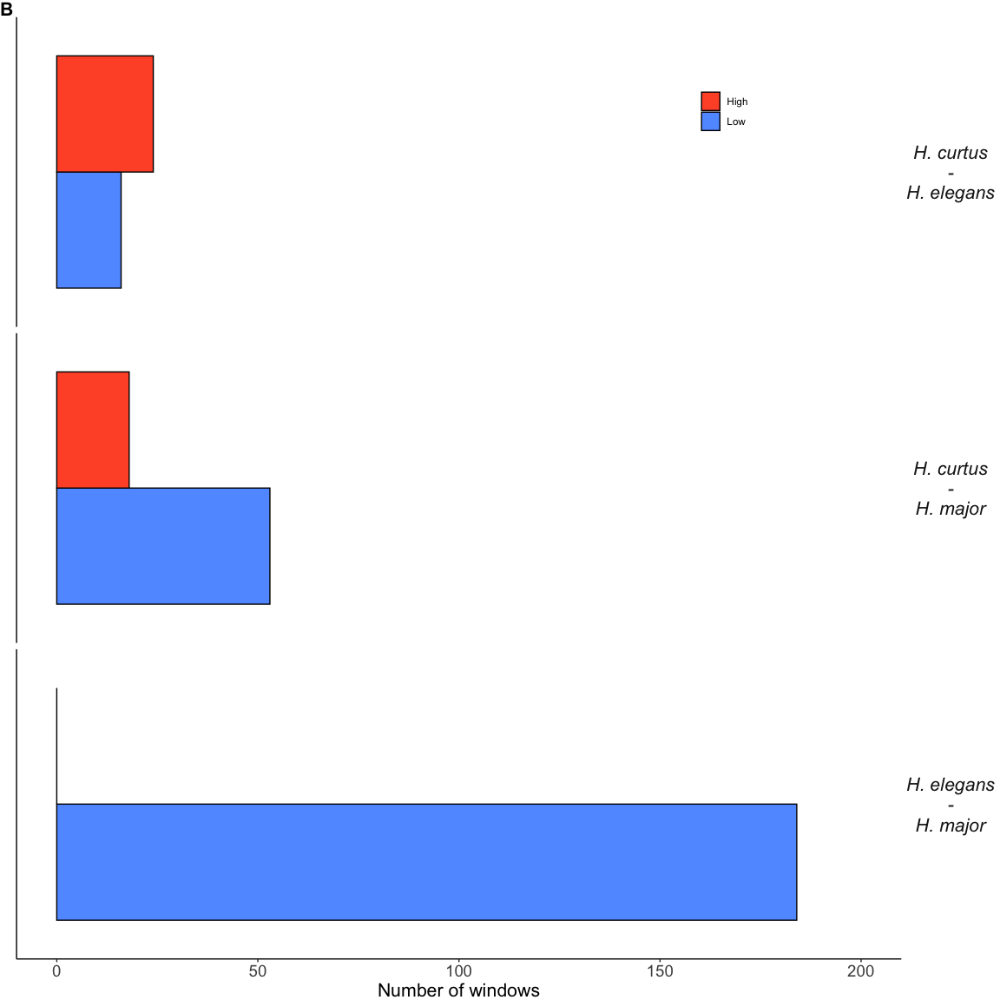

Diversity statistics
================
Alastair Ludington
2025-03-30

- [Data](#data)
- [Diveristy statistics summary](#diveristy-statistics-summary)
- [Correlations of diversity
  statistics](#correlations-of-diversity-statistics)
  - [Within-species correlations](#within-species-correlations)
  - [Between species correlations](#between-species-correlations)
- [Genome scans](#genome-scans)
  - [High/low divergence regions](#highlow-divergence-regions)
  - [Elevated low-divergence windows identified on chromosome
    2](#elevated-low-divergence-windows-identified-on-chromosome-2)
  - [Distribution across the genome
    (genome-scan)](#distribution-across-the-genome-genome-scan)
- [Divergence profiling](#divergence-profiling)
  - [Overlay divergence profiles with genome
    scan](#overlay-divergence-profiles-with-genome-scan)
- [High-divergence windows correspond with
  centromeres](#high-divergence-windows-correspond-with-centromeres)
  - [Overlay diversity/profiling with centromere
    predictions](#overlay-diversityprofiling-with-centromere-predictions)
- [Main text figure](#main-text-figure)

All analyses relating to intra and inter-species diversity and
divergence are found in this document.

Windowed calculations of π, F<sub>ST</sub> and d<sub>XY</sub> were
calculated using the program Pixy, while genome-wide average
F<sub>ST</sub> was calculated using VCFtools.

## Data

First thing, I load all the data into a single dataframe. I use the
d<sub>XY</sub> and π outputs to filter the F<sub>ST</sub>, requiring
that all windows have adequate called sites to be included in the final
output. Specifically, F<sub>ST</sub> doesn’t report number of sites, so
I need to use the other datasets to remove aberrant windows.

``` r
df_fst <- dir_ls(
  path = here("results", "03-diversity-statistics", "between-species"), 
  glob = "*fst.txt"
) |>
  read_tsv(col_types = cols()) |>
  mutate(
    comparison = paste(pop1, pop2, sep = '-'), 
    chromosome = as.numeric(str_remove(chromosome, 'chr')),
    chromosome = factor(chromosome, levels = 1:15),
    .before = pop1
  ) |>
  filter(!is.na(avg_wc_fst)) |>
  arrange(comparison, chromosome, window_pos_1)

df_dxy <- dir_ls(
  path = here("results", "03-diversity-statistics", "between-species"),
  glob = "*dxy*"
) |>
  read_tsv(col_types = cols()) |>
  mutate(
    chromosome = as.numeric(str_remove(chromosome, 'chr')),
    chromosome = factor(chromosome, levels = 1:15),
    comparison = paste(pop1, pop2, sep = '-'),
    .before = pop1
  ) |>
  filter(!is.na(avg_dxy), no_sites >= 5000) |>
  arrange(chromosome, window_pos_1)

df_pi <- dir_ls(
  path = here("results", "03-diversity-statistics", "within-species"),
  glob = "*pi*"
) |>
  read_tsv(col_types = cols()) |>
  filter(!is.na(avg_pi), no_sites >= 5000) |>
  arrange(pop, chromosome, window_pos_1) |>
  mutate(
    chromosome = as.numeric(str_remove(chromosome, 'chr')),
    chromosome = factor(chromosome, levels = 1:15)
  )

df_data <- inner_join(df_fst, df_dxy)

# Tajima's D genome-wide (from SFS data)
sfs_tajD <- read_csv(
  here("results", "02-demography", "sfs-tajimas-D.csv"), 
  col_types = cols()
) |>
  rename(pop = Species, `Tajimas D` = tajimasD_sfs) |>
  mutate(
    pop = case_when(
      pop == "H. curtus" ~ "HCU",
      pop == "H. major" ~ "HMA",
      pop == "H. elegans" ~ "HEL"
    )
  )

# Genome wide avg. Fst from VCFtools
df_fst_genome <- read_csv(
  file = here("results", "03-diversity-statistics", "between-species", "fst-genome_wide.csv"),
  col_names = TRUE,
  col_types = cols()
) |>
  rename(comparison = Comparison) |>
  select(-nSites)
```

## Diveristy statistics summary

Below I generate genome-wide averages for π, Tajima’s D, d<sub>XY</sub>
and F<sub>ST</sub>. Tajima’s D values are generated in the
`02-demography` section. The F<sub>ST</sub> estimates are returned by
`VCFtools` at run time.

``` r
# Dxy genome-wide average
gw_dxy <- df_data |>
  summarise(Dxy = sum(count_diffs)/sum(count_comparisons), .by = comparison)

# Nucleotide (pi) genome-wide average
gw_pi <- df_pi |>
  summarise(pi = sum(count_diffs)/sum(count_comparisons), .by = pop)

# Join within species measures
gw_within <- gw_pi |>
  left_join(sfs_tajD) |>
  select(-int)

# Join between species measures
gw_between <- gw_dxy |>
  left_join(df_fst_genome)

# Print to screen
bind_cols(gw_within, gw_between) |>
  rename(Species = pop, Comparison = comparison) |>
  mutate(
    Species = case_when(
      Species == "HCU" ~ "H. curtus",
      Species == "HMA" ~ "H. major",
      Species == "HEL" ~ "H. elegans",
    ),
    Comparison = case_when(
      Comparison == "HCU-HEL" ~ "H. curtus - H. elegans",
      Comparison == "HCU-HMA" ~ "H. curtus - H. major",
      Comparison == "HEL-HMA" ~ "H. elegans - H. major",
    )
  ) |>
  gt() |>
  tab_spanner(
    label = md("**Within populations**"),
    columns = 1:3
  ) |>
  tab_spanner(
    label = md("**Between populations**"),
    columns = 4:7
  ) |>
  fmt_number(
    columns = c(2, 3, 5, 6, 7),
    n_sigfig = 2
  ) |>
  cols_label(
    pi = md("π"),
    Dxy = md("d~XY~"),
    Fst = md("F~ST~"),
    `Fst (weighted)` = md("F~ST~ (weighted)")
  ) |>
  cols_align(
    align = "center",
    columns = c(2, 3, 5, 6, 7)
  ) |>
  as_raw_html()
```

<div id="amwvdeltnl" style="padding-left:0px;padding-right:0px;padding-top:10px;padding-bottom:10px;overflow-x:auto;overflow-y:auto;width:auto;height:auto;">
  &#10;  <table class="gt_table" data-quarto-disable-processing="false" data-quarto-bootstrap="false" style="-webkit-font-smoothing: antialiased; -moz-osx-font-smoothing: grayscale; font-family: system-ui, 'Segoe UI', Roboto, Helvetica, Arial, sans-serif, 'Apple Color Emoji', 'Segoe UI Emoji', 'Segoe UI Symbol', 'Noto Color Emoji'; display: table; border-collapse: collapse; line-height: normal; margin-left: auto; margin-right: auto; color: #333333; font-size: 16px; font-weight: normal; font-style: normal; background-color: #FFFFFF; width: auto; border-top-style: solid; border-top-width: 2px; border-top-color: #A8A8A8; border-right-style: none; border-right-width: 2px; border-right-color: #D3D3D3; border-bottom-style: solid; border-bottom-width: 2px; border-bottom-color: #A8A8A8; border-left-style: none; border-left-width: 2px; border-left-color: #D3D3D3;" bgcolor="#FFFFFF">
  <thead style="border-style: none;">
    <tr class="gt_col_headings gt_spanner_row" style="border-style: none; border-top-style: solid; border-top-width: 2px; border-top-color: #D3D3D3; border-bottom-width: 2px; border-bottom-color: #D3D3D3; border-left-style: none; border-left-width: 1px; border-left-color: #D3D3D3; border-right-style: none; border-right-width: 1px; border-right-color: #D3D3D3; border-bottom-style: hidden;">
      <th class="gt_center gt_columns_top_border gt_column_spanner_outer" rowspan="1" colspan="3" scope="colgroup" id="**Within populations**" style="border-style: none; color: #333333; background-color: #FFFFFF; font-size: 100%; font-weight: normal; text-transform: inherit; padding-top: 0; padding-bottom: 0; padding-right: 4px; text-align: center; padding-left: 0;" bgcolor="#FFFFFF" align="center">
        <div class="gt_column_spanner" style="border-bottom-style: solid; border-bottom-width: 2px; border-bottom-color: #D3D3D3; vertical-align: bottom; padding-top: 5px; padding-bottom: 5px; overflow-x: hidden; display: inline-block; width: 100%;"><span class="gt_from_md"><strong style="margin-top: 0; margin-bottom: 0;">Within populations</strong></span></div>
      </th>
      <th class="gt_center gt_columns_top_border gt_column_spanner_outer" rowspan="1" colspan="4" scope="colgroup" id="**Between populations**" style="border-style: none; color: #333333; background-color: #FFFFFF; font-size: 100%; font-weight: normal; text-transform: inherit; padding-top: 0; padding-bottom: 0; padding-left: 4px; text-align: center; padding-right: 0;" bgcolor="#FFFFFF" align="center">
        <div class="gt_column_spanner" style="border-bottom-style: solid; border-bottom-width: 2px; border-bottom-color: #D3D3D3; vertical-align: bottom; padding-top: 5px; padding-bottom: 5px; overflow-x: hidden; display: inline-block; width: 100%;"><span class="gt_from_md"><strong style="margin-top: 0; margin-bottom: 0;">Between populations</strong></span></div>
      </th>
    </tr>
    <tr class="gt_col_headings" style="border-style: none; border-top-style: solid; border-top-width: 2px; border-top-color: #D3D3D3; border-bottom-style: solid; border-bottom-width: 2px; border-bottom-color: #D3D3D3; border-left-style: none; border-left-width: 1px; border-left-color: #D3D3D3; border-right-style: none; border-right-width: 1px; border-right-color: #D3D3D3;">
      <th class="gt_col_heading gt_columns_bottom_border gt_left" rowspan="1" colspan="1" scope="col" id="Species" style="border-style: none; color: #333333; background-color: #FFFFFF; font-size: 100%; font-weight: normal; text-transform: inherit; border-left-style: none; border-left-width: 1px; border-left-color: #D3D3D3; border-right-style: none; border-right-width: 1px; border-right-color: #D3D3D3; vertical-align: bottom; padding-top: 5px; padding-bottom: 6px; padding-left: 5px; padding-right: 5px; overflow-x: hidden; text-align: left;" bgcolor="#FFFFFF" valign="bottom" align="left">Species</th>
      <th class="gt_col_heading gt_columns_bottom_border gt_center" rowspan="1" colspan="1" scope="col" id="pi" style="border-style: none; color: #333333; background-color: #FFFFFF; font-size: 100%; font-weight: normal; text-transform: inherit; border-left-style: none; border-left-width: 1px; border-left-color: #D3D3D3; border-right-style: none; border-right-width: 1px; border-right-color: #D3D3D3; vertical-align: bottom; padding-top: 5px; padding-bottom: 6px; padding-left: 5px; padding-right: 5px; overflow-x: hidden; text-align: center;" bgcolor="#FFFFFF" valign="bottom" align="center"><span class="gt_from_md">π</span></th>
      <th class="gt_col_heading gt_columns_bottom_border gt_center" rowspan="1" colspan="1" scope="col" id="Tajimas-D" style="border-style: none; color: #333333; background-color: #FFFFFF; font-size: 100%; font-weight: normal; text-transform: inherit; border-left-style: none; border-left-width: 1px; border-left-color: #D3D3D3; border-right-style: none; border-right-width: 1px; border-right-color: #D3D3D3; vertical-align: bottom; padding-top: 5px; padding-bottom: 6px; padding-left: 5px; padding-right: 5px; overflow-x: hidden; text-align: center;" bgcolor="#FFFFFF" valign="bottom" align="center">Tajimas D</th>
      <th class="gt_col_heading gt_columns_bottom_border gt_left" rowspan="1" colspan="1" scope="col" id="Comparison" style="border-style: none; color: #333333; background-color: #FFFFFF; font-size: 100%; font-weight: normal; text-transform: inherit; border-left-style: none; border-left-width: 1px; border-left-color: #D3D3D3; border-right-style: none; border-right-width: 1px; border-right-color: #D3D3D3; vertical-align: bottom; padding-top: 5px; padding-bottom: 6px; padding-left: 5px; padding-right: 5px; overflow-x: hidden; text-align: left;" bgcolor="#FFFFFF" valign="bottom" align="left">Comparison</th>
      <th class="gt_col_heading gt_columns_bottom_border gt_center" rowspan="1" colspan="1" scope="col" id="Dxy" style="border-style: none; color: #333333; background-color: #FFFFFF; font-size: 100%; font-weight: normal; text-transform: inherit; border-left-style: none; border-left-width: 1px; border-left-color: #D3D3D3; border-right-style: none; border-right-width: 1px; border-right-color: #D3D3D3; vertical-align: bottom; padding-top: 5px; padding-bottom: 6px; padding-left: 5px; padding-right: 5px; overflow-x: hidden; text-align: center;" bgcolor="#FFFFFF" valign="bottom" align="center"><span class="gt_from_md">d<sub style="margin-top: 0; margin-bottom: 0;">XY</sub></span></th>
      <th class="gt_col_heading gt_columns_bottom_border gt_center" rowspan="1" colspan="1" scope="col" id="Fst" style="border-style: none; color: #333333; background-color: #FFFFFF; font-size: 100%; font-weight: normal; text-transform: inherit; border-left-style: none; border-left-width: 1px; border-left-color: #D3D3D3; border-right-style: none; border-right-width: 1px; border-right-color: #D3D3D3; vertical-align: bottom; padding-top: 5px; padding-bottom: 6px; padding-left: 5px; padding-right: 5px; overflow-x: hidden; text-align: center;" bgcolor="#FFFFFF" valign="bottom" align="center"><span class="gt_from_md">F<sub style="margin-top: 0; margin-bottom: 0;">ST</sub></span></th>
      <th class="gt_col_heading gt_columns_bottom_border gt_center" rowspan="1" colspan="1" scope="col" id="Fst-(weighted)" style="border-style: none; color: #333333; background-color: #FFFFFF; font-size: 100%; font-weight: normal; text-transform: inherit; border-left-style: none; border-left-width: 1px; border-left-color: #D3D3D3; border-right-style: none; border-right-width: 1px; border-right-color: #D3D3D3; vertical-align: bottom; padding-top: 5px; padding-bottom: 6px; padding-left: 5px; padding-right: 5px; overflow-x: hidden; text-align: center;" bgcolor="#FFFFFF" valign="bottom" align="center"><span class="gt_from_md">F<sub style="margin-top: 0; margin-bottom: 0;">ST</sub> (weighted)</span></th>
    </tr>
  </thead>
  <tbody class="gt_table_body" style="border-style: none; border-top-style: solid; border-top-width: 2px; border-top-color: #D3D3D3; border-bottom-style: solid; border-bottom-width: 2px; border-bottom-color: #D3D3D3;">
    <tr style="border-style: none;"><td headers="Species" class="gt_row gt_left" style="border-style: none; padding-top: 8px; padding-bottom: 8px; padding-left: 5px; padding-right: 5px; margin: 10px; border-top-style: solid; border-top-width: 1px; border-top-color: #D3D3D3; border-left-style: none; border-left-width: 1px; border-left-color: #D3D3D3; border-right-style: none; border-right-width: 1px; border-right-color: #D3D3D3; vertical-align: middle; overflow-x: hidden; text-align: left;" valign="middle" align="left">H. curtus</td>
<td headers="pi" class="gt_row gt_center" style="border-style: none; padding-top: 8px; padding-bottom: 8px; padding-left: 5px; padding-right: 5px; margin: 10px; border-top-style: solid; border-top-width: 1px; border-top-color: #D3D3D3; border-left-style: none; border-left-width: 1px; border-left-color: #D3D3D3; border-right-style: none; border-right-width: 1px; border-right-color: #D3D3D3; vertical-align: middle; overflow-x: hidden; text-align: center;" valign="middle" align="center">0.0028</td>
<td headers="Tajimas D" class="gt_row gt_center" style="border-style: none; padding-top: 8px; padding-bottom: 8px; padding-left: 5px; padding-right: 5px; margin: 10px; border-top-style: solid; border-top-width: 1px; border-top-color: #D3D3D3; border-left-style: none; border-left-width: 1px; border-left-color: #D3D3D3; border-right-style: none; border-right-width: 1px; border-right-color: #D3D3D3; vertical-align: middle; overflow-x: hidden; text-align: center;" valign="middle" align="center">−0.57</td>
<td headers="Comparison" class="gt_row gt_left" style="border-style: none; padding-top: 8px; padding-bottom: 8px; padding-left: 5px; padding-right: 5px; margin: 10px; border-top-style: solid; border-top-width: 1px; border-top-color: #D3D3D3; border-left-style: none; border-left-width: 1px; border-left-color: #D3D3D3; border-right-style: none; border-right-width: 1px; border-right-color: #D3D3D3; vertical-align: middle; overflow-x: hidden; text-align: left;" valign="middle" align="left">H. curtus - H. elegans</td>
<td headers="Dxy" class="gt_row gt_center" style="border-style: none; padding-top: 8px; padding-bottom: 8px; padding-left: 5px; padding-right: 5px; margin: 10px; border-top-style: solid; border-top-width: 1px; border-top-color: #D3D3D3; border-left-style: none; border-left-width: 1px; border-left-color: #D3D3D3; border-right-style: none; border-right-width: 1px; border-right-color: #D3D3D3; vertical-align: middle; overflow-x: hidden; text-align: center;" valign="middle" align="center">0.0055</td>
<td headers="Fst" class="gt_row gt_center" style="border-style: none; padding-top: 8px; padding-bottom: 8px; padding-left: 5px; padding-right: 5px; margin: 10px; border-top-style: solid; border-top-width: 1px; border-top-color: #D3D3D3; border-left-style: none; border-left-width: 1px; border-left-color: #D3D3D3; border-right-style: none; border-right-width: 1px; border-right-color: #D3D3D3; vertical-align: middle; overflow-x: hidden; text-align: center;" valign="middle" align="center">0.25</td>
<td headers="Fst (weighted)" class="gt_row gt_center" style="border-style: none; padding-top: 8px; padding-bottom: 8px; padding-left: 5px; padding-right: 5px; margin: 10px; border-top-style: solid; border-top-width: 1px; border-top-color: #D3D3D3; border-left-style: none; border-left-width: 1px; border-left-color: #D3D3D3; border-right-style: none; border-right-width: 1px; border-right-color: #D3D3D3; vertical-align: middle; overflow-x: hidden; text-align: center;" valign="middle" align="center">0.54</td></tr>
    <tr style="border-style: none;"><td headers="Species" class="gt_row gt_left" style="border-style: none; padding-top: 8px; padding-bottom: 8px; padding-left: 5px; padding-right: 5px; margin: 10px; border-top-style: solid; border-top-width: 1px; border-top-color: #D3D3D3; border-left-style: none; border-left-width: 1px; border-left-color: #D3D3D3; border-right-style: none; border-right-width: 1px; border-right-color: #D3D3D3; vertical-align: middle; overflow-x: hidden; text-align: left;" valign="middle" align="left">H. elegans</td>
<td headers="pi" class="gt_row gt_center" style="border-style: none; padding-top: 8px; padding-bottom: 8px; padding-left: 5px; padding-right: 5px; margin: 10px; border-top-style: solid; border-top-width: 1px; border-top-color: #D3D3D3; border-left-style: none; border-left-width: 1px; border-left-color: #D3D3D3; border-right-style: none; border-right-width: 1px; border-right-color: #D3D3D3; vertical-align: middle; overflow-x: hidden; text-align: center;" valign="middle" align="center">0.0023</td>
<td headers="Tajimas D" class="gt_row gt_center" style="border-style: none; padding-top: 8px; padding-bottom: 8px; padding-left: 5px; padding-right: 5px; margin: 10px; border-top-style: solid; border-top-width: 1px; border-top-color: #D3D3D3; border-left-style: none; border-left-width: 1px; border-left-color: #D3D3D3; border-right-style: none; border-right-width: 1px; border-right-color: #D3D3D3; vertical-align: middle; overflow-x: hidden; text-align: center;" valign="middle" align="center">−0.40</td>
<td headers="Comparison" class="gt_row gt_left" style="border-style: none; padding-top: 8px; padding-bottom: 8px; padding-left: 5px; padding-right: 5px; margin: 10px; border-top-style: solid; border-top-width: 1px; border-top-color: #D3D3D3; border-left-style: none; border-left-width: 1px; border-left-color: #D3D3D3; border-right-style: none; border-right-width: 1px; border-right-color: #D3D3D3; vertical-align: middle; overflow-x: hidden; text-align: left;" valign="middle" align="left">H. curtus - H. major</td>
<td headers="Dxy" class="gt_row gt_center" style="border-style: none; padding-top: 8px; padding-bottom: 8px; padding-left: 5px; padding-right: 5px; margin: 10px; border-top-style: solid; border-top-width: 1px; border-top-color: #D3D3D3; border-left-style: none; border-left-width: 1px; border-left-color: #D3D3D3; border-right-style: none; border-right-width: 1px; border-right-color: #D3D3D3; vertical-align: middle; overflow-x: hidden; text-align: center;" valign="middle" align="center">0.0057</td>
<td headers="Fst" class="gt_row gt_center" style="border-style: none; padding-top: 8px; padding-bottom: 8px; padding-left: 5px; padding-right: 5px; margin: 10px; border-top-style: solid; border-top-width: 1px; border-top-color: #D3D3D3; border-left-style: none; border-left-width: 1px; border-left-color: #D3D3D3; border-right-style: none; border-right-width: 1px; border-right-color: #D3D3D3; vertical-align: middle; overflow-x: hidden; text-align: center;" valign="middle" align="center">0.28</td>
<td headers="Fst (weighted)" class="gt_row gt_center" style="border-style: none; padding-top: 8px; padding-bottom: 8px; padding-left: 5px; padding-right: 5px; margin: 10px; border-top-style: solid; border-top-width: 1px; border-top-color: #D3D3D3; border-left-style: none; border-left-width: 1px; border-left-color: #D3D3D3; border-right-style: none; border-right-width: 1px; border-right-color: #D3D3D3; vertical-align: middle; overflow-x: hidden; text-align: center;" valign="middle" align="center">0.60</td></tr>
    <tr style="border-style: none;"><td headers="Species" class="gt_row gt_left" style="border-style: none; padding-top: 8px; padding-bottom: 8px; padding-left: 5px; padding-right: 5px; margin: 10px; border-top-style: solid; border-top-width: 1px; border-top-color: #D3D3D3; border-left-style: none; border-left-width: 1px; border-left-color: #D3D3D3; border-right-style: none; border-right-width: 1px; border-right-color: #D3D3D3; vertical-align: middle; overflow-x: hidden; text-align: left;" valign="middle" align="left">H. major</td>
<td headers="pi" class="gt_row gt_center" style="border-style: none; padding-top: 8px; padding-bottom: 8px; padding-left: 5px; padding-right: 5px; margin: 10px; border-top-style: solid; border-top-width: 1px; border-top-color: #D3D3D3; border-left-style: none; border-left-width: 1px; border-left-color: #D3D3D3; border-right-style: none; border-right-width: 1px; border-right-color: #D3D3D3; vertical-align: middle; overflow-x: hidden; text-align: center;" valign="middle" align="center">0.0018</td>
<td headers="Tajimas D" class="gt_row gt_center" style="border-style: none; padding-top: 8px; padding-bottom: 8px; padding-left: 5px; padding-right: 5px; margin: 10px; border-top-style: solid; border-top-width: 1px; border-top-color: #D3D3D3; border-left-style: none; border-left-width: 1px; border-left-color: #D3D3D3; border-right-style: none; border-right-width: 1px; border-right-color: #D3D3D3; vertical-align: middle; overflow-x: hidden; text-align: center;" valign="middle" align="center">−0.53</td>
<td headers="Comparison" class="gt_row gt_left" style="border-style: none; padding-top: 8px; padding-bottom: 8px; padding-left: 5px; padding-right: 5px; margin: 10px; border-top-style: solid; border-top-width: 1px; border-top-color: #D3D3D3; border-left-style: none; border-left-width: 1px; border-left-color: #D3D3D3; border-right-style: none; border-right-width: 1px; border-right-color: #D3D3D3; vertical-align: middle; overflow-x: hidden; text-align: left;" valign="middle" align="left">H. elegans - H. major</td>
<td headers="Dxy" class="gt_row gt_center" style="border-style: none; padding-top: 8px; padding-bottom: 8px; padding-left: 5px; padding-right: 5px; margin: 10px; border-top-style: solid; border-top-width: 1px; border-top-color: #D3D3D3; border-left-style: none; border-left-width: 1px; border-left-color: #D3D3D3; border-right-style: none; border-right-width: 1px; border-right-color: #D3D3D3; vertical-align: middle; overflow-x: hidden; text-align: center;" valign="middle" align="center">0.0058</td>
<td headers="Fst" class="gt_row gt_center" style="border-style: none; padding-top: 8px; padding-bottom: 8px; padding-left: 5px; padding-right: 5px; margin: 10px; border-top-style: solid; border-top-width: 1px; border-top-color: #D3D3D3; border-left-style: none; border-left-width: 1px; border-left-color: #D3D3D3; border-right-style: none; border-right-width: 1px; border-right-color: #D3D3D3; vertical-align: middle; overflow-x: hidden; text-align: center;" valign="middle" align="center">0.33</td>
<td headers="Fst (weighted)" class="gt_row gt_center" style="border-style: none; padding-top: 8px; padding-bottom: 8px; padding-left: 5px; padding-right: 5px; margin: 10px; border-top-style: solid; border-top-width: 1px; border-top-color: #D3D3D3; border-left-style: none; border-left-width: 1px; border-left-color: #D3D3D3; border-right-style: none; border-right-width: 1px; border-right-color: #D3D3D3; vertical-align: middle; overflow-x: hidden; text-align: center;" valign="middle" align="center">0.65</td></tr>
  </tbody>
  &#10;  
</table>
</div>

## Correlations of diversity statistics

Here we’ll correlate diversity statistics within species and between
species.

### Within-species correlations

First, we calculate average-π between **two samples** per-window. This
is not and average π estimate **within** a sample. This is so we can
compare π to other pair-wise statistics (d<sub>XY</sub> and
F<sub>ST</sub>).

``` r
comparisons_within <- list(c("HCU", "HEL"), c("HCU", "HMA"), c("HEL", "HMA"))
pairwise_pi <- map(comparisons_within, \(spec) {
  df_pi |>
    filter(pop %in% spec) |>
    select(chromosome, window_pos_1, window_pos_2, count_diffs, count_comparisons) |>
    summarise(
      count_diffs = sum(count_diffs),
      count_comparisons = sum(count_comparisons),
      .by = c(chromosome, window_pos_1, window_pos_2)
    ) |>
    mutate(
      avg_pi = count_diffs/count_comparisons,
      comparison = paste(spec, collapse = "-")
    )
}) |>
  bind_rows() |>
  select(comparison, chromosome, starts_with('window'), avg_pi)

# Update dataframe with avg. pi beween species 
df_data <- df_data |>
  left_join(pairwise_pi)

# Custom labelling
df_data <- df_data |>
  mutate(
    comp_label = case_when(
      comparison == "HCU-HEL" ~ "H. curtus\n-\nH. elegans",
      comparison == "HCU-HMA" ~ "H. curtus\n-\nH. major",
      comparison == "HEL-HMA" ~ "H. elegans\n-\nH. major"
    ),
    .before = pop1
  )
```

Within species correlations are performed to explore the relationship
between different diversity statistics.

``` r
# Fst vs Dxy
plot_scatter_fst_dxy <- df_data |>
  ggplot(aes(x = avg_wc_fst, y = avg_dxy)) +
  geom_point(colour = 'grey80') +
  geom_smooth(method = 'lm', colour = "black") +
  ggpubr::stat_cor(
    digits = 3,
    label.x.npc = "left",
    label.y.npc = 0.9,
    p.accuracy = 0.001,
    show.legend = FALSE,
    cor.coef.name = "r",
    size = 4
  ) +
  scale_x_continuous(
    limits = c(0,1), 
    breaks = c(0, 0.5, 1), 
    labels = c("0", "0.5", "1"),
    expand = c(0.01, 0)
  ) +
  scale_y_continuous(
    limits = c(0, 0.05), 
    breaks = seq(0, 0.05, 0.025), 
    labels = as.character(seq(0, 0.05, 0.025)),
    expand = c(0.02, 0)
  ) +
  labs(
    x = bquote(F[ST]),
    y = bquote(d[XY])
  ) +
  # theme_bw() +
  ggh4x::facet_wrap2(vars(comp_label), axes = "all", nrow = 3) +
  theme(
    strip.background = element_blank(),
    strip.text = element_blank(),
    panel.grid.major = element_blank(),
    panel.grid.minor = element_blank(),
    panel.background = element_blank()
  )

# Avg. pi vs Fst
plot_scatter_pi_fst <- df_data |>
  ggplot(aes(x = avg_pi, y = avg_wc_fst)) +
  geom_point(colour = 'grey80') +
  geom_smooth(method = 'lm', na.rm = TRUE, colour = "black") +
  ggpubr::stat_cor(
    digits = 3,
    label.x.npc = 0.3,
    label.y.npc = 0.9,
    p.accuracy = 0.001,
    show.legend = FALSE,
    cor.coef.name = "r",
    size = 4
  ) +
  scale_x_continuous(
    limits = c(0, 0.032),
    breaks = seq(0, 0.032, 0.01),
    labels = as.character(seq(0, 0.032, 0.01)),
    expand = c(0.01, 0)
  ) +
  scale_y_continuous(
    breaks = c(0, 0.5, 1),
    labels = c("0", "0.5", "1"),
    limits = c(0, 1),
    expand = c(0.02, 0)
  ) +
  labs(
    x = "Average \U03C0",
    y = bquote(F[ST])
  ) +
  # theme_bw() +
  ggh4x::facet_wrap2(facets = vars(comp_label), axes = "all", nrow = 3) +
  theme(
    strip.background = element_blank(),
    strip.text = element_blank(),
    panel.grid.major = element_blank(),
    panel.grid.minor = element_blank(),
    # panel.border = element_blank(),
    panel.background = element_blank(),
    # axis.line = element_line(colour = "black", linewidth = 0.7)
  )

# Avg. pi vs Dxy
plot_scatter_pi_dxy <- df_data |>
  ggplot(aes(x = avg_pi, y = avg_dxy, colour = avg_wc_fst)) +
  geom_point() +
  geom_smooth(method = 'lm', colour = "black") +
  ggpubr::stat_cor(
    digits = 3,
    label.x.npc = "left",
    label.y.npc = 0.9,
    p.accuracy = 0.001,
    show.legend = FALSE,
    cor.coef.name = "r",
    size = 4
  ) +
  scale_colour_gradientn(
    colours = c("grey90", "grey80", "grey70", "#f3722c"),
    values = c(0, 0.25, 0.5, 0.75, 1),
    breaks = c(0, 0.25, 0.5, 0.75, 1),
    labels = c("0", "0.25", "0.5", "0.75", "1"),
    limits = c(0, 1)
  ) +
  scale_y_continuous(
    limits = c(0, 0.05), 
    breaks = seq(0, 0.05, 0.025), 
    labels = as.character(seq(0, 0.05, 0.025)),
    expand = c(0.02, 0)
  ) +
  scale_x_continuous(
    limits = c(0, 0.032), 
    breaks = seq(0, 0.032, 0.01), 
    labels = as.character(seq(0, 0.032, 0.01)),
    expand = c(0.01, 0)
  ) +
  labs(
    x = "Average \U03C0",
    y = bquote(d[XY]),
    colour = bquote(F[ST])
  ) +
  # theme_bw() +
  ggh4x::facet_grid2(rows = vars(comp_label), axes = "all") +
  theme(
    strip.text = element_text(size = 18),
    panel.grid.major = element_blank(),
    panel.grid.minor = element_blank(),
    panel.background = element_blank()
  )

# Join them all together
plot_correlation_within <- (plot_scatter_fst_dxy + plot_scatter_pi_fst + plot_scatter_pi_dxy ) +
  plot_annotation(tag_levels = 'A') &
  theme(
    axis.text = element_text(size = 16),
    axis.title = element_text(size = 18),
    legend.position = 'bottom',
    legend.title = element_text(size = 18),
    legend.text = element_text(size = 16),
    legend.key.width = unit(1, 'cm'),
    strip.text.y = element_text(angle = 270, face = "italic"),
    strip.background = element_blank(),
    plot.tag = element_text(size = 16, face = "bold")
  )

# Export
cairo_pdf(
  filename = here("manuscript", "figures", "figure-3-correlation-within.pdf"),
  width = 14, height = 12,
)
plot_correlation_within
invisible(dev.off())

ragg::agg_png(
  filename = here("manuscript", "figures", "figure-3-correlation-within.png"),
  width = 2000, 
  height = 2000,
  units = "px",
  res = 170
)
plot_correlation_within
invisible(dev.off())

# Display in document
plot_correlation_within
```


### Between species correlations

Between species correlations are performed to see if divergence patterns
at regions of the genome are similar or different between pairs of
species-comparisons. If they report significant positive correlation,
then the same regions of the genome show similar divergence patterns in
each of the pairwise comparisons. The alternate is true for a negative
correlation - the same regions of the genome show different divergence
profiles between different combinations of samples.

``` r
comparisons_between <- list(c("HCU-HEL", "HCU-HMA"), c("HCU-HEL", "HEL-HMA"), c("HCU-HMA","HEL-HMA"))
plot_scatter_between_fst <- imap(comparisons_between, \(comp, idx) {
  
  comp1 <- case_when(
    comp[[1]] == "HCU-HEL" ~ "H. curtus - H. elegans",
    comp[[1]] == "HCU-HMA" ~ "H. curtus - H. major",
    comp[[1]] == "HEL-HMA" ~ "H. elegans - H. major" 
  )
  
  comp2 <- case_when(
    comp[[2]] == "HCU-HEL" ~ "H. curtus - H. elegans",
    comp[[2]] == "HCU-HMA" ~ "H. curtus - H. major",
    comp[[2]] == "HEL-HMA" ~ "H. elegans - H. major" 
  )
  
  # space to left/right top/bottom of figures
  expan <- case_when(
    idx == 1 ~ c(0.01, 0.035),
    idx == 2 ~ c(0.01, 0.035),
    idx == 3 ~ c(0.01, 0.035)
  )
  
  p <- df_data |>
    filter(comparison %in% comp) |>
    select(comparison, chromosome, window_pos_1, avg_wc_fst) |>
    pivot_wider(names_from = comparison, values_from = avg_wc_fst) |>
    ggplot(
      aes(
        x = .data[[comp[1]]],
        y = .data[[comp[2]]]
      )
    ) +
    scale_x_continuous(
      limits = c(0, 1),
      breaks = c(0, 0.5, 1), 
      labels = c("0", "0.5", "1"), 
      expand = expansion(mult = expan)
    ) +
    scale_y_continuous(
      limits = c(0, 1),
      breaks = c(0, 0.5, 1), 
      labels = c("0", "0.5", "1"), 
      expand = expansion(mult = expan)
    ) +
    geom_point(colour = 'grey80') +
    geom_smooth(method = 'lm', colour = "black") +
    ggpubr::stat_cor(
      digits = 3,
      label.x.npc = "left",
      label.y.npc = "top",
      p.accuracy = 0.001,
      show.legend = FALSE,
      cor.coef.name = "r",
      size = 4
    ) +
    labs(
      x = comp1,
      y = comp2
    ) +
    theme_bw() +
    theme(
      axis.text = element_text(size = 16),
      axis.title = element_text(size = 18, face = "italic"),
      axis.title.x = element_blank(),
      panel.grid.major = element_blank(),
      panel.grid.minor = element_blank(),
      panel.border = element_blank(),
      panel.background = element_blank(),
      axis.line = element_line(colour = "black", linewidth = 0.4)
    )
  
  if(idx == 1) {
    p <- p + labs(tag = "A")
  }
  p
})

plot_scatter_between_dxy <- imap(comparisons_between, \(comp, idx) {
  
  comp1 <- case_when(
    comp[[1]] == "HCU-HEL" ~ "H. curtus - H. elegans",
    comp[[1]] == "HCU-HMA" ~ "H. curtus - H. major",
    comp[[1]] == "HEL-HMA" ~ "H. elegans - H. major" 
  )
  
  comp2 <- case_when(
    comp[[2]] == "HCU-HEL" ~ "H. curtus - H. elegans",
    comp[[2]] == "HCU-HMA" ~ "H. curtus - H. major",
    comp[[2]] == "HEL-HMA" ~ "H. elegans - H. major" 
  )
  
  expan <- case_when(
    idx == 1 ~ c(0.01, 0.035),
    idx == 2 ~ c(0.01, 0.035),
    idx == 3 ~ c(0.01, 0.035)
  )
  
  p <- df_data |>
    filter(comparison %in% comp) |>
    select(comparison, chromosome, window_pos_1, avg_dxy) |>
    pivot_wider(names_from = comparison, values_from = avg_dxy) |>
    ggplot(
      aes(
        x = .data[[comp[1]]],
        y = .data[[comp[2]]]
      )
    ) +
    geom_point(colour = 'grey40', alpha = 0.3) +
    geom_smooth(method = 'lm', colour = "black") +
    ggpubr::stat_cor(
      digits = 3,
      label.x.npc = "left",
      label.y.npc = "top",
      p.accuracy = 0.001,
      show.legend = FALSE,
      cor.coef.name = "r",
      size = 4
    ) +
    scale_y_continuous(
      limits = c(0, 0.05), 
      breaks = seq(0, 0.05, 0.01), 
      labels = as.character(seq(0, 0.05, 0.01)),
      expand = expansion(mult = expan)
    ) +
    scale_x_continuous(
      limits = c(0, 0.04), 
      breaks = seq(0, 0.04, 0.01), 
      labels = as.character(seq(0, 0.04, 0.01)),
      expand = expansion(mult = expan)
    ) +
    labs(
      x = comp1,
      y = comp2
    ) +
    theme_bw() +
    theme(
      axis.text = element_text(size = 16),
      axis.title = element_text(size = 18, face = "italic"),
      panel.grid.major = element_blank(),
      panel.grid.minor = element_blank(),
      panel.border = element_blank(),
      panel.background = element_blank(),
      axis.line = element_line(colour = "black", linewidth = 0.4)
    )
  
  if(idx == 1) {
    p <- p + labs(tag = "B")
  }
  p
})

plot_correlation_fst <- wrap_plots(plot_scatter_between_fst)
plot_correlation_dxy <- wrap_plots(plot_scatter_between_dxy)
plot_correlation_between <- (plot_correlation_fst / plot_correlation_dxy) &
  theme(plot.tag = element_text(size = 16, face = "bold"))

# Export
cairo_pdf(
  filename = here("manuscript", "figures", "figure-4-correlation-between.pdf"),
  width = 14, height = 12,
)
plot_correlation_between
invisible(dev.off())

ragg::agg_png(
  filename = here("manuscript", "figures", "figure-4-correlation-between.png"),
  width = 2000, 
  height = 2000,
  units = "px",
  res = 170
)
plot_correlation_between
invisible(dev.off())

# Display in document
plot_correlation_between
```


## Genome scans

Genome scans are used to identify which regions of the genome show
high/low divergence.

### High/low divergence regions

First, the code below is used to Z-normalise windowed estimates of
F<sub>ST</sub> to enable better comparison between datasets. I use the
weighted genome-wide average F<sub>ST</sub> reported by `VCFtools` in
the calculation.

``` r
df_data <- df_data |>
  left_join(
    df_fst_genome |> select(comparison, avg_fst = `Fst (weighted)`)
  ) |>
  mutate(
    zfst = (avg_wc_fst - avg_fst)/sd(avg_wc_fst),
    .by = comparison
  )
```

Windows where ZF<sub>ST</sub> is $\geq$ 3 and $\leq$ -3 are classified
as high- and low-divergence windows, respectively.

``` r
df_data <- df_data |>
  mutate(
    classification = case_when(
      zfst <= -3 ~ 'Low',
      zfst >= 3 ~ 'High',
      .default = 'Background'
    ),
    classification = factor(classification, levels = c("Background", "High", "Low")),
    highlight = ifelse(as.numeric(chromosome) %% 2 == 0, 'even', 'odd')
  )

# Summary of background, low- and high-divergence windows
df_high_low_div_count <- df_data |>
  summarise(count = n(), .by = c("comparison", "classification")) |>
  pivot_wider(names_from = classification, values_from = count)

df_high_low_div_count |>
  gt::gt(rowname_col = "comparison") |>
  gt::sub_missing(missing_text = "-") |>
  gt::fmt_number(columns = 2, sep_mark = ",", drop_trailing_zeros = TRUE)|>
  gt::cols_align(columns = 2:4, align = "center") |>
  gt::tab_style(
    style = gt::cell_text(weight = "bold"),
    locations = gt::cells_column_labels(everything())
  ) |>
  gt::as_raw_html()
```

<div id="pbolydvieh" style="padding-left:0px;padding-right:0px;padding-top:10px;padding-bottom:10px;overflow-x:auto;overflow-y:auto;width:auto;height:auto;">
  &#10;  <table class="gt_table" data-quarto-disable-processing="false" data-quarto-bootstrap="false" style="-webkit-font-smoothing: antialiased; -moz-osx-font-smoothing: grayscale; font-family: system-ui, 'Segoe UI', Roboto, Helvetica, Arial, sans-serif, 'Apple Color Emoji', 'Segoe UI Emoji', 'Segoe UI Symbol', 'Noto Color Emoji'; display: table; border-collapse: collapse; line-height: normal; margin-left: auto; margin-right: auto; color: #333333; font-size: 16px; font-weight: normal; font-style: normal; background-color: #FFFFFF; width: auto; border-top-style: solid; border-top-width: 2px; border-top-color: #A8A8A8; border-right-style: none; border-right-width: 2px; border-right-color: #D3D3D3; border-bottom-style: solid; border-bottom-width: 2px; border-bottom-color: #A8A8A8; border-left-style: none; border-left-width: 2px; border-left-color: #D3D3D3;" bgcolor="#FFFFFF">
  <thead style="border-style: none;">
    <tr class="gt_col_headings" style="border-style: none; border-top-style: solid; border-top-width: 2px; border-top-color: #D3D3D3; border-bottom-style: solid; border-bottom-width: 2px; border-bottom-color: #D3D3D3; border-left-style: none; border-left-width: 1px; border-left-color: #D3D3D3; border-right-style: none; border-right-width: 1px; border-right-color: #D3D3D3;">
      <th class="gt_col_heading gt_columns_bottom_border gt_left" rowspan="1" colspan="1" scope="col" id="a::stub" style="border-style: none; color: #333333; background-color: #FFFFFF; font-size: 100%; font-weight: normal; text-transform: inherit; border-left-style: none; border-left-width: 1px; border-left-color: #D3D3D3; border-right-style: none; border-right-width: 1px; border-right-color: #D3D3D3; vertical-align: bottom; padding-top: 5px; padding-bottom: 6px; padding-left: 5px; padding-right: 5px; overflow-x: hidden; text-align: left;" bgcolor="#FFFFFF" valign="bottom" align="left"></th>
      <th class="gt_col_heading gt_columns_bottom_border gt_center" rowspan="1" colspan="1" style="border-style: none; color: #333333; background-color: #FFFFFF; font-size: 100%; text-transform: inherit; border-left-style: none; border-left-width: 1px; border-left-color: #D3D3D3; border-right-style: none; border-right-width: 1px; border-right-color: #D3D3D3; vertical-align: bottom; padding-top: 5px; padding-bottom: 6px; padding-left: 5px; padding-right: 5px; overflow-x: hidden; text-align: center; font-weight: bold;" scope="col" id="Background" bgcolor="#FFFFFF" valign="bottom" align="center">Background</th>
      <th class="gt_col_heading gt_columns_bottom_border gt_center" rowspan="1" colspan="1" style="border-style: none; color: #333333; background-color: #FFFFFF; font-size: 100%; text-transform: inherit; border-left-style: none; border-left-width: 1px; border-left-color: #D3D3D3; border-right-style: none; border-right-width: 1px; border-right-color: #D3D3D3; vertical-align: bottom; padding-top: 5px; padding-bottom: 6px; padding-left: 5px; padding-right: 5px; overflow-x: hidden; text-align: center; font-weight: bold;" scope="col" id="Low" bgcolor="#FFFFFF" valign="bottom" align="center">Low</th>
      <th class="gt_col_heading gt_columns_bottom_border gt_center" rowspan="1" colspan="1" style="border-style: none; color: #333333; background-color: #FFFFFF; font-size: 100%; text-transform: inherit; border-left-style: none; border-left-width: 1px; border-left-color: #D3D3D3; border-right-style: none; border-right-width: 1px; border-right-color: #D3D3D3; vertical-align: bottom; padding-top: 5px; padding-bottom: 6px; padding-left: 5px; padding-right: 5px; overflow-x: hidden; text-align: center; font-weight: bold;" scope="col" id="High" bgcolor="#FFFFFF" valign="bottom" align="center">High</th>
    </tr>
  </thead>
  <tbody class="gt_table_body" style="border-style: none; border-top-style: solid; border-top-width: 2px; border-top-color: #D3D3D3; border-bottom-style: solid; border-bottom-width: 2px; border-bottom-color: #D3D3D3;">
    <tr style="border-style: none;"><th id="stub_1_1" scope="row" class="gt_row gt_left gt_stub" style="border-style: none; padding-top: 8px; padding-bottom: 8px; margin: 10px; border-top-style: solid; border-top-width: 1px; border-top-color: #D3D3D3; border-left-style: none; border-left-width: 1px; border-left-color: #D3D3D3; vertical-align: middle; overflow-x: hidden; color: #333333; background-color: #FFFFFF; font-size: 100%; font-weight: initial; text-transform: inherit; border-right-style: solid; border-right-width: 2px; border-right-color: #D3D3D3; padding-left: 5px; padding-right: 5px; text-align: left;" valign="middle" bgcolor="#FFFFFF" align="left">HCU-HEL</th>
<td headers="stub_1_1 Background" class="gt_row gt_center" style="border-style: none; padding-top: 8px; padding-bottom: 8px; padding-left: 5px; padding-right: 5px; margin: 10px; border-top-style: solid; border-top-width: 1px; border-top-color: #D3D3D3; border-left-style: none; border-left-width: 1px; border-left-color: #D3D3D3; border-right-style: none; border-right-width: 1px; border-right-color: #D3D3D3; vertical-align: middle; overflow-x: hidden; text-align: center;" valign="middle" align="center">33,521</td>
<td headers="stub_1_1 Low" class="gt_row gt_center" style="border-style: none; padding-top: 8px; padding-bottom: 8px; padding-left: 5px; padding-right: 5px; margin: 10px; border-top-style: solid; border-top-width: 1px; border-top-color: #D3D3D3; border-left-style: none; border-left-width: 1px; border-left-color: #D3D3D3; border-right-style: none; border-right-width: 1px; border-right-color: #D3D3D3; vertical-align: middle; overflow-x: hidden; text-align: center;" valign="middle" align="center">16</td>
<td headers="stub_1_1 High" class="gt_row gt_center" style="border-style: none; padding-top: 8px; padding-bottom: 8px; padding-left: 5px; padding-right: 5px; margin: 10px; border-top-style: solid; border-top-width: 1px; border-top-color: #D3D3D3; border-left-style: none; border-left-width: 1px; border-left-color: #D3D3D3; border-right-style: none; border-right-width: 1px; border-right-color: #D3D3D3; vertical-align: middle; overflow-x: hidden; text-align: center;" valign="middle" align="center">24</td></tr>
    <tr style="border-style: none;"><th id="stub_1_2" scope="row" class="gt_row gt_left gt_stub" style="border-style: none; padding-top: 8px; padding-bottom: 8px; margin: 10px; border-top-style: solid; border-top-width: 1px; border-top-color: #D3D3D3; border-left-style: none; border-left-width: 1px; border-left-color: #D3D3D3; vertical-align: middle; overflow-x: hidden; color: #333333; background-color: #FFFFFF; font-size: 100%; font-weight: initial; text-transform: inherit; border-right-style: solid; border-right-width: 2px; border-right-color: #D3D3D3; padding-left: 5px; padding-right: 5px; text-align: left;" valign="middle" bgcolor="#FFFFFF" align="left">HCU-HMA</th>
<td headers="stub_1_2 Background" class="gt_row gt_center" style="border-style: none; padding-top: 8px; padding-bottom: 8px; padding-left: 5px; padding-right: 5px; margin: 10px; border-top-style: solid; border-top-width: 1px; border-top-color: #D3D3D3; border-left-style: none; border-left-width: 1px; border-left-color: #D3D3D3; border-right-style: none; border-right-width: 1px; border-right-color: #D3D3D3; vertical-align: middle; overflow-x: hidden; text-align: center;" valign="middle" align="center">33,326</td>
<td headers="stub_1_2 Low" class="gt_row gt_center" style="border-style: none; padding-top: 8px; padding-bottom: 8px; padding-left: 5px; padding-right: 5px; margin: 10px; border-top-style: solid; border-top-width: 1px; border-top-color: #D3D3D3; border-left-style: none; border-left-width: 1px; border-left-color: #D3D3D3; border-right-style: none; border-right-width: 1px; border-right-color: #D3D3D3; vertical-align: middle; overflow-x: hidden; text-align: center;" valign="middle" align="center">53</td>
<td headers="stub_1_2 High" class="gt_row gt_center" style="border-style: none; padding-top: 8px; padding-bottom: 8px; padding-left: 5px; padding-right: 5px; margin: 10px; border-top-style: solid; border-top-width: 1px; border-top-color: #D3D3D3; border-left-style: none; border-left-width: 1px; border-left-color: #D3D3D3; border-right-style: none; border-right-width: 1px; border-right-color: #D3D3D3; vertical-align: middle; overflow-x: hidden; text-align: center;" valign="middle" align="center">18</td></tr>
    <tr style="border-style: none;"><th id="stub_1_3" scope="row" class="gt_row gt_left gt_stub" style="border-style: none; padding-top: 8px; padding-bottom: 8px; margin: 10px; border-top-style: solid; border-top-width: 1px; border-top-color: #D3D3D3; border-left-style: none; border-left-width: 1px; border-left-color: #D3D3D3; vertical-align: middle; overflow-x: hidden; color: #333333; background-color: #FFFFFF; font-size: 100%; font-weight: initial; text-transform: inherit; border-right-style: solid; border-right-width: 2px; border-right-color: #D3D3D3; padding-left: 5px; padding-right: 5px; text-align: left;" valign="middle" bgcolor="#FFFFFF" align="left">HEL-HMA</th>
<td headers="stub_1_3 Background" class="gt_row gt_center" style="border-style: none; padding-top: 8px; padding-bottom: 8px; padding-left: 5px; padding-right: 5px; margin: 10px; border-top-style: solid; border-top-width: 1px; border-top-color: #D3D3D3; border-left-style: none; border-left-width: 1px; border-left-color: #D3D3D3; border-right-style: none; border-right-width: 1px; border-right-color: #D3D3D3; vertical-align: middle; overflow-x: hidden; text-align: center;" valign="middle" align="center">33,356</td>
<td headers="stub_1_3 Low" class="gt_row gt_center" style="border-style: none; padding-top: 8px; padding-bottom: 8px; padding-left: 5px; padding-right: 5px; margin: 10px; border-top-style: solid; border-top-width: 1px; border-top-color: #D3D3D3; border-left-style: none; border-left-width: 1px; border-left-color: #D3D3D3; border-right-style: none; border-right-width: 1px; border-right-color: #D3D3D3; vertical-align: middle; overflow-x: hidden; text-align: center;" valign="middle" align="center">184</td>
<td headers="stub_1_3 High" class="gt_row gt_center" style="border-style: none; padding-top: 8px; padding-bottom: 8px; padding-left: 5px; padding-right: 5px; margin: 10px; border-top-style: solid; border-top-width: 1px; border-top-color: #D3D3D3; border-left-style: none; border-left-width: 1px; border-left-color: #D3D3D3; border-right-style: none; border-right-width: 1px; border-right-color: #D3D3D3; vertical-align: middle; overflow-x: hidden; text-align: center;" valign="middle" align="center">-</td></tr>
  </tbody>
  &#10;  
</table>
</div>

Exploring high- and low-divergence windows by chromosome shows the
following distribution.

``` r
df_data |>
  summarise(count = n(), .by = c("comparison", "chromosome", "classification")) |>
  filter(classification != "Background") |>
  pivot_wider(names_from = c(comparison, classification) , values_from = count, names_sep = " ") |>
  gt::gt(rowname_col = "comparison") |>
  gt::fmt_missing(missing_text = "-") |>
  gt::tab_spanner(
    label = "HCU-HEL",
    columns = c(`HCU-HEL Low`, `HCU-HEL High`)
  ) |>
  gt::tab_spanner(
    label = "HCU-HMA",
    columns = c(`HCU-HMA Low`, `HCU-HMA High`)
  ) |>
  gt::tab_spanner(
    label = "HEL-HMA",
    columns = c(`HEL-HMA Low`)
  ) |>
  gt::cols_label(
    `HCU-HEL Low` = "Low",
    `HCU-HEL High` = "High",
    `HCU-HMA Low` = "Low",
    `HCU-HMA High` = "High",
    `HEL-HMA Low` = "Low"
  ) |>
  gt::cols_align(columns = 2:5, align = "center") |>
  gt::cols_align(columns = 6, align = "left") |>
  gt::as_raw_html()
```

<div id="vvzqnfpipe" style="padding-left:0px;padding-right:0px;padding-top:10px;padding-bottom:10px;overflow-x:auto;overflow-y:auto;width:auto;height:auto;">
  &#10;  <table class="gt_table" data-quarto-disable-processing="false" data-quarto-bootstrap="false" style="-webkit-font-smoothing: antialiased; -moz-osx-font-smoothing: grayscale; font-family: system-ui, 'Segoe UI', Roboto, Helvetica, Arial, sans-serif, 'Apple Color Emoji', 'Segoe UI Emoji', 'Segoe UI Symbol', 'Noto Color Emoji'; display: table; border-collapse: collapse; line-height: normal; margin-left: auto; margin-right: auto; color: #333333; font-size: 16px; font-weight: normal; font-style: normal; background-color: #FFFFFF; width: auto; border-top-style: solid; border-top-width: 2px; border-top-color: #A8A8A8; border-right-style: none; border-right-width: 2px; border-right-color: #D3D3D3; border-bottom-style: solid; border-bottom-width: 2px; border-bottom-color: #A8A8A8; border-left-style: none; border-left-width: 2px; border-left-color: #D3D3D3;" bgcolor="#FFFFFF">
  <thead style="border-style: none;">
    <tr class="gt_col_headings gt_spanner_row" style="border-style: none; border-top-style: solid; border-top-width: 2px; border-top-color: #D3D3D3; border-bottom-width: 2px; border-bottom-color: #D3D3D3; border-left-style: none; border-left-width: 1px; border-left-color: #D3D3D3; border-right-style: none; border-right-width: 1px; border-right-color: #D3D3D3; border-bottom-style: hidden;">
      <th class="gt_col_heading gt_columns_bottom_border gt_center" rowspan="2" colspan="1" scope="col" id="chromosome" style="border-style: none; color: #333333; background-color: #FFFFFF; font-size: 100%; font-weight: normal; text-transform: inherit; border-left-style: none; border-left-width: 1px; border-left-color: #D3D3D3; border-right-style: none; border-right-width: 1px; border-right-color: #D3D3D3; vertical-align: bottom; padding-top: 5px; padding-bottom: 6px; padding-left: 5px; padding-right: 5px; overflow-x: hidden; text-align: center;" bgcolor="#FFFFFF" valign="bottom" align="center">chromosome</th>
      <th class="gt_center gt_columns_top_border gt_column_spanner_outer" rowspan="1" colspan="2" scope="colgroup" id="HCU-HEL" style="border-style: none; color: #333333; background-color: #FFFFFF; font-size: 100%; font-weight: normal; text-transform: inherit; padding-top: 0; padding-bottom: 0; padding-left: 4px; padding-right: 4px; text-align: center;" bgcolor="#FFFFFF" align="center">
        <div class="gt_column_spanner" style="border-bottom-style: solid; border-bottom-width: 2px; border-bottom-color: #D3D3D3; vertical-align: bottom; padding-top: 5px; padding-bottom: 5px; overflow-x: hidden; display: inline-block; width: 100%;">HCU-HEL</div>
      </th>
      <th class="gt_center gt_columns_top_border gt_column_spanner_outer" rowspan="1" colspan="2" scope="colgroup" id="HCU-HMA" style="border-style: none; color: #333333; background-color: #FFFFFF; font-size: 100%; font-weight: normal; text-transform: inherit; padding-top: 0; padding-bottom: 0; padding-left: 4px; padding-right: 4px; text-align: center;" bgcolor="#FFFFFF" align="center">
        <div class="gt_column_spanner" style="border-bottom-style: solid; border-bottom-width: 2px; border-bottom-color: #D3D3D3; vertical-align: bottom; padding-top: 5px; padding-bottom: 5px; overflow-x: hidden; display: inline-block; width: 100%;">HCU-HMA</div>
      </th>
      <th class="gt_center gt_columns_top_border gt_column_spanner_outer" rowspan="1" colspan="1" scope="col" id="HEL-HMA" style="border-style: none; color: #333333; background-color: #FFFFFF; font-size: 100%; font-weight: normal; text-transform: inherit; padding-top: 0; padding-bottom: 0; padding-left: 4px; text-align: center; padding-right: 0;" bgcolor="#FFFFFF" align="center">
        <div class="gt_column_spanner" style="border-bottom-style: solid; border-bottom-width: 2px; border-bottom-color: #D3D3D3; vertical-align: bottom; padding-top: 5px; padding-bottom: 5px; overflow-x: hidden; display: inline-block; width: 100%;">HEL-HMA</div>
      </th>
    </tr>
    <tr class="gt_col_headings" style="border-style: none; border-top-style: solid; border-top-width: 2px; border-top-color: #D3D3D3; border-bottom-style: solid; border-bottom-width: 2px; border-bottom-color: #D3D3D3; border-left-style: none; border-left-width: 1px; border-left-color: #D3D3D3; border-right-style: none; border-right-width: 1px; border-right-color: #D3D3D3;">
      <th class="gt_col_heading gt_columns_bottom_border gt_center" rowspan="1" colspan="1" scope="col" id="HCU-HEL-Low" style="border-style: none; color: #333333; background-color: #FFFFFF; font-size: 100%; font-weight: normal; text-transform: inherit; border-left-style: none; border-left-width: 1px; border-left-color: #D3D3D3; border-right-style: none; border-right-width: 1px; border-right-color: #D3D3D3; vertical-align: bottom; padding-top: 5px; padding-bottom: 6px; padding-left: 5px; padding-right: 5px; overflow-x: hidden; text-align: center;" bgcolor="#FFFFFF" valign="bottom" align="center">Low</th>
      <th class="gt_col_heading gt_columns_bottom_border gt_center" rowspan="1" colspan="1" scope="col" id="HCU-HEL-High" style="border-style: none; color: #333333; background-color: #FFFFFF; font-size: 100%; font-weight: normal; text-transform: inherit; border-left-style: none; border-left-width: 1px; border-left-color: #D3D3D3; border-right-style: none; border-right-width: 1px; border-right-color: #D3D3D3; vertical-align: bottom; padding-top: 5px; padding-bottom: 6px; padding-left: 5px; padding-right: 5px; overflow-x: hidden; text-align: center;" bgcolor="#FFFFFF" valign="bottom" align="center">High</th>
      <th class="gt_col_heading gt_columns_bottom_border gt_center" rowspan="1" colspan="1" scope="col" id="HCU-HMA-Low" style="border-style: none; color: #333333; background-color: #FFFFFF; font-size: 100%; font-weight: normal; text-transform: inherit; border-left-style: none; border-left-width: 1px; border-left-color: #D3D3D3; border-right-style: none; border-right-width: 1px; border-right-color: #D3D3D3; vertical-align: bottom; padding-top: 5px; padding-bottom: 6px; padding-left: 5px; padding-right: 5px; overflow-x: hidden; text-align: center;" bgcolor="#FFFFFF" valign="bottom" align="center">Low</th>
      <th class="gt_col_heading gt_columns_bottom_border gt_center" rowspan="1" colspan="1" scope="col" id="HCU-HMA-High" style="border-style: none; color: #333333; background-color: #FFFFFF; font-size: 100%; font-weight: normal; text-transform: inherit; border-left-style: none; border-left-width: 1px; border-left-color: #D3D3D3; border-right-style: none; border-right-width: 1px; border-right-color: #D3D3D3; vertical-align: bottom; padding-top: 5px; padding-bottom: 6px; padding-left: 5px; padding-right: 5px; overflow-x: hidden; text-align: center;" bgcolor="#FFFFFF" valign="bottom" align="center">High</th>
      <th class="gt_col_heading gt_columns_bottom_border gt_left" rowspan="1" colspan="1" scope="col" id="HEL-HMA-Low" style="border-style: none; color: #333333; background-color: #FFFFFF; font-size: 100%; font-weight: normal; text-transform: inherit; border-left-style: none; border-left-width: 1px; border-left-color: #D3D3D3; border-right-style: none; border-right-width: 1px; border-right-color: #D3D3D3; vertical-align: bottom; padding-top: 5px; padding-bottom: 6px; padding-left: 5px; padding-right: 5px; overflow-x: hidden; text-align: left;" bgcolor="#FFFFFF" valign="bottom" align="left">Low</th>
    </tr>
  </thead>
  <tbody class="gt_table_body" style="border-style: none; border-top-style: solid; border-top-width: 2px; border-top-color: #D3D3D3; border-bottom-style: solid; border-bottom-width: 2px; border-bottom-color: #D3D3D3;">
    <tr style="border-style: none;"><td headers="chromosome" class="gt_row gt_center" style="border-style: none; padding-top: 8px; padding-bottom: 8px; padding-left: 5px; padding-right: 5px; margin: 10px; border-top-style: solid; border-top-width: 1px; border-top-color: #D3D3D3; border-left-style: none; border-left-width: 1px; border-left-color: #D3D3D3; border-right-style: none; border-right-width: 1px; border-right-color: #D3D3D3; vertical-align: middle; overflow-x: hidden; text-align: center;" valign="middle" align="center">1</td>
<td headers="HCU-HEL Low" class="gt_row gt_center" style="border-style: none; padding-top: 8px; padding-bottom: 8px; padding-left: 5px; padding-right: 5px; margin: 10px; border-top-style: solid; border-top-width: 1px; border-top-color: #D3D3D3; border-left-style: none; border-left-width: 1px; border-left-color: #D3D3D3; border-right-style: none; border-right-width: 1px; border-right-color: #D3D3D3; vertical-align: middle; overflow-x: hidden; text-align: center;" valign="middle" align="center">3</td>
<td headers="HCU-HEL High" class="gt_row gt_center" style="border-style: none; padding-top: 8px; padding-bottom: 8px; padding-left: 5px; padding-right: 5px; margin: 10px; border-top-style: solid; border-top-width: 1px; border-top-color: #D3D3D3; border-left-style: none; border-left-width: 1px; border-left-color: #D3D3D3; border-right-style: none; border-right-width: 1px; border-right-color: #D3D3D3; vertical-align: middle; overflow-x: hidden; text-align: center;" valign="middle" align="center">3</td>
<td headers="HCU-HMA Low" class="gt_row gt_center" style="border-style: none; padding-top: 8px; padding-bottom: 8px; padding-left: 5px; padding-right: 5px; margin: 10px; border-top-style: solid; border-top-width: 1px; border-top-color: #D3D3D3; border-left-style: none; border-left-width: 1px; border-left-color: #D3D3D3; border-right-style: none; border-right-width: 1px; border-right-color: #D3D3D3; vertical-align: middle; overflow-x: hidden; text-align: center;" valign="middle" align="center">7</td>
<td headers="HCU-HMA High" class="gt_row gt_center" style="border-style: none; padding-top: 8px; padding-bottom: 8px; padding-left: 5px; padding-right: 5px; margin: 10px; border-top-style: solid; border-top-width: 1px; border-top-color: #D3D3D3; border-left-style: none; border-left-width: 1px; border-left-color: #D3D3D3; border-right-style: none; border-right-width: 1px; border-right-color: #D3D3D3; vertical-align: middle; overflow-x: hidden; text-align: center;" valign="middle" align="center">5</td>
<td headers="HEL-HMA Low" class="gt_row gt_left" style="border-style: none; padding-top: 8px; padding-bottom: 8px; padding-left: 5px; padding-right: 5px; margin: 10px; border-top-style: solid; border-top-width: 1px; border-top-color: #D3D3D3; border-left-style: none; border-left-width: 1px; border-left-color: #D3D3D3; border-right-style: none; border-right-width: 1px; border-right-color: #D3D3D3; vertical-align: middle; overflow-x: hidden; text-align: left;" valign="middle" align="left">16</td></tr>
    <tr style="border-style: none;"><td headers="chromosome" class="gt_row gt_center" style="border-style: none; padding-top: 8px; padding-bottom: 8px; padding-left: 5px; padding-right: 5px; margin: 10px; border-top-style: solid; border-top-width: 1px; border-top-color: #D3D3D3; border-left-style: none; border-left-width: 1px; border-left-color: #D3D3D3; border-right-style: none; border-right-width: 1px; border-right-color: #D3D3D3; vertical-align: middle; overflow-x: hidden; text-align: center;" valign="middle" align="center">2</td>
<td headers="HCU-HEL Low" class="gt_row gt_center" style="border-style: none; padding-top: 8px; padding-bottom: 8px; padding-left: 5px; padding-right: 5px; margin: 10px; border-top-style: solid; border-top-width: 1px; border-top-color: #D3D3D3; border-left-style: none; border-left-width: 1px; border-left-color: #D3D3D3; border-right-style: none; border-right-width: 1px; border-right-color: #D3D3D3; vertical-align: middle; overflow-x: hidden; text-align: center;" valign="middle" align="center">12</td>
<td headers="HCU-HEL High" class="gt_row gt_center" style="border-style: none; padding-top: 8px; padding-bottom: 8px; padding-left: 5px; padding-right: 5px; margin: 10px; border-top-style: solid; border-top-width: 1px; border-top-color: #D3D3D3; border-left-style: none; border-left-width: 1px; border-left-color: #D3D3D3; border-right-style: none; border-right-width: 1px; border-right-color: #D3D3D3; vertical-align: middle; overflow-x: hidden; text-align: center;" valign="middle" align="center">2</td>
<td headers="HCU-HMA Low" class="gt_row gt_center" style="border-style: none; padding-top: 8px; padding-bottom: 8px; padding-left: 5px; padding-right: 5px; margin: 10px; border-top-style: solid; border-top-width: 1px; border-top-color: #D3D3D3; border-left-style: none; border-left-width: 1px; border-left-color: #D3D3D3; border-right-style: none; border-right-width: 1px; border-right-color: #D3D3D3; vertical-align: middle; overflow-x: hidden; text-align: center;" valign="middle" align="center">30</td>
<td headers="HCU-HMA High" class="gt_row gt_center" style="border-style: none; padding-top: 8px; padding-bottom: 8px; padding-left: 5px; padding-right: 5px; margin: 10px; border-top-style: solid; border-top-width: 1px; border-top-color: #D3D3D3; border-left-style: none; border-left-width: 1px; border-left-color: #D3D3D3; border-right-style: none; border-right-width: 1px; border-right-color: #D3D3D3; vertical-align: middle; overflow-x: hidden; text-align: center;" valign="middle" align="center">-</td>
<td headers="HEL-HMA Low" class="gt_row gt_left" style="border-style: none; padding-top: 8px; padding-bottom: 8px; padding-left: 5px; padding-right: 5px; margin: 10px; border-top-style: solid; border-top-width: 1px; border-top-color: #D3D3D3; border-left-style: none; border-left-width: 1px; border-left-color: #D3D3D3; border-right-style: none; border-right-width: 1px; border-right-color: #D3D3D3; vertical-align: middle; overflow-x: hidden; text-align: left;" valign="middle" align="left">112</td></tr>
    <tr style="border-style: none;"><td headers="chromosome" class="gt_row gt_center" style="border-style: none; padding-top: 8px; padding-bottom: 8px; padding-left: 5px; padding-right: 5px; margin: 10px; border-top-style: solid; border-top-width: 1px; border-top-color: #D3D3D3; border-left-style: none; border-left-width: 1px; border-left-color: #D3D3D3; border-right-style: none; border-right-width: 1px; border-right-color: #D3D3D3; vertical-align: middle; overflow-x: hidden; text-align: center;" valign="middle" align="center">3</td>
<td headers="HCU-HEL Low" class="gt_row gt_center" style="border-style: none; padding-top: 8px; padding-bottom: 8px; padding-left: 5px; padding-right: 5px; margin: 10px; border-top-style: solid; border-top-width: 1px; border-top-color: #D3D3D3; border-left-style: none; border-left-width: 1px; border-left-color: #D3D3D3; border-right-style: none; border-right-width: 1px; border-right-color: #D3D3D3; vertical-align: middle; overflow-x: hidden; text-align: center;" valign="middle" align="center">-</td>
<td headers="HCU-HEL High" class="gt_row gt_center" style="border-style: none; padding-top: 8px; padding-bottom: 8px; padding-left: 5px; padding-right: 5px; margin: 10px; border-top-style: solid; border-top-width: 1px; border-top-color: #D3D3D3; border-left-style: none; border-left-width: 1px; border-left-color: #D3D3D3; border-right-style: none; border-right-width: 1px; border-right-color: #D3D3D3; vertical-align: middle; overflow-x: hidden; text-align: center;" valign="middle" align="center">1</td>
<td headers="HCU-HMA Low" class="gt_row gt_center" style="border-style: none; padding-top: 8px; padding-bottom: 8px; padding-left: 5px; padding-right: 5px; margin: 10px; border-top-style: solid; border-top-width: 1px; border-top-color: #D3D3D3; border-left-style: none; border-left-width: 1px; border-left-color: #D3D3D3; border-right-style: none; border-right-width: 1px; border-right-color: #D3D3D3; vertical-align: middle; overflow-x: hidden; text-align: center;" valign="middle" align="center">-</td>
<td headers="HCU-HMA High" class="gt_row gt_center" style="border-style: none; padding-top: 8px; padding-bottom: 8px; padding-left: 5px; padding-right: 5px; margin: 10px; border-top-style: solid; border-top-width: 1px; border-top-color: #D3D3D3; border-left-style: none; border-left-width: 1px; border-left-color: #D3D3D3; border-right-style: none; border-right-width: 1px; border-right-color: #D3D3D3; vertical-align: middle; overflow-x: hidden; text-align: center;" valign="middle" align="center">1</td>
<td headers="HEL-HMA Low" class="gt_row gt_left" style="border-style: none; padding-top: 8px; padding-bottom: 8px; padding-left: 5px; padding-right: 5px; margin: 10px; border-top-style: solid; border-top-width: 1px; border-top-color: #D3D3D3; border-left-style: none; border-left-width: 1px; border-left-color: #D3D3D3; border-right-style: none; border-right-width: 1px; border-right-color: #D3D3D3; vertical-align: middle; overflow-x: hidden; text-align: left;" valign="middle" align="left">9</td></tr>
    <tr style="border-style: none;"><td headers="chromosome" class="gt_row gt_center" style="border-style: none; padding-top: 8px; padding-bottom: 8px; padding-left: 5px; padding-right: 5px; margin: 10px; border-top-style: solid; border-top-width: 1px; border-top-color: #D3D3D3; border-left-style: none; border-left-width: 1px; border-left-color: #D3D3D3; border-right-style: none; border-right-width: 1px; border-right-color: #D3D3D3; vertical-align: middle; overflow-x: hidden; text-align: center;" valign="middle" align="center">4</td>
<td headers="HCU-HEL Low" class="gt_row gt_center" style="border-style: none; padding-top: 8px; padding-bottom: 8px; padding-left: 5px; padding-right: 5px; margin: 10px; border-top-style: solid; border-top-width: 1px; border-top-color: #D3D3D3; border-left-style: none; border-left-width: 1px; border-left-color: #D3D3D3; border-right-style: none; border-right-width: 1px; border-right-color: #D3D3D3; vertical-align: middle; overflow-x: hidden; text-align: center;" valign="middle" align="center">-</td>
<td headers="HCU-HEL High" class="gt_row gt_center" style="border-style: none; padding-top: 8px; padding-bottom: 8px; padding-left: 5px; padding-right: 5px; margin: 10px; border-top-style: solid; border-top-width: 1px; border-top-color: #D3D3D3; border-left-style: none; border-left-width: 1px; border-left-color: #D3D3D3; border-right-style: none; border-right-width: 1px; border-right-color: #D3D3D3; vertical-align: middle; overflow-x: hidden; text-align: center;" valign="middle" align="center">4</td>
<td headers="HCU-HMA Low" class="gt_row gt_center" style="border-style: none; padding-top: 8px; padding-bottom: 8px; padding-left: 5px; padding-right: 5px; margin: 10px; border-top-style: solid; border-top-width: 1px; border-top-color: #D3D3D3; border-left-style: none; border-left-width: 1px; border-left-color: #D3D3D3; border-right-style: none; border-right-width: 1px; border-right-color: #D3D3D3; vertical-align: middle; overflow-x: hidden; text-align: center;" valign="middle" align="center">1</td>
<td headers="HCU-HMA High" class="gt_row gt_center" style="border-style: none; padding-top: 8px; padding-bottom: 8px; padding-left: 5px; padding-right: 5px; margin: 10px; border-top-style: solid; border-top-width: 1px; border-top-color: #D3D3D3; border-left-style: none; border-left-width: 1px; border-left-color: #D3D3D3; border-right-style: none; border-right-width: 1px; border-right-color: #D3D3D3; vertical-align: middle; overflow-x: hidden; text-align: center;" valign="middle" align="center">2</td>
<td headers="HEL-HMA Low" class="gt_row gt_left" style="border-style: none; padding-top: 8px; padding-bottom: 8px; padding-left: 5px; padding-right: 5px; margin: 10px; border-top-style: solid; border-top-width: 1px; border-top-color: #D3D3D3; border-left-style: none; border-left-width: 1px; border-left-color: #D3D3D3; border-right-style: none; border-right-width: 1px; border-right-color: #D3D3D3; vertical-align: middle; overflow-x: hidden; text-align: left;" valign="middle" align="left">6</td></tr>
    <tr style="border-style: none;"><td headers="chromosome" class="gt_row gt_center" style="border-style: none; padding-top: 8px; padding-bottom: 8px; padding-left: 5px; padding-right: 5px; margin: 10px; border-top-style: solid; border-top-width: 1px; border-top-color: #D3D3D3; border-left-style: none; border-left-width: 1px; border-left-color: #D3D3D3; border-right-style: none; border-right-width: 1px; border-right-color: #D3D3D3; vertical-align: middle; overflow-x: hidden; text-align: center;" valign="middle" align="center">5</td>
<td headers="HCU-HEL Low" class="gt_row gt_center" style="border-style: none; padding-top: 8px; padding-bottom: 8px; padding-left: 5px; padding-right: 5px; margin: 10px; border-top-style: solid; border-top-width: 1px; border-top-color: #D3D3D3; border-left-style: none; border-left-width: 1px; border-left-color: #D3D3D3; border-right-style: none; border-right-width: 1px; border-right-color: #D3D3D3; vertical-align: middle; overflow-x: hidden; text-align: center;" valign="middle" align="center">-</td>
<td headers="HCU-HEL High" class="gt_row gt_center" style="border-style: none; padding-top: 8px; padding-bottom: 8px; padding-left: 5px; padding-right: 5px; margin: 10px; border-top-style: solid; border-top-width: 1px; border-top-color: #D3D3D3; border-left-style: none; border-left-width: 1px; border-left-color: #D3D3D3; border-right-style: none; border-right-width: 1px; border-right-color: #D3D3D3; vertical-align: middle; overflow-x: hidden; text-align: center;" valign="middle" align="center">3</td>
<td headers="HCU-HMA Low" class="gt_row gt_center" style="border-style: none; padding-top: 8px; padding-bottom: 8px; padding-left: 5px; padding-right: 5px; margin: 10px; border-top-style: solid; border-top-width: 1px; border-top-color: #D3D3D3; border-left-style: none; border-left-width: 1px; border-left-color: #D3D3D3; border-right-style: none; border-right-width: 1px; border-right-color: #D3D3D3; vertical-align: middle; overflow-x: hidden; text-align: center;" valign="middle" align="center">3</td>
<td headers="HCU-HMA High" class="gt_row gt_center" style="border-style: none; padding-top: 8px; padding-bottom: 8px; padding-left: 5px; padding-right: 5px; margin: 10px; border-top-style: solid; border-top-width: 1px; border-top-color: #D3D3D3; border-left-style: none; border-left-width: 1px; border-left-color: #D3D3D3; border-right-style: none; border-right-width: 1px; border-right-color: #D3D3D3; vertical-align: middle; overflow-x: hidden; text-align: center;" valign="middle" align="center">2</td>
<td headers="HEL-HMA Low" class="gt_row gt_left" style="border-style: none; padding-top: 8px; padding-bottom: 8px; padding-left: 5px; padding-right: 5px; margin: 10px; border-top-style: solid; border-top-width: 1px; border-top-color: #D3D3D3; border-left-style: none; border-left-width: 1px; border-left-color: #D3D3D3; border-right-style: none; border-right-width: 1px; border-right-color: #D3D3D3; vertical-align: middle; overflow-x: hidden; text-align: left;" valign="middle" align="left">3</td></tr>
    <tr style="border-style: none;"><td headers="chromosome" class="gt_row gt_center" style="border-style: none; padding-top: 8px; padding-bottom: 8px; padding-left: 5px; padding-right: 5px; margin: 10px; border-top-style: solid; border-top-width: 1px; border-top-color: #D3D3D3; border-left-style: none; border-left-width: 1px; border-left-color: #D3D3D3; border-right-style: none; border-right-width: 1px; border-right-color: #D3D3D3; vertical-align: middle; overflow-x: hidden; text-align: center;" valign="middle" align="center">6</td>
<td headers="HCU-HEL Low" class="gt_row gt_center" style="border-style: none; padding-top: 8px; padding-bottom: 8px; padding-left: 5px; padding-right: 5px; margin: 10px; border-top-style: solid; border-top-width: 1px; border-top-color: #D3D3D3; border-left-style: none; border-left-width: 1px; border-left-color: #D3D3D3; border-right-style: none; border-right-width: 1px; border-right-color: #D3D3D3; vertical-align: middle; overflow-x: hidden; text-align: center;" valign="middle" align="center">1</td>
<td headers="HCU-HEL High" class="gt_row gt_center" style="border-style: none; padding-top: 8px; padding-bottom: 8px; padding-left: 5px; padding-right: 5px; margin: 10px; border-top-style: solid; border-top-width: 1px; border-top-color: #D3D3D3; border-left-style: none; border-left-width: 1px; border-left-color: #D3D3D3; border-right-style: none; border-right-width: 1px; border-right-color: #D3D3D3; vertical-align: middle; overflow-x: hidden; text-align: center;" valign="middle" align="center">8</td>
<td headers="HCU-HMA Low" class="gt_row gt_center" style="border-style: none; padding-top: 8px; padding-bottom: 8px; padding-left: 5px; padding-right: 5px; margin: 10px; border-top-style: solid; border-top-width: 1px; border-top-color: #D3D3D3; border-left-style: none; border-left-width: 1px; border-left-color: #D3D3D3; border-right-style: none; border-right-width: 1px; border-right-color: #D3D3D3; vertical-align: middle; overflow-x: hidden; text-align: center;" valign="middle" align="center">3</td>
<td headers="HCU-HMA High" class="gt_row gt_center" style="border-style: none; padding-top: 8px; padding-bottom: 8px; padding-left: 5px; padding-right: 5px; margin: 10px; border-top-style: solid; border-top-width: 1px; border-top-color: #D3D3D3; border-left-style: none; border-left-width: 1px; border-left-color: #D3D3D3; border-right-style: none; border-right-width: 1px; border-right-color: #D3D3D3; vertical-align: middle; overflow-x: hidden; text-align: center;" valign="middle" align="center">6</td>
<td headers="HEL-HMA Low" class="gt_row gt_left" style="border-style: none; padding-top: 8px; padding-bottom: 8px; padding-left: 5px; padding-right: 5px; margin: 10px; border-top-style: solid; border-top-width: 1px; border-top-color: #D3D3D3; border-left-style: none; border-left-width: 1px; border-left-color: #D3D3D3; border-right-style: none; border-right-width: 1px; border-right-color: #D3D3D3; vertical-align: middle; overflow-x: hidden; text-align: left;" valign="middle" align="left">4</td></tr>
    <tr style="border-style: none;"><td headers="chromosome" class="gt_row gt_center" style="border-style: none; padding-top: 8px; padding-bottom: 8px; padding-left: 5px; padding-right: 5px; margin: 10px; border-top-style: solid; border-top-width: 1px; border-top-color: #D3D3D3; border-left-style: none; border-left-width: 1px; border-left-color: #D3D3D3; border-right-style: none; border-right-width: 1px; border-right-color: #D3D3D3; vertical-align: middle; overflow-x: hidden; text-align: center;" valign="middle" align="center">9</td>
<td headers="HCU-HEL Low" class="gt_row gt_center" style="border-style: none; padding-top: 8px; padding-bottom: 8px; padding-left: 5px; padding-right: 5px; margin: 10px; border-top-style: solid; border-top-width: 1px; border-top-color: #D3D3D3; border-left-style: none; border-left-width: 1px; border-left-color: #D3D3D3; border-right-style: none; border-right-width: 1px; border-right-color: #D3D3D3; vertical-align: middle; overflow-x: hidden; text-align: center;" valign="middle" align="center">-</td>
<td headers="HCU-HEL High" class="gt_row gt_center" style="border-style: none; padding-top: 8px; padding-bottom: 8px; padding-left: 5px; padding-right: 5px; margin: 10px; border-top-style: solid; border-top-width: 1px; border-top-color: #D3D3D3; border-left-style: none; border-left-width: 1px; border-left-color: #D3D3D3; border-right-style: none; border-right-width: 1px; border-right-color: #D3D3D3; vertical-align: middle; overflow-x: hidden; text-align: center;" valign="middle" align="center">2</td>
<td headers="HCU-HMA Low" class="gt_row gt_center" style="border-style: none; padding-top: 8px; padding-bottom: 8px; padding-left: 5px; padding-right: 5px; margin: 10px; border-top-style: solid; border-top-width: 1px; border-top-color: #D3D3D3; border-left-style: none; border-left-width: 1px; border-left-color: #D3D3D3; border-right-style: none; border-right-width: 1px; border-right-color: #D3D3D3; vertical-align: middle; overflow-x: hidden; text-align: center;" valign="middle" align="center">-</td>
<td headers="HCU-HMA High" class="gt_row gt_center" style="border-style: none; padding-top: 8px; padding-bottom: 8px; padding-left: 5px; padding-right: 5px; margin: 10px; border-top-style: solid; border-top-width: 1px; border-top-color: #D3D3D3; border-left-style: none; border-left-width: 1px; border-left-color: #D3D3D3; border-right-style: none; border-right-width: 1px; border-right-color: #D3D3D3; vertical-align: middle; overflow-x: hidden; text-align: center;" valign="middle" align="center">1</td>
<td headers="HEL-HMA Low" class="gt_row gt_left" style="border-style: none; padding-top: 8px; padding-bottom: 8px; padding-left: 5px; padding-right: 5px; margin: 10px; border-top-style: solid; border-top-width: 1px; border-top-color: #D3D3D3; border-left-style: none; border-left-width: 1px; border-left-color: #D3D3D3; border-right-style: none; border-right-width: 1px; border-right-color: #D3D3D3; vertical-align: middle; overflow-x: hidden; text-align: left;" valign="middle" align="left">2</td></tr>
    <tr style="border-style: none;"><td headers="chromosome" class="gt_row gt_center" style="border-style: none; padding-top: 8px; padding-bottom: 8px; padding-left: 5px; padding-right: 5px; margin: 10px; border-top-style: solid; border-top-width: 1px; border-top-color: #D3D3D3; border-left-style: none; border-left-width: 1px; border-left-color: #D3D3D3; border-right-style: none; border-right-width: 1px; border-right-color: #D3D3D3; vertical-align: middle; overflow-x: hidden; text-align: center;" valign="middle" align="center">11</td>
<td headers="HCU-HEL Low" class="gt_row gt_center" style="border-style: none; padding-top: 8px; padding-bottom: 8px; padding-left: 5px; padding-right: 5px; margin: 10px; border-top-style: solid; border-top-width: 1px; border-top-color: #D3D3D3; border-left-style: none; border-left-width: 1px; border-left-color: #D3D3D3; border-right-style: none; border-right-width: 1px; border-right-color: #D3D3D3; vertical-align: middle; overflow-x: hidden; text-align: center;" valign="middle" align="center">-</td>
<td headers="HCU-HEL High" class="gt_row gt_center" style="border-style: none; padding-top: 8px; padding-bottom: 8px; padding-left: 5px; padding-right: 5px; margin: 10px; border-top-style: solid; border-top-width: 1px; border-top-color: #D3D3D3; border-left-style: none; border-left-width: 1px; border-left-color: #D3D3D3; border-right-style: none; border-right-width: 1px; border-right-color: #D3D3D3; vertical-align: middle; overflow-x: hidden; text-align: center;" valign="middle" align="center">1</td>
<td headers="HCU-HMA Low" class="gt_row gt_center" style="border-style: none; padding-top: 8px; padding-bottom: 8px; padding-left: 5px; padding-right: 5px; margin: 10px; border-top-style: solid; border-top-width: 1px; border-top-color: #D3D3D3; border-left-style: none; border-left-width: 1px; border-left-color: #D3D3D3; border-right-style: none; border-right-width: 1px; border-right-color: #D3D3D3; vertical-align: middle; overflow-x: hidden; text-align: center;" valign="middle" align="center">-</td>
<td headers="HCU-HMA High" class="gt_row gt_center" style="border-style: none; padding-top: 8px; padding-bottom: 8px; padding-left: 5px; padding-right: 5px; margin: 10px; border-top-style: solid; border-top-width: 1px; border-top-color: #D3D3D3; border-left-style: none; border-left-width: 1px; border-left-color: #D3D3D3; border-right-style: none; border-right-width: 1px; border-right-color: #D3D3D3; vertical-align: middle; overflow-x: hidden; text-align: center;" valign="middle" align="center">1</td>
<td headers="HEL-HMA Low" class="gt_row gt_left" style="border-style: none; padding-top: 8px; padding-bottom: 8px; padding-left: 5px; padding-right: 5px; margin: 10px; border-top-style: solid; border-top-width: 1px; border-top-color: #D3D3D3; border-left-style: none; border-left-width: 1px; border-left-color: #D3D3D3; border-right-style: none; border-right-width: 1px; border-right-color: #D3D3D3; vertical-align: middle; overflow-x: hidden; text-align: left;" valign="middle" align="left">-</td></tr>
    <tr style="border-style: none;"><td headers="chromosome" class="gt_row gt_center" style="border-style: none; padding-top: 8px; padding-bottom: 8px; padding-left: 5px; padding-right: 5px; margin: 10px; border-top-style: solid; border-top-width: 1px; border-top-color: #D3D3D3; border-left-style: none; border-left-width: 1px; border-left-color: #D3D3D3; border-right-style: none; border-right-width: 1px; border-right-color: #D3D3D3; vertical-align: middle; overflow-x: hidden; text-align: center;" valign="middle" align="center">10</td>
<td headers="HCU-HEL Low" class="gt_row gt_center" style="border-style: none; padding-top: 8px; padding-bottom: 8px; padding-left: 5px; padding-right: 5px; margin: 10px; border-top-style: solid; border-top-width: 1px; border-top-color: #D3D3D3; border-left-style: none; border-left-width: 1px; border-left-color: #D3D3D3; border-right-style: none; border-right-width: 1px; border-right-color: #D3D3D3; vertical-align: middle; overflow-x: hidden; text-align: center;" valign="middle" align="center">-</td>
<td headers="HCU-HEL High" class="gt_row gt_center" style="border-style: none; padding-top: 8px; padding-bottom: 8px; padding-left: 5px; padding-right: 5px; margin: 10px; border-top-style: solid; border-top-width: 1px; border-top-color: #D3D3D3; border-left-style: none; border-left-width: 1px; border-left-color: #D3D3D3; border-right-style: none; border-right-width: 1px; border-right-color: #D3D3D3; vertical-align: middle; overflow-x: hidden; text-align: center;" valign="middle" align="center">-</td>
<td headers="HCU-HMA Low" class="gt_row gt_center" style="border-style: none; padding-top: 8px; padding-bottom: 8px; padding-left: 5px; padding-right: 5px; margin: 10px; border-top-style: solid; border-top-width: 1px; border-top-color: #D3D3D3; border-left-style: none; border-left-width: 1px; border-left-color: #D3D3D3; border-right-style: none; border-right-width: 1px; border-right-color: #D3D3D3; vertical-align: middle; overflow-x: hidden; text-align: center;" valign="middle" align="center">1</td>
<td headers="HCU-HMA High" class="gt_row gt_center" style="border-style: none; padding-top: 8px; padding-bottom: 8px; padding-left: 5px; padding-right: 5px; margin: 10px; border-top-style: solid; border-top-width: 1px; border-top-color: #D3D3D3; border-left-style: none; border-left-width: 1px; border-left-color: #D3D3D3; border-right-style: none; border-right-width: 1px; border-right-color: #D3D3D3; vertical-align: middle; overflow-x: hidden; text-align: center;" valign="middle" align="center">-</td>
<td headers="HEL-HMA Low" class="gt_row gt_left" style="border-style: none; padding-top: 8px; padding-bottom: 8px; padding-left: 5px; padding-right: 5px; margin: 10px; border-top-style: solid; border-top-width: 1px; border-top-color: #D3D3D3; border-left-style: none; border-left-width: 1px; border-left-color: #D3D3D3; border-right-style: none; border-right-width: 1px; border-right-color: #D3D3D3; vertical-align: middle; overflow-x: hidden; text-align: left;" valign="middle" align="left">2</td></tr>
    <tr style="border-style: none;"><td headers="chromosome" class="gt_row gt_center" style="border-style: none; padding-top: 8px; padding-bottom: 8px; padding-left: 5px; padding-right: 5px; margin: 10px; border-top-style: solid; border-top-width: 1px; border-top-color: #D3D3D3; border-left-style: none; border-left-width: 1px; border-left-color: #D3D3D3; border-right-style: none; border-right-width: 1px; border-right-color: #D3D3D3; vertical-align: middle; overflow-x: hidden; text-align: center;" valign="middle" align="center">12</td>
<td headers="HCU-HEL Low" class="gt_row gt_center" style="border-style: none; padding-top: 8px; padding-bottom: 8px; padding-left: 5px; padding-right: 5px; margin: 10px; border-top-style: solid; border-top-width: 1px; border-top-color: #D3D3D3; border-left-style: none; border-left-width: 1px; border-left-color: #D3D3D3; border-right-style: none; border-right-width: 1px; border-right-color: #D3D3D3; vertical-align: middle; overflow-x: hidden; text-align: center;" valign="middle" align="center">-</td>
<td headers="HCU-HEL High" class="gt_row gt_center" style="border-style: none; padding-top: 8px; padding-bottom: 8px; padding-left: 5px; padding-right: 5px; margin: 10px; border-top-style: solid; border-top-width: 1px; border-top-color: #D3D3D3; border-left-style: none; border-left-width: 1px; border-left-color: #D3D3D3; border-right-style: none; border-right-width: 1px; border-right-color: #D3D3D3; vertical-align: middle; overflow-x: hidden; text-align: center;" valign="middle" align="center">-</td>
<td headers="HCU-HMA Low" class="gt_row gt_center" style="border-style: none; padding-top: 8px; padding-bottom: 8px; padding-left: 5px; padding-right: 5px; margin: 10px; border-top-style: solid; border-top-width: 1px; border-top-color: #D3D3D3; border-left-style: none; border-left-width: 1px; border-left-color: #D3D3D3; border-right-style: none; border-right-width: 1px; border-right-color: #D3D3D3; vertical-align: middle; overflow-x: hidden; text-align: center;" valign="middle" align="center">5</td>
<td headers="HCU-HMA High" class="gt_row gt_center" style="border-style: none; padding-top: 8px; padding-bottom: 8px; padding-left: 5px; padding-right: 5px; margin: 10px; border-top-style: solid; border-top-width: 1px; border-top-color: #D3D3D3; border-left-style: none; border-left-width: 1px; border-left-color: #D3D3D3; border-right-style: none; border-right-width: 1px; border-right-color: #D3D3D3; vertical-align: middle; overflow-x: hidden; text-align: center;" valign="middle" align="center">-</td>
<td headers="HEL-HMA Low" class="gt_row gt_left" style="border-style: none; padding-top: 8px; padding-bottom: 8px; padding-left: 5px; padding-right: 5px; margin: 10px; border-top-style: solid; border-top-width: 1px; border-top-color: #D3D3D3; border-left-style: none; border-left-width: 1px; border-left-color: #D3D3D3; border-right-style: none; border-right-width: 1px; border-right-color: #D3D3D3; vertical-align: middle; overflow-x: hidden; text-align: left;" valign="middle" align="left">10</td></tr>
    <tr style="border-style: none;"><td headers="chromosome" class="gt_row gt_center" style="border-style: none; padding-top: 8px; padding-bottom: 8px; padding-left: 5px; padding-right: 5px; margin: 10px; border-top-style: solid; border-top-width: 1px; border-top-color: #D3D3D3; border-left-style: none; border-left-width: 1px; border-left-color: #D3D3D3; border-right-style: none; border-right-width: 1px; border-right-color: #D3D3D3; vertical-align: middle; overflow-x: hidden; text-align: center;" valign="middle" align="center">14</td>
<td headers="HCU-HEL Low" class="gt_row gt_center" style="border-style: none; padding-top: 8px; padding-bottom: 8px; padding-left: 5px; padding-right: 5px; margin: 10px; border-top-style: solid; border-top-width: 1px; border-top-color: #D3D3D3; border-left-style: none; border-left-width: 1px; border-left-color: #D3D3D3; border-right-style: none; border-right-width: 1px; border-right-color: #D3D3D3; vertical-align: middle; overflow-x: hidden; text-align: center;" valign="middle" align="center">-</td>
<td headers="HCU-HEL High" class="gt_row gt_center" style="border-style: none; padding-top: 8px; padding-bottom: 8px; padding-left: 5px; padding-right: 5px; margin: 10px; border-top-style: solid; border-top-width: 1px; border-top-color: #D3D3D3; border-left-style: none; border-left-width: 1px; border-left-color: #D3D3D3; border-right-style: none; border-right-width: 1px; border-right-color: #D3D3D3; vertical-align: middle; overflow-x: hidden; text-align: center;" valign="middle" align="center">-</td>
<td headers="HCU-HMA Low" class="gt_row gt_center" style="border-style: none; padding-top: 8px; padding-bottom: 8px; padding-left: 5px; padding-right: 5px; margin: 10px; border-top-style: solid; border-top-width: 1px; border-top-color: #D3D3D3; border-left-style: none; border-left-width: 1px; border-left-color: #D3D3D3; border-right-style: none; border-right-width: 1px; border-right-color: #D3D3D3; vertical-align: middle; overflow-x: hidden; text-align: center;" valign="middle" align="center">1</td>
<td headers="HCU-HMA High" class="gt_row gt_center" style="border-style: none; padding-top: 8px; padding-bottom: 8px; padding-left: 5px; padding-right: 5px; margin: 10px; border-top-style: solid; border-top-width: 1px; border-top-color: #D3D3D3; border-left-style: none; border-left-width: 1px; border-left-color: #D3D3D3; border-right-style: none; border-right-width: 1px; border-right-color: #D3D3D3; vertical-align: middle; overflow-x: hidden; text-align: center;" valign="middle" align="center">-</td>
<td headers="HEL-HMA Low" class="gt_row gt_left" style="border-style: none; padding-top: 8px; padding-bottom: 8px; padding-left: 5px; padding-right: 5px; margin: 10px; border-top-style: solid; border-top-width: 1px; border-top-color: #D3D3D3; border-left-style: none; border-left-width: 1px; border-left-color: #D3D3D3; border-right-style: none; border-right-width: 1px; border-right-color: #D3D3D3; vertical-align: middle; overflow-x: hidden; text-align: left;" valign="middle" align="left">2</td></tr>
    <tr style="border-style: none;"><td headers="chromosome" class="gt_row gt_center" style="border-style: none; padding-top: 8px; padding-bottom: 8px; padding-left: 5px; padding-right: 5px; margin: 10px; border-top-style: solid; border-top-width: 1px; border-top-color: #D3D3D3; border-left-style: none; border-left-width: 1px; border-left-color: #D3D3D3; border-right-style: none; border-right-width: 1px; border-right-color: #D3D3D3; vertical-align: middle; overflow-x: hidden; text-align: center;" valign="middle" align="center">15</td>
<td headers="HCU-HEL Low" class="gt_row gt_center" style="border-style: none; padding-top: 8px; padding-bottom: 8px; padding-left: 5px; padding-right: 5px; margin: 10px; border-top-style: solid; border-top-width: 1px; border-top-color: #D3D3D3; border-left-style: none; border-left-width: 1px; border-left-color: #D3D3D3; border-right-style: none; border-right-width: 1px; border-right-color: #D3D3D3; vertical-align: middle; overflow-x: hidden; text-align: center;" valign="middle" align="center">-</td>
<td headers="HCU-HEL High" class="gt_row gt_center" style="border-style: none; padding-top: 8px; padding-bottom: 8px; padding-left: 5px; padding-right: 5px; margin: 10px; border-top-style: solid; border-top-width: 1px; border-top-color: #D3D3D3; border-left-style: none; border-left-width: 1px; border-left-color: #D3D3D3; border-right-style: none; border-right-width: 1px; border-right-color: #D3D3D3; vertical-align: middle; overflow-x: hidden; text-align: center;" valign="middle" align="center">-</td>
<td headers="HCU-HMA Low" class="gt_row gt_center" style="border-style: none; padding-top: 8px; padding-bottom: 8px; padding-left: 5px; padding-right: 5px; margin: 10px; border-top-style: solid; border-top-width: 1px; border-top-color: #D3D3D3; border-left-style: none; border-left-width: 1px; border-left-color: #D3D3D3; border-right-style: none; border-right-width: 1px; border-right-color: #D3D3D3; vertical-align: middle; overflow-x: hidden; text-align: center;" valign="middle" align="center">2</td>
<td headers="HCU-HMA High" class="gt_row gt_center" style="border-style: none; padding-top: 8px; padding-bottom: 8px; padding-left: 5px; padding-right: 5px; margin: 10px; border-top-style: solid; border-top-width: 1px; border-top-color: #D3D3D3; border-left-style: none; border-left-width: 1px; border-left-color: #D3D3D3; border-right-style: none; border-right-width: 1px; border-right-color: #D3D3D3; vertical-align: middle; overflow-x: hidden; text-align: center;" valign="middle" align="center">-</td>
<td headers="HEL-HMA Low" class="gt_row gt_left" style="border-style: none; padding-top: 8px; padding-bottom: 8px; padding-left: 5px; padding-right: 5px; margin: 10px; border-top-style: solid; border-top-width: 1px; border-top-color: #D3D3D3; border-left-style: none; border-left-width: 1px; border-left-color: #D3D3D3; border-right-style: none; border-right-width: 1px; border-right-color: #D3D3D3; vertical-align: middle; overflow-x: hidden; text-align: left;" valign="middle" align="left">11</td></tr>
    <tr style="border-style: none;"><td headers="chromosome" class="gt_row gt_center" style="border-style: none; padding-top: 8px; padding-bottom: 8px; padding-left: 5px; padding-right: 5px; margin: 10px; border-top-style: solid; border-top-width: 1px; border-top-color: #D3D3D3; border-left-style: none; border-left-width: 1px; border-left-color: #D3D3D3; border-right-style: none; border-right-width: 1px; border-right-color: #D3D3D3; vertical-align: middle; overflow-x: hidden; text-align: center;" valign="middle" align="center">8</td>
<td headers="HCU-HEL Low" class="gt_row gt_center" style="border-style: none; padding-top: 8px; padding-bottom: 8px; padding-left: 5px; padding-right: 5px; margin: 10px; border-top-style: solid; border-top-width: 1px; border-top-color: #D3D3D3; border-left-style: none; border-left-width: 1px; border-left-color: #D3D3D3; border-right-style: none; border-right-width: 1px; border-right-color: #D3D3D3; vertical-align: middle; overflow-x: hidden; text-align: center;" valign="middle" align="center">-</td>
<td headers="HCU-HEL High" class="gt_row gt_center" style="border-style: none; padding-top: 8px; padding-bottom: 8px; padding-left: 5px; padding-right: 5px; margin: 10px; border-top-style: solid; border-top-width: 1px; border-top-color: #D3D3D3; border-left-style: none; border-left-width: 1px; border-left-color: #D3D3D3; border-right-style: none; border-right-width: 1px; border-right-color: #D3D3D3; vertical-align: middle; overflow-x: hidden; text-align: center;" valign="middle" align="center">-</td>
<td headers="HCU-HMA Low" class="gt_row gt_center" style="border-style: none; padding-top: 8px; padding-bottom: 8px; padding-left: 5px; padding-right: 5px; margin: 10px; border-top-style: solid; border-top-width: 1px; border-top-color: #D3D3D3; border-left-style: none; border-left-width: 1px; border-left-color: #D3D3D3; border-right-style: none; border-right-width: 1px; border-right-color: #D3D3D3; vertical-align: middle; overflow-x: hidden; text-align: center;" valign="middle" align="center">-</td>
<td headers="HCU-HMA High" class="gt_row gt_center" style="border-style: none; padding-top: 8px; padding-bottom: 8px; padding-left: 5px; padding-right: 5px; margin: 10px; border-top-style: solid; border-top-width: 1px; border-top-color: #D3D3D3; border-left-style: none; border-left-width: 1px; border-left-color: #D3D3D3; border-right-style: none; border-right-width: 1px; border-right-color: #D3D3D3; vertical-align: middle; overflow-x: hidden; text-align: center;" valign="middle" align="center">-</td>
<td headers="HEL-HMA Low" class="gt_row gt_left" style="border-style: none; padding-top: 8px; padding-bottom: 8px; padding-left: 5px; padding-right: 5px; margin: 10px; border-top-style: solid; border-top-width: 1px; border-top-color: #D3D3D3; border-left-style: none; border-left-width: 1px; border-left-color: #D3D3D3; border-right-style: none; border-right-width: 1px; border-right-color: #D3D3D3; vertical-align: middle; overflow-x: hidden; text-align: left;" valign="middle" align="left">7</td></tr>
  </tbody>
  &#10;  
</table>
</div>

### Elevated low-divergence windows identified on chromosome 2

Notably, most low-divergence windows are located at the start of
chromosome 2, a region containing between 52.8 $-$ 75% of all
low-divergence windows.

``` r
df_data |>
  filter(classification == 'Low', chromosome == 2, window_pos_2 <= 60e6) |>
  summarise(`Chromosome 2 (1:60Mb)` = n(), .by = comparison) |>
  left_join(df_high_low_div_count) |>
  mutate(`% Chromosome 2 (1:60Mb)` = `Chromosome 2 (1:60Mb)`/Low * 100) |>
  select(comparison, `Total low` = Low, `Chromosome 2 (1:60Mb)`, `% Chromosome 2 (1:60Mb)`) |>
  gt::gt(rowname_col = "comparison") |>
  gt::fmt_number(columns = 4, decimals = 1) |>
  gt::cols_align(columns = 3:4, align = "center") |>
  gt::tab_style(
    style = gt::cell_text(weight = "bold"),
    locations = gt::cells_column_labels(everything())
  ) |>
  gt::as_raw_html()
```

<div id="sluohqizhn" style="padding-left:0px;padding-right:0px;padding-top:10px;padding-bottom:10px;overflow-x:auto;overflow-y:auto;width:auto;height:auto;">
  &#10;  <table class="gt_table" data-quarto-disable-processing="false" data-quarto-bootstrap="false" style="-webkit-font-smoothing: antialiased; -moz-osx-font-smoothing: grayscale; font-family: system-ui, 'Segoe UI', Roboto, Helvetica, Arial, sans-serif, 'Apple Color Emoji', 'Segoe UI Emoji', 'Segoe UI Symbol', 'Noto Color Emoji'; display: table; border-collapse: collapse; line-height: normal; margin-left: auto; margin-right: auto; color: #333333; font-size: 16px; font-weight: normal; font-style: normal; background-color: #FFFFFF; width: auto; border-top-style: solid; border-top-width: 2px; border-top-color: #A8A8A8; border-right-style: none; border-right-width: 2px; border-right-color: #D3D3D3; border-bottom-style: solid; border-bottom-width: 2px; border-bottom-color: #A8A8A8; border-left-style: none; border-left-width: 2px; border-left-color: #D3D3D3;" bgcolor="#FFFFFF">
  <thead style="border-style: none;">
    <tr class="gt_col_headings" style="border-style: none; border-top-style: solid; border-top-width: 2px; border-top-color: #D3D3D3; border-bottom-style: solid; border-bottom-width: 2px; border-bottom-color: #D3D3D3; border-left-style: none; border-left-width: 1px; border-left-color: #D3D3D3; border-right-style: none; border-right-width: 1px; border-right-color: #D3D3D3;">
      <th class="gt_col_heading gt_columns_bottom_border gt_left" rowspan="1" colspan="1" scope="col" id="a::stub" style="border-style: none; color: #333333; background-color: #FFFFFF; font-size: 100%; font-weight: normal; text-transform: inherit; border-left-style: none; border-left-width: 1px; border-left-color: #D3D3D3; border-right-style: none; border-right-width: 1px; border-right-color: #D3D3D3; vertical-align: bottom; padding-top: 5px; padding-bottom: 6px; padding-left: 5px; padding-right: 5px; overflow-x: hidden; text-align: left;" bgcolor="#FFFFFF" valign="bottom" align="left"></th>
      <th class="gt_col_heading gt_columns_bottom_border gt_right" rowspan="1" colspan="1" style="border-style: none; color: #333333; background-color: #FFFFFF; font-size: 100%; text-transform: inherit; border-left-style: none; border-left-width: 1px; border-left-color: #D3D3D3; border-right-style: none; border-right-width: 1px; border-right-color: #D3D3D3; vertical-align: bottom; padding-top: 5px; padding-bottom: 6px; padding-left: 5px; padding-right: 5px; overflow-x: hidden; text-align: right; font-variant-numeric: tabular-nums; font-weight: bold;" scope="col" id="Total-low" bgcolor="#FFFFFF" valign="bottom" align="right">Total low</th>
      <th class="gt_col_heading gt_columns_bottom_border gt_center" rowspan="1" colspan="1" style="border-style: none; color: #333333; background-color: #FFFFFF; font-size: 100%; text-transform: inherit; border-left-style: none; border-left-width: 1px; border-left-color: #D3D3D3; border-right-style: none; border-right-width: 1px; border-right-color: #D3D3D3; vertical-align: bottom; padding-top: 5px; padding-bottom: 6px; padding-left: 5px; padding-right: 5px; overflow-x: hidden; text-align: center; font-weight: bold;" scope="col" id="Chromosome-2-(1:60Mb)" bgcolor="#FFFFFF" valign="bottom" align="center">Chromosome 2 (1:60Mb)</th>
      <th class="gt_col_heading gt_columns_bottom_border gt_center" rowspan="1" colspan="1" style="border-style: none; color: #333333; background-color: #FFFFFF; font-size: 100%; text-transform: inherit; border-left-style: none; border-left-width: 1px; border-left-color: #D3D3D3; border-right-style: none; border-right-width: 1px; border-right-color: #D3D3D3; vertical-align: bottom; padding-top: 5px; padding-bottom: 6px; padding-left: 5px; padding-right: 5px; overflow-x: hidden; text-align: center; font-weight: bold;" scope="col" id="a%-Chromosome-2-(1:60Mb)" bgcolor="#FFFFFF" valign="bottom" align="center">% Chromosome 2 (1:60Mb)</th>
    </tr>
  </thead>
  <tbody class="gt_table_body" style="border-style: none; border-top-style: solid; border-top-width: 2px; border-top-color: #D3D3D3; border-bottom-style: solid; border-bottom-width: 2px; border-bottom-color: #D3D3D3;">
    <tr style="border-style: none;"><th id="stub_1_1" scope="row" class="gt_row gt_left gt_stub" style="border-style: none; padding-top: 8px; padding-bottom: 8px; margin: 10px; border-top-style: solid; border-top-width: 1px; border-top-color: #D3D3D3; border-left-style: none; border-left-width: 1px; border-left-color: #D3D3D3; vertical-align: middle; overflow-x: hidden; color: #333333; background-color: #FFFFFF; font-size: 100%; font-weight: initial; text-transform: inherit; border-right-style: solid; border-right-width: 2px; border-right-color: #D3D3D3; padding-left: 5px; padding-right: 5px; text-align: left;" valign="middle" bgcolor="#FFFFFF" align="left">HCU-HEL</th>
<td headers="stub_1_1 Total low" class="gt_row gt_right" style="border-style: none; padding-top: 8px; padding-bottom: 8px; padding-left: 5px; padding-right: 5px; margin: 10px; border-top-style: solid; border-top-width: 1px; border-top-color: #D3D3D3; border-left-style: none; border-left-width: 1px; border-left-color: #D3D3D3; border-right-style: none; border-right-width: 1px; border-right-color: #D3D3D3; vertical-align: middle; overflow-x: hidden; text-align: right; font-variant-numeric: tabular-nums;" valign="middle" align="right">16</td>
<td headers="stub_1_1 Chromosome 2 (1:60Mb)" class="gt_row gt_center" style="border-style: none; padding-top: 8px; padding-bottom: 8px; padding-left: 5px; padding-right: 5px; margin: 10px; border-top-style: solid; border-top-width: 1px; border-top-color: #D3D3D3; border-left-style: none; border-left-width: 1px; border-left-color: #D3D3D3; border-right-style: none; border-right-width: 1px; border-right-color: #D3D3D3; vertical-align: middle; overflow-x: hidden; text-align: center;" valign="middle" align="center">12</td>
<td headers="stub_1_1 % Chromosome 2 (1:60Mb)" class="gt_row gt_center" style="border-style: none; padding-top: 8px; padding-bottom: 8px; padding-left: 5px; padding-right: 5px; margin: 10px; border-top-style: solid; border-top-width: 1px; border-top-color: #D3D3D3; border-left-style: none; border-left-width: 1px; border-left-color: #D3D3D3; border-right-style: none; border-right-width: 1px; border-right-color: #D3D3D3; vertical-align: middle; overflow-x: hidden; text-align: center;" valign="middle" align="center">75.0</td></tr>
    <tr style="border-style: none;"><th id="stub_1_2" scope="row" class="gt_row gt_left gt_stub" style="border-style: none; padding-top: 8px; padding-bottom: 8px; margin: 10px; border-top-style: solid; border-top-width: 1px; border-top-color: #D3D3D3; border-left-style: none; border-left-width: 1px; border-left-color: #D3D3D3; vertical-align: middle; overflow-x: hidden; color: #333333; background-color: #FFFFFF; font-size: 100%; font-weight: initial; text-transform: inherit; border-right-style: solid; border-right-width: 2px; border-right-color: #D3D3D3; padding-left: 5px; padding-right: 5px; text-align: left;" valign="middle" bgcolor="#FFFFFF" align="left">HCU-HMA</th>
<td headers="stub_1_2 Total low" class="gt_row gt_right" style="border-style: none; padding-top: 8px; padding-bottom: 8px; padding-left: 5px; padding-right: 5px; margin: 10px; border-top-style: solid; border-top-width: 1px; border-top-color: #D3D3D3; border-left-style: none; border-left-width: 1px; border-left-color: #D3D3D3; border-right-style: none; border-right-width: 1px; border-right-color: #D3D3D3; vertical-align: middle; overflow-x: hidden; text-align: right; font-variant-numeric: tabular-nums;" valign="middle" align="right">53</td>
<td headers="stub_1_2 Chromosome 2 (1:60Mb)" class="gt_row gt_center" style="border-style: none; padding-top: 8px; padding-bottom: 8px; padding-left: 5px; padding-right: 5px; margin: 10px; border-top-style: solid; border-top-width: 1px; border-top-color: #D3D3D3; border-left-style: none; border-left-width: 1px; border-left-color: #D3D3D3; border-right-style: none; border-right-width: 1px; border-right-color: #D3D3D3; vertical-align: middle; overflow-x: hidden; text-align: center;" valign="middle" align="center">28</td>
<td headers="stub_1_2 % Chromosome 2 (1:60Mb)" class="gt_row gt_center" style="border-style: none; padding-top: 8px; padding-bottom: 8px; padding-left: 5px; padding-right: 5px; margin: 10px; border-top-style: solid; border-top-width: 1px; border-top-color: #D3D3D3; border-left-style: none; border-left-width: 1px; border-left-color: #D3D3D3; border-right-style: none; border-right-width: 1px; border-right-color: #D3D3D3; vertical-align: middle; overflow-x: hidden; text-align: center;" valign="middle" align="center">52.8</td></tr>
    <tr style="border-style: none;"><th id="stub_1_3" scope="row" class="gt_row gt_left gt_stub" style="border-style: none; padding-top: 8px; padding-bottom: 8px; margin: 10px; border-top-style: solid; border-top-width: 1px; border-top-color: #D3D3D3; border-left-style: none; border-left-width: 1px; border-left-color: #D3D3D3; vertical-align: middle; overflow-x: hidden; color: #333333; background-color: #FFFFFF; font-size: 100%; font-weight: initial; text-transform: inherit; border-right-style: solid; border-right-width: 2px; border-right-color: #D3D3D3; padding-left: 5px; padding-right: 5px; text-align: left;" valign="middle" bgcolor="#FFFFFF" align="left">HEL-HMA</th>
<td headers="stub_1_3 Total low" class="gt_row gt_right" style="border-style: none; padding-top: 8px; padding-bottom: 8px; padding-left: 5px; padding-right: 5px; margin: 10px; border-top-style: solid; border-top-width: 1px; border-top-color: #D3D3D3; border-left-style: none; border-left-width: 1px; border-left-color: #D3D3D3; border-right-style: none; border-right-width: 1px; border-right-color: #D3D3D3; vertical-align: middle; overflow-x: hidden; text-align: right; font-variant-numeric: tabular-nums;" valign="middle" align="right">184</td>
<td headers="stub_1_3 Chromosome 2 (1:60Mb)" class="gt_row gt_center" style="border-style: none; padding-top: 8px; padding-bottom: 8px; padding-left: 5px; padding-right: 5px; margin: 10px; border-top-style: solid; border-top-width: 1px; border-top-color: #D3D3D3; border-left-style: none; border-left-width: 1px; border-left-color: #D3D3D3; border-right-style: none; border-right-width: 1px; border-right-color: #D3D3D3; vertical-align: middle; overflow-x: hidden; text-align: center;" valign="middle" align="center">105</td>
<td headers="stub_1_3 % Chromosome 2 (1:60Mb)" class="gt_row gt_center" style="border-style: none; padding-top: 8px; padding-bottom: 8px; padding-left: 5px; padding-right: 5px; margin: 10px; border-top-style: solid; border-top-width: 1px; border-top-color: #D3D3D3; border-left-style: none; border-left-width: 1px; border-left-color: #D3D3D3; border-right-style: none; border-right-width: 1px; border-right-color: #D3D3D3; vertical-align: middle; overflow-x: hidden; text-align: center;" valign="middle" align="center">57.1</td></tr>
  </tbody>
  &#10;  
</table>
</div>

### Distribution across the genome (genome-scan)

Lastly, we can look at where these windows exist along the genome.

``` r
# pal_between <- c("#191716", "#e6af2e", "#e0e2db")
lvls_between <- c("HCU-HMA", "HCU-HEL", "HEL-HMA")

df_data <- df_data |>
  mutate(
    comp_label = case_when(
      comparison == "HCU-HEL" ~ "H. curtus\n-\nH. elegans",
      comparison == "HCU-HMA" ~ "H. curtus\n-\nH. major",
      comparison == "HEL-HMA" ~ "H. elegans\n-\nH. major"
    ),
    .before = pop1
  )

plot_genome_scan <- df_data |>
  ggplot(
    aes(
      x = floor(window_pos_1 + window_pos_2)/2,
      y = zfst,
      colour = comp_label,
      linetype = comp_label,
    )
  ) +
  geom_point(alpha = 0.3, colour = "grey80") +
  geom_point(
    data = df_data |> filter(zfst >= 3),
    mapping = aes(x = floor(window_pos_1 + window_pos_2)/2, y = zfst),
    colour = "#FF5733"
  ) +
  geom_point(
    data = df_data |> filter(zfst <= -3),
    mapping = aes(x = floor(window_pos_1 + window_pos_2)/2, y = zfst),
    colour = "#619CFF"
  ) +
  geom_hline(
    yintercept = c(-3, 3),
    col = "black",
    linewidth = 0.5,
    linetype = "dashed",
    alpha = 0.5
  ) +
  facet_grid(
    rows = vars(comp_label),
    cols = vars(chromosome),
    scales = "free_x", 
    switch = "x"
  ) +
  labs(
    x = NULL,
    y = bquote(ZF[ST]),
    tag = "A"
  ) +
  scale_y_continuous(
    limits = c(-6, 4),
    breaks = c(-3, 0, 3),
    labels = c("-3", "0", "3")
  ) +
  theme_classic() +
  theme(
    axis.text.x = element_blank(),
    axis.ticks.x = element_blank(),
    axis.text = element_text(size = 14),
    axis.title = element_text(size = 16),
    legend.position = "bottom",
    plot.margin=grid::unit(c(0,0,0,0), "mm"),
    strip.text.x = element_text(size = 16),
    strip.text.y = element_blank(),
    strip.background = element_blank(),
    strip.placement = "outside",
    plot.tag = element_text(size = 16, face = "bold")
  )

# Export
cairo_pdf(
  filename = here("manuscript", "figures", "figure-5A-genome-scan.pdf"),
  width = 14, height = 12,
)
plot_genome_scan
invisible(dev.off())

plot_genome_scan
```


For additional context, we’ll add a barplot to the side of each
comparison to show the number of ZF<sub>ST</sub> windows $\geq$ 3 and
$\leq$-3.

``` r
# H. elegans - H. major don't have any high-div windows,so set it to zero
tmp <- tribble(
  ~comp_label,~classification,~count,
  "H. elegans\n-\nH. major",factor("High"),0
)

plot_div_count <- df_data |>
  filter(classification %in% c("Low", "High")) |>
  summarise(count = n(), .by = c(comp_label, classification)) |>
  bind_rows(tmp) |>
  mutate(
    comp_label = forcats::fct_inorder(comp_label),
    classification = factor(classification, levels = c("Low", "High")),
    order = 4 - as.numeric(comp_label)
  ) |>
  ggplot(aes(x = count, y = reorder(comp_label, order), fill = classification)) +
  geom_col(position = "dodge", colour = "black") +
  scale_fill_manual(values = c("#FF5733", "#619CFF"), breaks = c("High", "Low")) +
  scale_x_continuous(
    limits = c(0, 200),
    breaks = seq(0, 200, 50),
    labels = as.character(seq(0, 200, 50))
  ) +
  facet_grid(rows = vars(comp_label), scales = "free") +
  labs(
    x = "Number of windows",
    y = NULL,
    tag = "B"
  ) +
  theme_classic() +
  theme(
    axis.text.y = element_blank(),
    axis.ticks.y = element_blank(),
    axis.text = element_text(size = 14),
    axis.title = element_text(size = 16),
    plot.margin=grid::unit(c(0,0,0,0), "mm"),
    strip.text = element_text(size = 16),
    strip.text.y = element_text(angle = 0, face = "italic"),
    strip.background = element_blank(),
    strip.placement = "outside",
    legend.title = element_blank(),
    legend.position = "inside",
    legend.position.inside = c(0.8, 0.9),
    plot.tag = element_text(size = 16, face = "bold")
  )

# Export
cairo_pdf(
  filename = here("manuscript", "figures", "figure-5B-count.pdf"),
  width = 14, height = 12,
)
plot_div_count
invisible(dev.off())

plot_div_count
```



## Divergence profiling

Additionally, we classified divergence by assessing diversity signals.
This technique makes assumptions on the type of selection/signal of
diversification based on what each divergence measure is doing within a
window.

``` r
lvls.profiles <- c(
  "Allopatric", "Recurrent", "Balancing", 
  "Div. with gene flow", "Background"
)

df_profiling <- df_data |>
  mutate(
    top1_dxy = quantile(avg_dxy, 0.99, na.rm = TRUE),
    bottom1_dxy = quantile(avg_dxy, 0.01, na.rm = TRUE),
    top1_fst = quantile(avg_wc_fst, 0.99, na.rm = TRUE),
    bottom1_fst = quantile(avg_wc_fst, 0.01, na.rm = TRUE),
    
    # Classify windows by selection profile
    profile = case_when(
      (avg_dxy >= top1_dxy & avg_wc_fst >= top1_fst) ~ "Div. with gene flow",
      (avg_dxy >= bottom1_dxy & avg_dxy <=top1_dxy & avg_wc_fst >= top1_fst) ~ "Allopatric",
      (avg_dxy <= bottom1_dxy & avg_wc_fst >= top1_fst) ~ "Recurrent",
      (avg_dxy >= top1_dxy & avg_wc_fst <= bottom1_fst) ~ "Balancing",
      .default = "Background"
    ),
    profile = factor(profile, levels = lvls.profiles),
    .by = c(comparison)
  )
```

First, we show how many windows were classified into each category.

``` r
# 1. Number of windows classified in each species comparison
# comparison Allopatric Recurrent Balancing `Div. with gene flow` Background
# HCU-HEL           310        16        90                    10      33135
# HCU-HMA           301        20        84                    13      32979
# HEL-HMA           315        15       116                     6      33088
df_classified <- df_profiling |>
  summarise(count = n(), .by = c(comp_label, profile)) |>
  pivot_wider(names_from = profile, values_from = count)

# 2. Number of windows that could be classified
# comparison total
# HCU-HEL      426
# HCU-HMA      418
# HEL-HMA      452
df_classified_total <- df_profiling |>
  filter(profile != 'Background') |>
  summarise(total = n(), .by = comp_label)

left_join(df_classified, df_classified_total) |>
  gt(rowname_col = "comp_label") |>
  as_raw_html()
```

<div id="qamhhchguj" style="padding-left:0px;padding-right:0px;padding-top:10px;padding-bottom:10px;overflow-x:auto;overflow-y:auto;width:auto;height:auto;">
  &#10;  <table class="gt_table" data-quarto-disable-processing="false" data-quarto-bootstrap="false" style="-webkit-font-smoothing: antialiased; -moz-osx-font-smoothing: grayscale; font-family: system-ui, 'Segoe UI', Roboto, Helvetica, Arial, sans-serif, 'Apple Color Emoji', 'Segoe UI Emoji', 'Segoe UI Symbol', 'Noto Color Emoji'; display: table; border-collapse: collapse; line-height: normal; margin-left: auto; margin-right: auto; color: #333333; font-size: 16px; font-weight: normal; font-style: normal; background-color: #FFFFFF; width: auto; border-top-style: solid; border-top-width: 2px; border-top-color: #A8A8A8; border-right-style: none; border-right-width: 2px; border-right-color: #D3D3D3; border-bottom-style: solid; border-bottom-width: 2px; border-bottom-color: #A8A8A8; border-left-style: none; border-left-width: 2px; border-left-color: #D3D3D3;" bgcolor="#FFFFFF">
  <thead style="border-style: none;">
    <tr class="gt_col_headings" style="border-style: none; border-top-style: solid; border-top-width: 2px; border-top-color: #D3D3D3; border-bottom-style: solid; border-bottom-width: 2px; border-bottom-color: #D3D3D3; border-left-style: none; border-left-width: 1px; border-left-color: #D3D3D3; border-right-style: none; border-right-width: 1px; border-right-color: #D3D3D3;">
      <th class="gt_col_heading gt_columns_bottom_border gt_left" rowspan="1" colspan="1" scope="col" id="a::stub" style="border-style: none; color: #333333; background-color: #FFFFFF; font-size: 100%; font-weight: normal; text-transform: inherit; border-left-style: none; border-left-width: 1px; border-left-color: #D3D3D3; border-right-style: none; border-right-width: 1px; border-right-color: #D3D3D3; vertical-align: bottom; padding-top: 5px; padding-bottom: 6px; padding-left: 5px; padding-right: 5px; overflow-x: hidden; text-align: left;" bgcolor="#FFFFFF" valign="bottom" align="left"></th>
      <th class="gt_col_heading gt_columns_bottom_border gt_right" rowspan="1" colspan="1" scope="col" id="Background" style="border-style: none; color: #333333; background-color: #FFFFFF; font-size: 100%; font-weight: normal; text-transform: inherit; border-left-style: none; border-left-width: 1px; border-left-color: #D3D3D3; border-right-style: none; border-right-width: 1px; border-right-color: #D3D3D3; vertical-align: bottom; padding-top: 5px; padding-bottom: 6px; padding-left: 5px; padding-right: 5px; overflow-x: hidden; text-align: right; font-variant-numeric: tabular-nums;" bgcolor="#FFFFFF" valign="bottom" align="right">Background</th>
      <th class="gt_col_heading gt_columns_bottom_border gt_right" rowspan="1" colspan="1" scope="col" id="Balancing" style="border-style: none; color: #333333; background-color: #FFFFFF; font-size: 100%; font-weight: normal; text-transform: inherit; border-left-style: none; border-left-width: 1px; border-left-color: #D3D3D3; border-right-style: none; border-right-width: 1px; border-right-color: #D3D3D3; vertical-align: bottom; padding-top: 5px; padding-bottom: 6px; padding-left: 5px; padding-right: 5px; overflow-x: hidden; text-align: right; font-variant-numeric: tabular-nums;" bgcolor="#FFFFFF" valign="bottom" align="right">Balancing</th>
      <th class="gt_col_heading gt_columns_bottom_border gt_right" rowspan="1" colspan="1" scope="col" id="Allopatric" style="border-style: none; color: #333333; background-color: #FFFFFF; font-size: 100%; font-weight: normal; text-transform: inherit; border-left-style: none; border-left-width: 1px; border-left-color: #D3D3D3; border-right-style: none; border-right-width: 1px; border-right-color: #D3D3D3; vertical-align: bottom; padding-top: 5px; padding-bottom: 6px; padding-left: 5px; padding-right: 5px; overflow-x: hidden; text-align: right; font-variant-numeric: tabular-nums;" bgcolor="#FFFFFF" valign="bottom" align="right">Allopatric</th>
      <th class="gt_col_heading gt_columns_bottom_border gt_right" rowspan="1" colspan="1" scope="col" id="Div.-with-gene-flow" style="border-style: none; color: #333333; background-color: #FFFFFF; font-size: 100%; font-weight: normal; text-transform: inherit; border-left-style: none; border-left-width: 1px; border-left-color: #D3D3D3; border-right-style: none; border-right-width: 1px; border-right-color: #D3D3D3; vertical-align: bottom; padding-top: 5px; padding-bottom: 6px; padding-left: 5px; padding-right: 5px; overflow-x: hidden; text-align: right; font-variant-numeric: tabular-nums;" bgcolor="#FFFFFF" valign="bottom" align="right">Div. with gene flow</th>
      <th class="gt_col_heading gt_columns_bottom_border gt_right" rowspan="1" colspan="1" scope="col" id="Recurrent" style="border-style: none; color: #333333; background-color: #FFFFFF; font-size: 100%; font-weight: normal; text-transform: inherit; border-left-style: none; border-left-width: 1px; border-left-color: #D3D3D3; border-right-style: none; border-right-width: 1px; border-right-color: #D3D3D3; vertical-align: bottom; padding-top: 5px; padding-bottom: 6px; padding-left: 5px; padding-right: 5px; overflow-x: hidden; text-align: right; font-variant-numeric: tabular-nums;" bgcolor="#FFFFFF" valign="bottom" align="right">Recurrent</th>
      <th class="gt_col_heading gt_columns_bottom_border gt_right" rowspan="1" colspan="1" scope="col" id="total" style="border-style: none; color: #333333; background-color: #FFFFFF; font-size: 100%; font-weight: normal; text-transform: inherit; border-left-style: none; border-left-width: 1px; border-left-color: #D3D3D3; border-right-style: none; border-right-width: 1px; border-right-color: #D3D3D3; vertical-align: bottom; padding-top: 5px; padding-bottom: 6px; padding-left: 5px; padding-right: 5px; overflow-x: hidden; text-align: right; font-variant-numeric: tabular-nums;" bgcolor="#FFFFFF" valign="bottom" align="right">total</th>
    </tr>
  </thead>
  <tbody class="gt_table_body" style="border-style: none; border-top-style: solid; border-top-width: 2px; border-top-color: #D3D3D3; border-bottom-style: solid; border-bottom-width: 2px; border-bottom-color: #D3D3D3;">
    <tr style="border-style: none;"><th id="stub_1_1" scope="row" class="gt_row gt_left gt_stub" style="border-style: none; padding-top: 8px; padding-bottom: 8px; margin: 10px; border-top-style: solid; border-top-width: 1px; border-top-color: #D3D3D3; border-left-style: none; border-left-width: 1px; border-left-color: #D3D3D3; vertical-align: middle; overflow-x: hidden; color: #333333; background-color: #FFFFFF; font-size: 100%; font-weight: initial; text-transform: inherit; border-right-style: solid; border-right-width: 2px; border-right-color: #D3D3D3; padding-left: 5px; padding-right: 5px; text-align: left;" valign="middle" bgcolor="#FFFFFF" align="left">H. curtus
-
H. elegans</th>
<td headers="stub_1_1 Background" class="gt_row gt_right" style="border-style: none; padding-top: 8px; padding-bottom: 8px; padding-left: 5px; padding-right: 5px; margin: 10px; border-top-style: solid; border-top-width: 1px; border-top-color: #D3D3D3; border-left-style: none; border-left-width: 1px; border-left-color: #D3D3D3; border-right-style: none; border-right-width: 1px; border-right-color: #D3D3D3; vertical-align: middle; overflow-x: hidden; text-align: right; font-variant-numeric: tabular-nums;" valign="middle" align="right">33135</td>
<td headers="stub_1_1 Balancing" class="gt_row gt_right" style="border-style: none; padding-top: 8px; padding-bottom: 8px; padding-left: 5px; padding-right: 5px; margin: 10px; border-top-style: solid; border-top-width: 1px; border-top-color: #D3D3D3; border-left-style: none; border-left-width: 1px; border-left-color: #D3D3D3; border-right-style: none; border-right-width: 1px; border-right-color: #D3D3D3; vertical-align: middle; overflow-x: hidden; text-align: right; font-variant-numeric: tabular-nums;" valign="middle" align="right">90</td>
<td headers="stub_1_1 Allopatric" class="gt_row gt_right" style="border-style: none; padding-top: 8px; padding-bottom: 8px; padding-left: 5px; padding-right: 5px; margin: 10px; border-top-style: solid; border-top-width: 1px; border-top-color: #D3D3D3; border-left-style: none; border-left-width: 1px; border-left-color: #D3D3D3; border-right-style: none; border-right-width: 1px; border-right-color: #D3D3D3; vertical-align: middle; overflow-x: hidden; text-align: right; font-variant-numeric: tabular-nums;" valign="middle" align="right">310</td>
<td headers="stub_1_1 Div. with gene flow" class="gt_row gt_right" style="border-style: none; padding-top: 8px; padding-bottom: 8px; padding-left: 5px; padding-right: 5px; margin: 10px; border-top-style: solid; border-top-width: 1px; border-top-color: #D3D3D3; border-left-style: none; border-left-width: 1px; border-left-color: #D3D3D3; border-right-style: none; border-right-width: 1px; border-right-color: #D3D3D3; vertical-align: middle; overflow-x: hidden; text-align: right; font-variant-numeric: tabular-nums;" valign="middle" align="right">10</td>
<td headers="stub_1_1 Recurrent" class="gt_row gt_right" style="border-style: none; padding-top: 8px; padding-bottom: 8px; padding-left: 5px; padding-right: 5px; margin: 10px; border-top-style: solid; border-top-width: 1px; border-top-color: #D3D3D3; border-left-style: none; border-left-width: 1px; border-left-color: #D3D3D3; border-right-style: none; border-right-width: 1px; border-right-color: #D3D3D3; vertical-align: middle; overflow-x: hidden; text-align: right; font-variant-numeric: tabular-nums;" valign="middle" align="right">16</td>
<td headers="stub_1_1 total" class="gt_row gt_right" style="border-style: none; padding-top: 8px; padding-bottom: 8px; padding-left: 5px; padding-right: 5px; margin: 10px; border-top-style: solid; border-top-width: 1px; border-top-color: #D3D3D3; border-left-style: none; border-left-width: 1px; border-left-color: #D3D3D3; border-right-style: none; border-right-width: 1px; border-right-color: #D3D3D3; vertical-align: middle; overflow-x: hidden; text-align: right; font-variant-numeric: tabular-nums;" valign="middle" align="right">426</td></tr>
    <tr style="border-style: none;"><th id="stub_1_2" scope="row" class="gt_row gt_left gt_stub" style="border-style: none; padding-top: 8px; padding-bottom: 8px; margin: 10px; border-top-style: solid; border-top-width: 1px; border-top-color: #D3D3D3; border-left-style: none; border-left-width: 1px; border-left-color: #D3D3D3; vertical-align: middle; overflow-x: hidden; color: #333333; background-color: #FFFFFF; font-size: 100%; font-weight: initial; text-transform: inherit; border-right-style: solid; border-right-width: 2px; border-right-color: #D3D3D3; padding-left: 5px; padding-right: 5px; text-align: left;" valign="middle" bgcolor="#FFFFFF" align="left">H. curtus
-
H. major</th>
<td headers="stub_1_2 Background" class="gt_row gt_right" style="border-style: none; padding-top: 8px; padding-bottom: 8px; padding-left: 5px; padding-right: 5px; margin: 10px; border-top-style: solid; border-top-width: 1px; border-top-color: #D3D3D3; border-left-style: none; border-left-width: 1px; border-left-color: #D3D3D3; border-right-style: none; border-right-width: 1px; border-right-color: #D3D3D3; vertical-align: middle; overflow-x: hidden; text-align: right; font-variant-numeric: tabular-nums;" valign="middle" align="right">32979</td>
<td headers="stub_1_2 Balancing" class="gt_row gt_right" style="border-style: none; padding-top: 8px; padding-bottom: 8px; padding-left: 5px; padding-right: 5px; margin: 10px; border-top-style: solid; border-top-width: 1px; border-top-color: #D3D3D3; border-left-style: none; border-left-width: 1px; border-left-color: #D3D3D3; border-right-style: none; border-right-width: 1px; border-right-color: #D3D3D3; vertical-align: middle; overflow-x: hidden; text-align: right; font-variant-numeric: tabular-nums;" valign="middle" align="right">84</td>
<td headers="stub_1_2 Allopatric" class="gt_row gt_right" style="border-style: none; padding-top: 8px; padding-bottom: 8px; padding-left: 5px; padding-right: 5px; margin: 10px; border-top-style: solid; border-top-width: 1px; border-top-color: #D3D3D3; border-left-style: none; border-left-width: 1px; border-left-color: #D3D3D3; border-right-style: none; border-right-width: 1px; border-right-color: #D3D3D3; vertical-align: middle; overflow-x: hidden; text-align: right; font-variant-numeric: tabular-nums;" valign="middle" align="right">301</td>
<td headers="stub_1_2 Div. with gene flow" class="gt_row gt_right" style="border-style: none; padding-top: 8px; padding-bottom: 8px; padding-left: 5px; padding-right: 5px; margin: 10px; border-top-style: solid; border-top-width: 1px; border-top-color: #D3D3D3; border-left-style: none; border-left-width: 1px; border-left-color: #D3D3D3; border-right-style: none; border-right-width: 1px; border-right-color: #D3D3D3; vertical-align: middle; overflow-x: hidden; text-align: right; font-variant-numeric: tabular-nums;" valign="middle" align="right">13</td>
<td headers="stub_1_2 Recurrent" class="gt_row gt_right" style="border-style: none; padding-top: 8px; padding-bottom: 8px; padding-left: 5px; padding-right: 5px; margin: 10px; border-top-style: solid; border-top-width: 1px; border-top-color: #D3D3D3; border-left-style: none; border-left-width: 1px; border-left-color: #D3D3D3; border-right-style: none; border-right-width: 1px; border-right-color: #D3D3D3; vertical-align: middle; overflow-x: hidden; text-align: right; font-variant-numeric: tabular-nums;" valign="middle" align="right">20</td>
<td headers="stub_1_2 total" class="gt_row gt_right" style="border-style: none; padding-top: 8px; padding-bottom: 8px; padding-left: 5px; padding-right: 5px; margin: 10px; border-top-style: solid; border-top-width: 1px; border-top-color: #D3D3D3; border-left-style: none; border-left-width: 1px; border-left-color: #D3D3D3; border-right-style: none; border-right-width: 1px; border-right-color: #D3D3D3; vertical-align: middle; overflow-x: hidden; text-align: right; font-variant-numeric: tabular-nums;" valign="middle" align="right">418</td></tr>
    <tr style="border-style: none;"><th id="stub_1_3" scope="row" class="gt_row gt_left gt_stub" style="border-style: none; padding-top: 8px; padding-bottom: 8px; margin: 10px; border-top-style: solid; border-top-width: 1px; border-top-color: #D3D3D3; border-left-style: none; border-left-width: 1px; border-left-color: #D3D3D3; vertical-align: middle; overflow-x: hidden; color: #333333; background-color: #FFFFFF; font-size: 100%; font-weight: initial; text-transform: inherit; border-right-style: solid; border-right-width: 2px; border-right-color: #D3D3D3; padding-left: 5px; padding-right: 5px; text-align: left;" valign="middle" bgcolor="#FFFFFF" align="left">H. elegans
-
H. major</th>
<td headers="stub_1_3 Background" class="gt_row gt_right" style="border-style: none; padding-top: 8px; padding-bottom: 8px; padding-left: 5px; padding-right: 5px; margin: 10px; border-top-style: solid; border-top-width: 1px; border-top-color: #D3D3D3; border-left-style: none; border-left-width: 1px; border-left-color: #D3D3D3; border-right-style: none; border-right-width: 1px; border-right-color: #D3D3D3; vertical-align: middle; overflow-x: hidden; text-align: right; font-variant-numeric: tabular-nums;" valign="middle" align="right">33088</td>
<td headers="stub_1_3 Balancing" class="gt_row gt_right" style="border-style: none; padding-top: 8px; padding-bottom: 8px; padding-left: 5px; padding-right: 5px; margin: 10px; border-top-style: solid; border-top-width: 1px; border-top-color: #D3D3D3; border-left-style: none; border-left-width: 1px; border-left-color: #D3D3D3; border-right-style: none; border-right-width: 1px; border-right-color: #D3D3D3; vertical-align: middle; overflow-x: hidden; text-align: right; font-variant-numeric: tabular-nums;" valign="middle" align="right">116</td>
<td headers="stub_1_3 Allopatric" class="gt_row gt_right" style="border-style: none; padding-top: 8px; padding-bottom: 8px; padding-left: 5px; padding-right: 5px; margin: 10px; border-top-style: solid; border-top-width: 1px; border-top-color: #D3D3D3; border-left-style: none; border-left-width: 1px; border-left-color: #D3D3D3; border-right-style: none; border-right-width: 1px; border-right-color: #D3D3D3; vertical-align: middle; overflow-x: hidden; text-align: right; font-variant-numeric: tabular-nums;" valign="middle" align="right">315</td>
<td headers="stub_1_3 Div. with gene flow" class="gt_row gt_right" style="border-style: none; padding-top: 8px; padding-bottom: 8px; padding-left: 5px; padding-right: 5px; margin: 10px; border-top-style: solid; border-top-width: 1px; border-top-color: #D3D3D3; border-left-style: none; border-left-width: 1px; border-left-color: #D3D3D3; border-right-style: none; border-right-width: 1px; border-right-color: #D3D3D3; vertical-align: middle; overflow-x: hidden; text-align: right; font-variant-numeric: tabular-nums;" valign="middle" align="right">6</td>
<td headers="stub_1_3 Recurrent" class="gt_row gt_right" style="border-style: none; padding-top: 8px; padding-bottom: 8px; padding-left: 5px; padding-right: 5px; margin: 10px; border-top-style: solid; border-top-width: 1px; border-top-color: #D3D3D3; border-left-style: none; border-left-width: 1px; border-left-color: #D3D3D3; border-right-style: none; border-right-width: 1px; border-right-color: #D3D3D3; vertical-align: middle; overflow-x: hidden; text-align: right; font-variant-numeric: tabular-nums;" valign="middle" align="right">15</td>
<td headers="stub_1_3 total" class="gt_row gt_right" style="border-style: none; padding-top: 8px; padding-bottom: 8px; padding-left: 5px; padding-right: 5px; margin: 10px; border-top-style: solid; border-top-width: 1px; border-top-color: #D3D3D3; border-left-style: none; border-left-width: 1px; border-left-color: #D3D3D3; border-right-style: none; border-right-width: 1px; border-right-color: #D3D3D3; vertical-align: middle; overflow-x: hidden; text-align: right; font-variant-numeric: tabular-nums;" valign="middle" align="right">452</td></tr>
  </tbody>
  &#10;  
</table>
</div>

These totals are represented as a percentage of all classified windows
for each comparison.

``` r
# 3. Classified windows as a % (relative to total no. classified. NOT to the total number of windows!)
# Allopatric Recurrent Balancing `Div. with gene flow`
# Balancing Allopatric `Div. with gene flow` Recurrent
# 21.1       72.8           2.35             3.76
# 20.1       72.0           3.11             4.78
# 25.7       69.7           1.33             3.32
left_join(df_classified, df_classified_total) |>
  reframe(across(.cols = 2:5, .fns = \(x) x/total * 100), .by = comp_label) |>
  gt(rowname_col = "comp_label") |>
  fmt_number(n_sigfig = 3) |>
  as_raw_html()
```

<div id="nzajcgvcik" style="padding-left:0px;padding-right:0px;padding-top:10px;padding-bottom:10px;overflow-x:auto;overflow-y:auto;width:auto;height:auto;">
  &#10;  <table class="gt_table" data-quarto-disable-processing="false" data-quarto-bootstrap="false" style="-webkit-font-smoothing: antialiased; -moz-osx-font-smoothing: grayscale; font-family: system-ui, 'Segoe UI', Roboto, Helvetica, Arial, sans-serif, 'Apple Color Emoji', 'Segoe UI Emoji', 'Segoe UI Symbol', 'Noto Color Emoji'; display: table; border-collapse: collapse; line-height: normal; margin-left: auto; margin-right: auto; color: #333333; font-size: 16px; font-weight: normal; font-style: normal; background-color: #FFFFFF; width: auto; border-top-style: solid; border-top-width: 2px; border-top-color: #A8A8A8; border-right-style: none; border-right-width: 2px; border-right-color: #D3D3D3; border-bottom-style: solid; border-bottom-width: 2px; border-bottom-color: #A8A8A8; border-left-style: none; border-left-width: 2px; border-left-color: #D3D3D3;" bgcolor="#FFFFFF">
  <thead style="border-style: none;">
    <tr class="gt_col_headings" style="border-style: none; border-top-style: solid; border-top-width: 2px; border-top-color: #D3D3D3; border-bottom-style: solid; border-bottom-width: 2px; border-bottom-color: #D3D3D3; border-left-style: none; border-left-width: 1px; border-left-color: #D3D3D3; border-right-style: none; border-right-width: 1px; border-right-color: #D3D3D3;">
      <th class="gt_col_heading gt_columns_bottom_border gt_left" rowspan="1" colspan="1" scope="col" id="a::stub" style="border-style: none; color: #333333; background-color: #FFFFFF; font-size: 100%; font-weight: normal; text-transform: inherit; border-left-style: none; border-left-width: 1px; border-left-color: #D3D3D3; border-right-style: none; border-right-width: 1px; border-right-color: #D3D3D3; vertical-align: bottom; padding-top: 5px; padding-bottom: 6px; padding-left: 5px; padding-right: 5px; overflow-x: hidden; text-align: left;" bgcolor="#FFFFFF" valign="bottom" align="left"></th>
      <th class="gt_col_heading gt_columns_bottom_border gt_right" rowspan="1" colspan="1" scope="col" id="Balancing" style="border-style: none; color: #333333; background-color: #FFFFFF; font-size: 100%; font-weight: normal; text-transform: inherit; border-left-style: none; border-left-width: 1px; border-left-color: #D3D3D3; border-right-style: none; border-right-width: 1px; border-right-color: #D3D3D3; vertical-align: bottom; padding-top: 5px; padding-bottom: 6px; padding-left: 5px; padding-right: 5px; overflow-x: hidden; text-align: right; font-variant-numeric: tabular-nums;" bgcolor="#FFFFFF" valign="bottom" align="right">Balancing</th>
      <th class="gt_col_heading gt_columns_bottom_border gt_right" rowspan="1" colspan="1" scope="col" id="Allopatric" style="border-style: none; color: #333333; background-color: #FFFFFF; font-size: 100%; font-weight: normal; text-transform: inherit; border-left-style: none; border-left-width: 1px; border-left-color: #D3D3D3; border-right-style: none; border-right-width: 1px; border-right-color: #D3D3D3; vertical-align: bottom; padding-top: 5px; padding-bottom: 6px; padding-left: 5px; padding-right: 5px; overflow-x: hidden; text-align: right; font-variant-numeric: tabular-nums;" bgcolor="#FFFFFF" valign="bottom" align="right">Allopatric</th>
      <th class="gt_col_heading gt_columns_bottom_border gt_right" rowspan="1" colspan="1" scope="col" id="Div.-with-gene-flow" style="border-style: none; color: #333333; background-color: #FFFFFF; font-size: 100%; font-weight: normal; text-transform: inherit; border-left-style: none; border-left-width: 1px; border-left-color: #D3D3D3; border-right-style: none; border-right-width: 1px; border-right-color: #D3D3D3; vertical-align: bottom; padding-top: 5px; padding-bottom: 6px; padding-left: 5px; padding-right: 5px; overflow-x: hidden; text-align: right; font-variant-numeric: tabular-nums;" bgcolor="#FFFFFF" valign="bottom" align="right">Div. with gene flow</th>
      <th class="gt_col_heading gt_columns_bottom_border gt_right" rowspan="1" colspan="1" scope="col" id="Recurrent" style="border-style: none; color: #333333; background-color: #FFFFFF; font-size: 100%; font-weight: normal; text-transform: inherit; border-left-style: none; border-left-width: 1px; border-left-color: #D3D3D3; border-right-style: none; border-right-width: 1px; border-right-color: #D3D3D3; vertical-align: bottom; padding-top: 5px; padding-bottom: 6px; padding-left: 5px; padding-right: 5px; overflow-x: hidden; text-align: right; font-variant-numeric: tabular-nums;" bgcolor="#FFFFFF" valign="bottom" align="right">Recurrent</th>
    </tr>
  </thead>
  <tbody class="gt_table_body" style="border-style: none; border-top-style: solid; border-top-width: 2px; border-top-color: #D3D3D3; border-bottom-style: solid; border-bottom-width: 2px; border-bottom-color: #D3D3D3;">
    <tr style="border-style: none;"><th id="stub_1_1" scope="row" class="gt_row gt_left gt_stub" style="border-style: none; padding-top: 8px; padding-bottom: 8px; margin: 10px; border-top-style: solid; border-top-width: 1px; border-top-color: #D3D3D3; border-left-style: none; border-left-width: 1px; border-left-color: #D3D3D3; vertical-align: middle; overflow-x: hidden; color: #333333; background-color: #FFFFFF; font-size: 100%; font-weight: initial; text-transform: inherit; border-right-style: solid; border-right-width: 2px; border-right-color: #D3D3D3; padding-left: 5px; padding-right: 5px; text-align: left;" valign="middle" bgcolor="#FFFFFF" align="left">H. curtus
-
H. elegans</th>
<td headers="stub_1_1 Balancing" class="gt_row gt_right" style="border-style: none; padding-top: 8px; padding-bottom: 8px; padding-left: 5px; padding-right: 5px; margin: 10px; border-top-style: solid; border-top-width: 1px; border-top-color: #D3D3D3; border-left-style: none; border-left-width: 1px; border-left-color: #D3D3D3; border-right-style: none; border-right-width: 1px; border-right-color: #D3D3D3; vertical-align: middle; overflow-x: hidden; text-align: right; font-variant-numeric: tabular-nums;" valign="middle" align="right">21.1</td>
<td headers="stub_1_1 Allopatric" class="gt_row gt_right" style="border-style: none; padding-top: 8px; padding-bottom: 8px; padding-left: 5px; padding-right: 5px; margin: 10px; border-top-style: solid; border-top-width: 1px; border-top-color: #D3D3D3; border-left-style: none; border-left-width: 1px; border-left-color: #D3D3D3; border-right-style: none; border-right-width: 1px; border-right-color: #D3D3D3; vertical-align: middle; overflow-x: hidden; text-align: right; font-variant-numeric: tabular-nums;" valign="middle" align="right">72.8</td>
<td headers="stub_1_1 Div. with gene flow" class="gt_row gt_right" style="border-style: none; padding-top: 8px; padding-bottom: 8px; padding-left: 5px; padding-right: 5px; margin: 10px; border-top-style: solid; border-top-width: 1px; border-top-color: #D3D3D3; border-left-style: none; border-left-width: 1px; border-left-color: #D3D3D3; border-right-style: none; border-right-width: 1px; border-right-color: #D3D3D3; vertical-align: middle; overflow-x: hidden; text-align: right; font-variant-numeric: tabular-nums;" valign="middle" align="right">2.35</td>
<td headers="stub_1_1 Recurrent" class="gt_row gt_right" style="border-style: none; padding-top: 8px; padding-bottom: 8px; padding-left: 5px; padding-right: 5px; margin: 10px; border-top-style: solid; border-top-width: 1px; border-top-color: #D3D3D3; border-left-style: none; border-left-width: 1px; border-left-color: #D3D3D3; border-right-style: none; border-right-width: 1px; border-right-color: #D3D3D3; vertical-align: middle; overflow-x: hidden; text-align: right; font-variant-numeric: tabular-nums;" valign="middle" align="right">3.76</td></tr>
    <tr style="border-style: none;"><th id="stub_1_2" scope="row" class="gt_row gt_left gt_stub" style="border-style: none; padding-top: 8px; padding-bottom: 8px; margin: 10px; border-top-style: solid; border-top-width: 1px; border-top-color: #D3D3D3; border-left-style: none; border-left-width: 1px; border-left-color: #D3D3D3; vertical-align: middle; overflow-x: hidden; color: #333333; background-color: #FFFFFF; font-size: 100%; font-weight: initial; text-transform: inherit; border-right-style: solid; border-right-width: 2px; border-right-color: #D3D3D3; padding-left: 5px; padding-right: 5px; text-align: left;" valign="middle" bgcolor="#FFFFFF" align="left">H. curtus
-
H. major</th>
<td headers="stub_1_2 Balancing" class="gt_row gt_right" style="border-style: none; padding-top: 8px; padding-bottom: 8px; padding-left: 5px; padding-right: 5px; margin: 10px; border-top-style: solid; border-top-width: 1px; border-top-color: #D3D3D3; border-left-style: none; border-left-width: 1px; border-left-color: #D3D3D3; border-right-style: none; border-right-width: 1px; border-right-color: #D3D3D3; vertical-align: middle; overflow-x: hidden; text-align: right; font-variant-numeric: tabular-nums;" valign="middle" align="right">20.1</td>
<td headers="stub_1_2 Allopatric" class="gt_row gt_right" style="border-style: none; padding-top: 8px; padding-bottom: 8px; padding-left: 5px; padding-right: 5px; margin: 10px; border-top-style: solid; border-top-width: 1px; border-top-color: #D3D3D3; border-left-style: none; border-left-width: 1px; border-left-color: #D3D3D3; border-right-style: none; border-right-width: 1px; border-right-color: #D3D3D3; vertical-align: middle; overflow-x: hidden; text-align: right; font-variant-numeric: tabular-nums;" valign="middle" align="right">72.0</td>
<td headers="stub_1_2 Div. with gene flow" class="gt_row gt_right" style="border-style: none; padding-top: 8px; padding-bottom: 8px; padding-left: 5px; padding-right: 5px; margin: 10px; border-top-style: solid; border-top-width: 1px; border-top-color: #D3D3D3; border-left-style: none; border-left-width: 1px; border-left-color: #D3D3D3; border-right-style: none; border-right-width: 1px; border-right-color: #D3D3D3; vertical-align: middle; overflow-x: hidden; text-align: right; font-variant-numeric: tabular-nums;" valign="middle" align="right">3.11</td>
<td headers="stub_1_2 Recurrent" class="gt_row gt_right" style="border-style: none; padding-top: 8px; padding-bottom: 8px; padding-left: 5px; padding-right: 5px; margin: 10px; border-top-style: solid; border-top-width: 1px; border-top-color: #D3D3D3; border-left-style: none; border-left-width: 1px; border-left-color: #D3D3D3; border-right-style: none; border-right-width: 1px; border-right-color: #D3D3D3; vertical-align: middle; overflow-x: hidden; text-align: right; font-variant-numeric: tabular-nums;" valign="middle" align="right">4.78</td></tr>
    <tr style="border-style: none;"><th id="stub_1_3" scope="row" class="gt_row gt_left gt_stub" style="border-style: none; padding-top: 8px; padding-bottom: 8px; margin: 10px; border-top-style: solid; border-top-width: 1px; border-top-color: #D3D3D3; border-left-style: none; border-left-width: 1px; border-left-color: #D3D3D3; vertical-align: middle; overflow-x: hidden; color: #333333; background-color: #FFFFFF; font-size: 100%; font-weight: initial; text-transform: inherit; border-right-style: solid; border-right-width: 2px; border-right-color: #D3D3D3; padding-left: 5px; padding-right: 5px; text-align: left;" valign="middle" bgcolor="#FFFFFF" align="left">H. elegans
-
H. major</th>
<td headers="stub_1_3 Balancing" class="gt_row gt_right" style="border-style: none; padding-top: 8px; padding-bottom: 8px; padding-left: 5px; padding-right: 5px; margin: 10px; border-top-style: solid; border-top-width: 1px; border-top-color: #D3D3D3; border-left-style: none; border-left-width: 1px; border-left-color: #D3D3D3; border-right-style: none; border-right-width: 1px; border-right-color: #D3D3D3; vertical-align: middle; overflow-x: hidden; text-align: right; font-variant-numeric: tabular-nums;" valign="middle" align="right">25.7</td>
<td headers="stub_1_3 Allopatric" class="gt_row gt_right" style="border-style: none; padding-top: 8px; padding-bottom: 8px; padding-left: 5px; padding-right: 5px; margin: 10px; border-top-style: solid; border-top-width: 1px; border-top-color: #D3D3D3; border-left-style: none; border-left-width: 1px; border-left-color: #D3D3D3; border-right-style: none; border-right-width: 1px; border-right-color: #D3D3D3; vertical-align: middle; overflow-x: hidden; text-align: right; font-variant-numeric: tabular-nums;" valign="middle" align="right">69.7</td>
<td headers="stub_1_3 Div. with gene flow" class="gt_row gt_right" style="border-style: none; padding-top: 8px; padding-bottom: 8px; padding-left: 5px; padding-right: 5px; margin: 10px; border-top-style: solid; border-top-width: 1px; border-top-color: #D3D3D3; border-left-style: none; border-left-width: 1px; border-left-color: #D3D3D3; border-right-style: none; border-right-width: 1px; border-right-color: #D3D3D3; vertical-align: middle; overflow-x: hidden; text-align: right; font-variant-numeric: tabular-nums;" valign="middle" align="right">1.33</td>
<td headers="stub_1_3 Recurrent" class="gt_row gt_right" style="border-style: none; padding-top: 8px; padding-bottom: 8px; padding-left: 5px; padding-right: 5px; margin: 10px; border-top-style: solid; border-top-width: 1px; border-top-color: #D3D3D3; border-left-style: none; border-left-width: 1px; border-left-color: #D3D3D3; border-right-style: none; border-right-width: 1px; border-right-color: #D3D3D3; vertical-align: middle; overflow-x: hidden; text-align: right; font-variant-numeric: tabular-nums;" valign="middle" align="right">3.32</td></tr>
  </tbody>
  &#10;  
</table>
</div>

Lastly, I show what proportion of windows classified as balancing
selection reside at the start of chromsome 2.

``` r
# 4. % of 'balancing selection' windows that exist at the start of chromosome 2
df_chr2_60mb <- df_profiling |>
  filter(chromosome == 2, window_pos_2 <= 60e6) |>
  filter(profile == 'Balancing') |>
  summarise(chr2_balancing_total = n(), .by = comp_label)

# comparison Background Balancing Allopatric `Div. with gene flow` Recurrent chr2_balancing_total chr2_pct_balancing
# HCU-HEL    33135       90        310                    10        16                   51               56.7
# HCU-HMA    32979       84        301                    13        20                   41               48.8
# HEL-HMA    33088       116       315                     6        15                   70               60.3
left_join(df_classified, df_chr2_60mb) |>
  mutate(chr2_pct_balancing = chr2_balancing_total/Balancing * 100) |>
  select(comp_label, Balancing, chr2_balancing_total, chr2_pct_balancing) |>
  gt(rowname_col = "comp_label") |>
  fmt_number(columns = 4, n_sigfig = 3) |>
  as_raw_html()
```

<div id="lkwwoqxyxn" style="padding-left:0px;padding-right:0px;padding-top:10px;padding-bottom:10px;overflow-x:auto;overflow-y:auto;width:auto;height:auto;">
  &#10;  <table class="gt_table" data-quarto-disable-processing="false" data-quarto-bootstrap="false" style="-webkit-font-smoothing: antialiased; -moz-osx-font-smoothing: grayscale; font-family: system-ui, 'Segoe UI', Roboto, Helvetica, Arial, sans-serif, 'Apple Color Emoji', 'Segoe UI Emoji', 'Segoe UI Symbol', 'Noto Color Emoji'; display: table; border-collapse: collapse; line-height: normal; margin-left: auto; margin-right: auto; color: #333333; font-size: 16px; font-weight: normal; font-style: normal; background-color: #FFFFFF; width: auto; border-top-style: solid; border-top-width: 2px; border-top-color: #A8A8A8; border-right-style: none; border-right-width: 2px; border-right-color: #D3D3D3; border-bottom-style: solid; border-bottom-width: 2px; border-bottom-color: #A8A8A8; border-left-style: none; border-left-width: 2px; border-left-color: #D3D3D3;" bgcolor="#FFFFFF">
  <thead style="border-style: none;">
    <tr class="gt_col_headings" style="border-style: none; border-top-style: solid; border-top-width: 2px; border-top-color: #D3D3D3; border-bottom-style: solid; border-bottom-width: 2px; border-bottom-color: #D3D3D3; border-left-style: none; border-left-width: 1px; border-left-color: #D3D3D3; border-right-style: none; border-right-width: 1px; border-right-color: #D3D3D3;">
      <th class="gt_col_heading gt_columns_bottom_border gt_left" rowspan="1" colspan="1" scope="col" id="a::stub" style="border-style: none; color: #333333; background-color: #FFFFFF; font-size: 100%; font-weight: normal; text-transform: inherit; border-left-style: none; border-left-width: 1px; border-left-color: #D3D3D3; border-right-style: none; border-right-width: 1px; border-right-color: #D3D3D3; vertical-align: bottom; padding-top: 5px; padding-bottom: 6px; padding-left: 5px; padding-right: 5px; overflow-x: hidden; text-align: left;" bgcolor="#FFFFFF" valign="bottom" align="left"></th>
      <th class="gt_col_heading gt_columns_bottom_border gt_right" rowspan="1" colspan="1" scope="col" id="Balancing" style="border-style: none; color: #333333; background-color: #FFFFFF; font-size: 100%; font-weight: normal; text-transform: inherit; border-left-style: none; border-left-width: 1px; border-left-color: #D3D3D3; border-right-style: none; border-right-width: 1px; border-right-color: #D3D3D3; vertical-align: bottom; padding-top: 5px; padding-bottom: 6px; padding-left: 5px; padding-right: 5px; overflow-x: hidden; text-align: right; font-variant-numeric: tabular-nums;" bgcolor="#FFFFFF" valign="bottom" align="right">Balancing</th>
      <th class="gt_col_heading gt_columns_bottom_border gt_right" rowspan="1" colspan="1" scope="col" id="chr2_balancing_total" style="border-style: none; color: #333333; background-color: #FFFFFF; font-size: 100%; font-weight: normal; text-transform: inherit; border-left-style: none; border-left-width: 1px; border-left-color: #D3D3D3; border-right-style: none; border-right-width: 1px; border-right-color: #D3D3D3; vertical-align: bottom; padding-top: 5px; padding-bottom: 6px; padding-left: 5px; padding-right: 5px; overflow-x: hidden; text-align: right; font-variant-numeric: tabular-nums;" bgcolor="#FFFFFF" valign="bottom" align="right">chr2_balancing_total</th>
      <th class="gt_col_heading gt_columns_bottom_border gt_right" rowspan="1" colspan="1" scope="col" id="chr2_pct_balancing" style="border-style: none; color: #333333; background-color: #FFFFFF; font-size: 100%; font-weight: normal; text-transform: inherit; border-left-style: none; border-left-width: 1px; border-left-color: #D3D3D3; border-right-style: none; border-right-width: 1px; border-right-color: #D3D3D3; vertical-align: bottom; padding-top: 5px; padding-bottom: 6px; padding-left: 5px; padding-right: 5px; overflow-x: hidden; text-align: right; font-variant-numeric: tabular-nums;" bgcolor="#FFFFFF" valign="bottom" align="right">chr2_pct_balancing</th>
    </tr>
  </thead>
  <tbody class="gt_table_body" style="border-style: none; border-top-style: solid; border-top-width: 2px; border-top-color: #D3D3D3; border-bottom-style: solid; border-bottom-width: 2px; border-bottom-color: #D3D3D3;">
    <tr style="border-style: none;"><th id="stub_1_1" scope="row" class="gt_row gt_left gt_stub" style="border-style: none; padding-top: 8px; padding-bottom: 8px; margin: 10px; border-top-style: solid; border-top-width: 1px; border-top-color: #D3D3D3; border-left-style: none; border-left-width: 1px; border-left-color: #D3D3D3; vertical-align: middle; overflow-x: hidden; color: #333333; background-color: #FFFFFF; font-size: 100%; font-weight: initial; text-transform: inherit; border-right-style: solid; border-right-width: 2px; border-right-color: #D3D3D3; padding-left: 5px; padding-right: 5px; text-align: left;" valign="middle" bgcolor="#FFFFFF" align="left">H. curtus
-
H. elegans</th>
<td headers="stub_1_1 Balancing" class="gt_row gt_right" style="border-style: none; padding-top: 8px; padding-bottom: 8px; padding-left: 5px; padding-right: 5px; margin: 10px; border-top-style: solid; border-top-width: 1px; border-top-color: #D3D3D3; border-left-style: none; border-left-width: 1px; border-left-color: #D3D3D3; border-right-style: none; border-right-width: 1px; border-right-color: #D3D3D3; vertical-align: middle; overflow-x: hidden; text-align: right; font-variant-numeric: tabular-nums;" valign="middle" align="right">90</td>
<td headers="stub_1_1 chr2_balancing_total" class="gt_row gt_right" style="border-style: none; padding-top: 8px; padding-bottom: 8px; padding-left: 5px; padding-right: 5px; margin: 10px; border-top-style: solid; border-top-width: 1px; border-top-color: #D3D3D3; border-left-style: none; border-left-width: 1px; border-left-color: #D3D3D3; border-right-style: none; border-right-width: 1px; border-right-color: #D3D3D3; vertical-align: middle; overflow-x: hidden; text-align: right; font-variant-numeric: tabular-nums;" valign="middle" align="right">51</td>
<td headers="stub_1_1 chr2_pct_balancing" class="gt_row gt_right" style="border-style: none; padding-top: 8px; padding-bottom: 8px; padding-left: 5px; padding-right: 5px; margin: 10px; border-top-style: solid; border-top-width: 1px; border-top-color: #D3D3D3; border-left-style: none; border-left-width: 1px; border-left-color: #D3D3D3; border-right-style: none; border-right-width: 1px; border-right-color: #D3D3D3; vertical-align: middle; overflow-x: hidden; text-align: right; font-variant-numeric: tabular-nums;" valign="middle" align="right">56.7</td></tr>
    <tr style="border-style: none;"><th id="stub_1_2" scope="row" class="gt_row gt_left gt_stub" style="border-style: none; padding-top: 8px; padding-bottom: 8px; margin: 10px; border-top-style: solid; border-top-width: 1px; border-top-color: #D3D3D3; border-left-style: none; border-left-width: 1px; border-left-color: #D3D3D3; vertical-align: middle; overflow-x: hidden; color: #333333; background-color: #FFFFFF; font-size: 100%; font-weight: initial; text-transform: inherit; border-right-style: solid; border-right-width: 2px; border-right-color: #D3D3D3; padding-left: 5px; padding-right: 5px; text-align: left;" valign="middle" bgcolor="#FFFFFF" align="left">H. curtus
-
H. major</th>
<td headers="stub_1_2 Balancing" class="gt_row gt_right" style="border-style: none; padding-top: 8px; padding-bottom: 8px; padding-left: 5px; padding-right: 5px; margin: 10px; border-top-style: solid; border-top-width: 1px; border-top-color: #D3D3D3; border-left-style: none; border-left-width: 1px; border-left-color: #D3D3D3; border-right-style: none; border-right-width: 1px; border-right-color: #D3D3D3; vertical-align: middle; overflow-x: hidden; text-align: right; font-variant-numeric: tabular-nums;" valign="middle" align="right">84</td>
<td headers="stub_1_2 chr2_balancing_total" class="gt_row gt_right" style="border-style: none; padding-top: 8px; padding-bottom: 8px; padding-left: 5px; padding-right: 5px; margin: 10px; border-top-style: solid; border-top-width: 1px; border-top-color: #D3D3D3; border-left-style: none; border-left-width: 1px; border-left-color: #D3D3D3; border-right-style: none; border-right-width: 1px; border-right-color: #D3D3D3; vertical-align: middle; overflow-x: hidden; text-align: right; font-variant-numeric: tabular-nums;" valign="middle" align="right">41</td>
<td headers="stub_1_2 chr2_pct_balancing" class="gt_row gt_right" style="border-style: none; padding-top: 8px; padding-bottom: 8px; padding-left: 5px; padding-right: 5px; margin: 10px; border-top-style: solid; border-top-width: 1px; border-top-color: #D3D3D3; border-left-style: none; border-left-width: 1px; border-left-color: #D3D3D3; border-right-style: none; border-right-width: 1px; border-right-color: #D3D3D3; vertical-align: middle; overflow-x: hidden; text-align: right; font-variant-numeric: tabular-nums;" valign="middle" align="right">48.8</td></tr>
    <tr style="border-style: none;"><th id="stub_1_3" scope="row" class="gt_row gt_left gt_stub" style="border-style: none; padding-top: 8px; padding-bottom: 8px; margin: 10px; border-top-style: solid; border-top-width: 1px; border-top-color: #D3D3D3; border-left-style: none; border-left-width: 1px; border-left-color: #D3D3D3; vertical-align: middle; overflow-x: hidden; color: #333333; background-color: #FFFFFF; font-size: 100%; font-weight: initial; text-transform: inherit; border-right-style: solid; border-right-width: 2px; border-right-color: #D3D3D3; padding-left: 5px; padding-right: 5px; text-align: left;" valign="middle" bgcolor="#FFFFFF" align="left">H. elegans
-
H. major</th>
<td headers="stub_1_3 Balancing" class="gt_row gt_right" style="border-style: none; padding-top: 8px; padding-bottom: 8px; padding-left: 5px; padding-right: 5px; margin: 10px; border-top-style: solid; border-top-width: 1px; border-top-color: #D3D3D3; border-left-style: none; border-left-width: 1px; border-left-color: #D3D3D3; border-right-style: none; border-right-width: 1px; border-right-color: #D3D3D3; vertical-align: middle; overflow-x: hidden; text-align: right; font-variant-numeric: tabular-nums;" valign="middle" align="right">116</td>
<td headers="stub_1_3 chr2_balancing_total" class="gt_row gt_right" style="border-style: none; padding-top: 8px; padding-bottom: 8px; padding-left: 5px; padding-right: 5px; margin: 10px; border-top-style: solid; border-top-width: 1px; border-top-color: #D3D3D3; border-left-style: none; border-left-width: 1px; border-left-color: #D3D3D3; border-right-style: none; border-right-width: 1px; border-right-color: #D3D3D3; vertical-align: middle; overflow-x: hidden; text-align: right; font-variant-numeric: tabular-nums;" valign="middle" align="right">70</td>
<td headers="stub_1_3 chr2_pct_balancing" class="gt_row gt_right" style="border-style: none; padding-top: 8px; padding-bottom: 8px; padding-left: 5px; padding-right: 5px; margin: 10px; border-top-style: solid; border-top-width: 1px; border-top-color: #D3D3D3; border-left-style: none; border-left-width: 1px; border-left-color: #D3D3D3; border-right-style: none; border-right-width: 1px; border-right-color: #D3D3D3; vertical-align: middle; overflow-x: hidden; text-align: right; font-variant-numeric: tabular-nums;" valign="middle" align="right">60.3</td></tr>
  </tbody>
  &#10;  
</table>
</div>

Below is the classification scatter plot showing which windows belong to
each category.

``` r
pal_profiles <- c(
  'Allopatric' = '#6CA167FF',
  'Recurrent' = '#FED105FF',
  'Balancing' = '#145A76FF',
  'Div. with gene flow' = '#E27B0CFF'
)

plot_profile_scatter <- df_profiling |>
  mutate(comp_label = str_replace_all(string = comp_label, pattern = "\\n", replacement = " ")) |>
  ggplot(
    aes(
      x = avg_wc_fst,
      y = avg_dxy,
      colour = profile
    )
  ) +
  geom_point() +
  scale_colour_manual(
    values = c(pal_profiles, 'Background' = 'grey90'),
    breaks = lvls.profiles[1:4]
  ) +
  scale_x_continuous(
    name = bquote(F[ST]),
    breaks = c(0, 0.5, 1),
    labels = c("0", "0.5", "1"),
    expand = expansion(mult = c(0.072, 0.03))
  ) +
  scale_y_continuous(
    name = bquote(d[XY]),
    limits = c(0, 0.05),
    breaks = seq(0, 0.05, 0.01),
    labels = c('0', '0.01', '0.02', '0.03', '0.04', '0.05'),
    expand = c(0, 0)
  ) +
  annotation_logticks(sides = 'l') +
  guides(
    colour = guide_legend(
      title = element_blank(),
      position = "top",
      title.hjust = 0.5,
      override.aes = list(size = 10)
    )
  ) +
  geom_hline(aes(yintercept = top1_dxy), linetype = "dashed", alpha = 0.6) +
  geom_hline(aes(yintercept = bottom1_dxy), alpha = 0.6) +
  geom_vline(aes(xintercept = top1_fst), linetype = "dashed", alpha = 0.6) +
  geom_vline(aes(xintercept = bottom1_fst), alpha = 0.6) +
  guides(
    colour = guide_legend(
      ncol = 3, 
      override.aes = list(size = 5)
    )
  ) +
  ggh4x::facet_wrap2(
    facets = vars(comp_label), 
    nrow = 1, 
    axes = "all", 
    remove_labels = TRUE
  ) +
  labs(
    colour = NULL,
    tag = "C"
  ) +
  theme(
    axis.text = element_text(size = 14),
    axis.title = element_text(size = 16),
    strip.text = element_text(size = 14, face = "italic", hjust = 0.5),
    strip.background = element_blank(),
    legend.text = element_text(size = 14),
    legend.position = "none",
    panel.spacing.x = unit(5, 'mm'),
    axis.line = element_line(colour = "black", linewidth = 0.4),
    plot.margin=grid::unit(c(0,0,0,0), "mm"),
    plot.tag = element_text(size = 16, face = "bold"),axis
  )

cairo_pdf(
  filename = here("manuscript", "figures", "figure-5C-profiling.pdf"),
  width = 14, height = 12,
)
plot_profile_scatter
invisible(dev.off())

plot_profile_scatter
```


### Overlay divergence profiles with genome scan

While not the clearest figure, overlaying the divergence profiling
results with the genome scan data illustrates that high-divergence
windows correspond to regions classified as “Allopatric” or “Recurrent”
in this analysis. Similarly, low-divergence windows are classified as
“Balancing”.

``` r
plot_div_profiling_overlay <- df_profiling |>
  ggplot(
    aes(
      x = floor((window_pos_1 + window_pos_2)/2),
      y = zfst
    )
  ) +
  geom_point(alpha = 0.3, colour = "grey80") +
  geom_point(
    data = df_data |> filter(zfst >= 3),
    mapping = aes(x = floor(window_pos_1 + window_pos_2)/2, y = zfst),
    colour = "#FF5733"
  ) +
  geom_point(
    data = df_data |> filter(zfst <= -3),
    mapping = aes(x = floor(window_pos_1 + window_pos_2)/2, y = zfst),
    colour = "#619CFF"
  ) +
  geom_rect(
    data = df_profiling |> filter(profile != "Background"),
    mapping = aes(
      xmin = window_pos_1, xmax = window_pos_2,
      ymin = -Inf, ymax = Inf,
      fill = profile
    )
  ) +
  scale_fill_manual(
    values = c(pal_profiles, 'Background' = 'grey90'),
    breaks = lvls.profiles[1:4]
  ) +
  geom_hline(
    yintercept = c(-3, 3),
    col = "black",
    linewidth = 0.5,
    linetype = "dashed"
  ) +
  facet_grid(
    rows = vars(comp_label),
    cols = vars(chromosome),
    scales = "free_x", 
    switch = "x"
  ) +
  labs(
    x = NULL,
    y = bquote(ZF[ST])
  ) +
  scale_y_continuous(
    limits = c(-6, 4),
    breaks = c(-3, 0, 3),
    labels = c("-3", "0", "3")
  ) +
  theme_classic() +
  theme(
    axis.text.x = element_blank(),
    axis.ticks.x = element_blank(),
    axis.text = element_text(size = 14),
    axis.title = element_text(size = 16),
    legend.position = "bottom",
    plot.margin=grid::unit(c(0,0,0,0), "mm"),
    strip.text.x = element_text(size = 16),
    strip.text.y = element_blank(),
    strip.background = element_blank(),
    strip.placement = "outside"
  )

cairo_pdf(
  filename = here("manuscript", "figures", "supp-divergence_profiling_overlay.pdf"),
  width = 14, height = 12,
)
plot_div_profiling_overlay
invisible(dev.off())

plot_div_profiling_overlay
```


## High-divergence windows correspond with centromeres

A pattern that emerged was high divergence loci/regions classified as
‘allopatric selection’ or ‘recurrent selection’ coincided with central
regions along the chromosomes.

We modeled centromere sequences to establish if the signals coincided
with centromeric regions, which typically exhibit low recombination and
elevated linkage.

``` r
df_centrominer <- fs::dir_ls(path = here('results', '03-diversity-statistics', 'centrominer', 'tsv') ) |>
  read_tsv(
    col_names = c("site", "value", "type"),
    col_types = cols(),
    id = 'chromosome'
  ) |>
  mutate(
    chromosome = sub('hydrophis_major\\.(chr.*).tsv', '\\1', basename(chromosome)),
    chromosome = factor(
      chromosome,
      levels = paste0("chr", 1:15)
    )
  ) |>
  filter(chromosome != "chrZ") |>
  arrange(chromosome, site) |>
  pivot_wider(names_from = type, values_from = value) |>
  mutate(
    window_pos_1 = site + 1,
    window_pos_2 = window_pos_1 + 5e4 - 1,
    statistic = "Centromere"
  ) |>
  select(statistic, chromosome, window_pos_1, window_pos_2, TR)
```

Below is a visualisation of where the predicted centromeres are along
each chromosome. The prediction approach isn’t perfect, but it does give
some high confidence regions along the genome where putative centromeres
might reside.

``` r
df_centrominer |>
  ggplot(
    aes(
      x=floor((window_pos_1 + window_pos_2)/2),
      y=TR
    )
  ) +
  geom_line() +
  labs(
    x = "Position (Mb)",
    y = "Length (bp)"
  ) +
  scale_x_continuous(
    labels = scales::number_format(scale = 1e-6, suffix = "M")
  )+
  ggh4x::facet_wrap2(
    facets = vars(chromosome), 
    axes = "all",
    scales = "free_x", 
    remove_labels = "all"
  ) +
  theme_classic() +
  theme(
    axis.text.x = element_text(hjust=0.5),
    strip.background = element_blank()
  )
```


### Overlay diversity/profiling with centromere predictions

Below are figures highlighting where high-divergence regions are (shaded
in grey) along the genome. What we see is that they often reside nearby
to predicted centromeric sequence.

``` r
df_centrominer <- df_centrominer |>
  mutate(
    chromosome = str_remove(chromosome, "chr"),
    chromosome = factor(chromosome, 1:15)
  )

# Wide-to-long
df_long <- df_data |>
  pivot_longer(names_to = "statistic", values_to = "values", c(zfst, avg_dxy)) |>
  mutate(
    comp_label = str_replace_all(comp_label, "\n", " "),
    statistic = forcats::fct_inorder(statistic)
  )

# Add statistic column to Pi dataframe
pi_long <- df_pi |>
  mutate(
    statistic = '\U03C0',
    species = case_when(
      pop == "HCU" ~ "H. curtus",
      pop == "HMA" ~ "H. major",
      pop == "HEL" ~ "H. elegans"
    )
  )
```

#### Chromosome 1

High divergence windows along chromosome 1 were identified between
positions 211-215Mb in the *H. curtus* comparisons. Overlaying the
divergence statistics, along with the predicted centromere sequences,
reveals that the high-divergence windows flank an extremely
low-divergence region (both within and between samples). What’s more,
there is a repeat sequence that has been modelled as centromeric, though
it is not the strongest signal.

``` r
plot_chr1 <- plotRegion(
  between = df_long,
  within = pi_long,
  centromere = df_centrominer,
  chr = 1,
  start = 210e6,
  end = 218e6,
  sstart = 214350001,
  send = 214500000,
  x_by = 1e6,
  dxy_ymax = 0.012, dxy_y_by = 0.003,
  palette_between = pal_between,
  palette_within = pal_within,
  tag = "D"
)

plot_chr1
```


If we expand our view out, we can see that where the high-divergence
windows reside is likely the place of the centromere, as d<sub>XY</sub>
and π dip significantly, while F<sub>ST</sub> elevates. Again,
centromeres are regions of low recombination and elevated linkage,
meaning they’re regions of the genome where diversity is low.

``` r
# Supplementary matrial
plot_chr1_expanded <- plotRegion(
  between = df_long,
  within = pi_long,
  centromere = df_centrominer,
  chr = 1,
  start = 150e6,
  end = 270e6,
  sstart = 214350001,
  send = 214500000,
  x_by = 5e6,
  dxy_ymax = 0.012, dxy_y_by = 0.003,
  palette_between = pal_between,
  palette_within = pal_within
)

plot_chr1_expanded
```


#### Chromosome 4

Chromosome 4 shows a similar pattern. The high divergence windows are
flanking a putative centromere, with regions either side of the
centromere showing high F<sub>ST</sub> and low d<sub>XY</sub> and π.

``` r
plot_chr4 <- plotRegion(
  between = df_long,
  within = pi_long,
  centromere = df_centrominer,
  chr = 4,
  start = 110e6,
  end = 125e6,
  sstart = 116300001,
  send = 116350000,
  dxy_ymax = 0.02, dxy_y_by = 0.01,
  pi_y_by = 0.005,
  palette_between = pal_between,
  palette_within = pal_within,
  tag = "E"
)

plot_chr4
```


## Main text figure

Below is the majority of figure 5 in the text. Only some minor tweaks
are made in Inkscape (addition of colour legends).

``` r
design <- "
AAAAAAA
AAAAAAA
AAAAAAA
BBBBBBB
BBBBBBB
CCCCCCC
CCCCCCC
"

plot_top <- wrap_elements(
  (plot_genome_scan | plot_spacer() | plot_div_count) +
    plot_layout(widths = c(4, 0.1, 1))
)

plot_mid <- wrap_elements(plot_profile_scatter)

plot_bottom <- wrap_elements(
  plot_chr1 + plot_chr4
)

plot_figure_5 <- (plot_top/plot_mid/plot_bottom) +
  plot_layout(design = design)

cairo_pdf(
  filename = here("manuscript", "figures", "figure-5-divergence.pdf"),
  width = 12, height = 14,
)
plot_figure_5
invisible(dev.off())

ragg::agg_png(
  filename = here("manuscript", "figures", "figure-5-divergence.png"),
  width = 2000, 
  height = 2500,
  units = "px",
  res = 170
)
plot_figure_5
invisible(dev.off())

plot_figure_5
```


